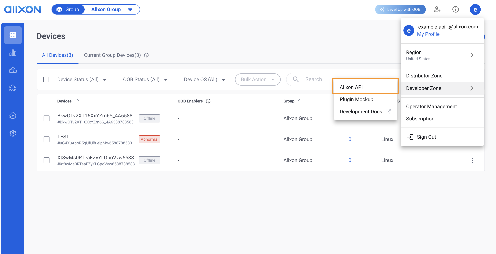
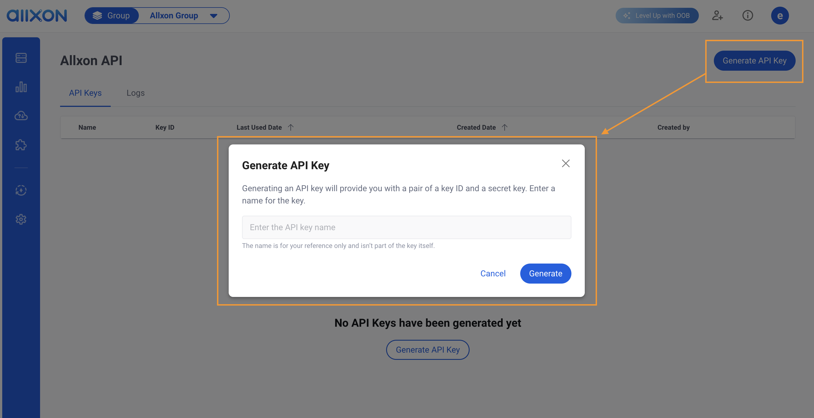
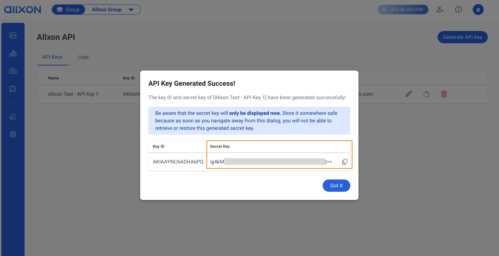

# Make Your First Allxon API Request

This section will help you get started quickly with the Allxon API using `curl`. It guides you through a simple interaction to retrieve the device connection status. 

For a more comprehensive understanding of the Allxon API, please visit [API Reference](./APIOverview.md).


## Before You Start
Before you begin using Allxon API, ensure you have an Allxon account and your edge devices are set up on Allxon Portal. For more information, please visit our [Resource Center](https://www.allxon.com/knowledge).


## Create Your API Key
The first step is to create a new API key on [Allxon Portal](https://dms.allxon.com/developer/apikeys). 
Login in and navigate to Allxon API Page.



There is a one-to-one relationship between the **Key ID** and the **Secret Key**.
Create an API key by clicking **Generate API Key**, and enter a customized name for this API Key. You can edit this name later.


Be aware that the secret key will only be displayed temporarily as soon as you navigate away from this dialog, you will not be able to retrieve or restore this generated secret key.


## Make an API Request

### Linux

#### Using `curl` on the Command Line

Create a shell script (e.g., `get_device_connection.sh`) by using the lines below, and insert your API key details.


```shell
#!/bin/bash

keyid="Your API Key's Key ID"

secret="Your API Key's Secret"

# get current epoch in milliseconds
EPOCH=$(date +%s%3N)

method="GET"

path="connection"

# calculate signing_key
signing_key=$( echo -n "$(($EPOCH / 3600000))" | openssl dgst -sha256 -hmac "$secret" -r | cut -d' ' -f1 )

# calculate signature
signature=$( echo -n "$method/$path$EPOCH" | openssl dgst -sha256 -hmac "$signing_key" -r | cut -d' ' -f1 )

curl "https://us.api-dev.allxon.com/$path" \
-X "$method" \
-H "Accept: application/json" \
-H "Accept-Encoding: gzip" \
-H "Content-Type: application/json" \
-H "Authorization: ALLXON-SIG1 Credential=\"$keyid\",Signature=\"$signature\"" \
-H "X-Allxon-Epoch: $EPOCH" \
--compressed
```
After creating the `get_device_connection.sh`, change the access permissions:

```shell
chmod u+x ./get_device_connection.sh
```

Then, execute the script:

```shell
./get_device_connection.sh
```

You should receive a response as follows:

```json
[{
    "sn": "your device's sn",
    "status": "online" // according to your device status at portal
}]
```