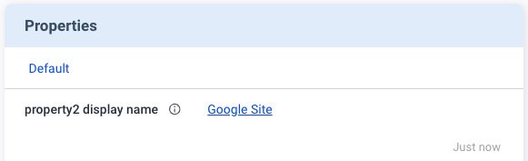
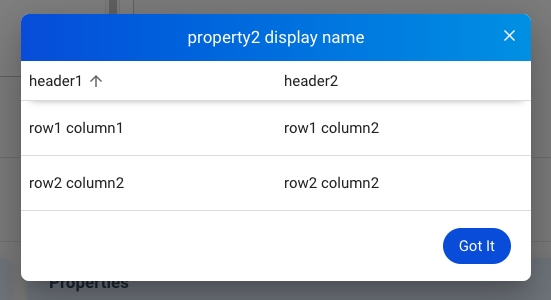

## Terminologies
- **Allxon Cloud**: The backend server(s) of Allxon service, both Allxon Portal and Allxon Agents are connected to Allxon Cloud.
- **Allxon Portal**: The frontend server(s) of Allxon service.
- **Allxon Agent**: The agent application of Allxon service.
- **Plugin**: A software application developed by developers to extend the functionalities of Allxon service.  Plugin sends collected data from modules to Allxon Cloud via Allxon Agents.  Also plugin sends commands to modules from Allxon Portal via Allxon Agents.
- **Module**: A hardware component or a software application developed by its vendors.  Plugin collects data or send commands to a module via the methods provided by its vendor.
- **MQTT Broker**: Each Allxon Agent will connect to a MQTT broker hosted by Allxon Cloud.  All the data exchange between Allxon Agents and Allxon Cloud will go through this channel.
- **WebSocket Server**: Each plugin will connect to a WebSocket server hosted within the Allxon Agent.  Plugin sends and receives data to/from Allxon Cloud with Plugin APIs through this channel.
- **Octo API**: The Application Programming Interface used to communicate between Allxon Agent and Plugin.
- **Allxon Octo SDK**: The Software Development Kit provided by Allxon to help developers to build up and verify Plugin APIs.
- **App GUID**: A unique identifier assigned by Allxon to each plugin in UUIDv4 format.
- **Access Key**: A secret key assigned by Allxon to each plugin for message signing.

## Octo API
Octo API adopts [JSON-RPC 2.0](https://www.jsonrpc.org/specification) Specification over WebSocket. Connect Allxon Agent WebSocket server with URL `"wss://localhost:55688"`. 

:::caution
Each API maximum payload size is 128 KB.
:::

:::danger
Not support _JSON-RPC batch_.
:::


### How to Read
- It's a _JSON-RPC Notification Request_ if API name start with `notify...`. 
- The bracket along with _JSON Key_ repesent following _JSON Type_:
    - `Object`, `Array`,  `String`, `Number`, `Bool`, `Null`
- If there is no bracket along with JSON Key, Means JSON Type is `String`.

## `v2/notifyPluginUpdate`

Direction: Plugin -> Agent

```json
{
    "jsonrpc": "2.0",
    "method": "v2/notifyPluginUpdate",
    "params": {
        "appGUID": "...",
        "epoch": "...",
        "appName": "...",
        "displayName": "...",
        "type": "...",
        "sdk": "...",
        "version": "...",
        "startCommand": "...",
        "stopCommand": "...",
        "modules": [
            {
                "moduleName": "...",
                "displayName": "...",
                "description": "...",
                "properties": [ ... ],
                "states": [ ... ],
                "metrics": [ ... ],
                "events": [ ... ],
                "commands": [ ... ],
                "alarms": [ ... ],
                "configs": [ ... ]
            }
        ]
    }
}
```

#### `$.params`

| Name | Type | Required | Description |
| --- | --- | --- | --- |
| `appGUID` | `String` | ✅ | The GUID of the plugin. |
| `appName` | `String` | ✅ | The "programming" name of the plugin. The name must match this regular expression[^1]. The name must be unique for all plugins. |
| `epoch` | `String` | ✅ | The current epoch time in seconds. |
| `displayName` | `String` |   | A display name for human read. |
| `type` | `String` | ✅ | `"ib"` for in-band plugin.<br/>`"oob"` for out-of-band plugin. |
| `sdk` | `String` | ✅ | The version of the plugIN SDK, follow [semantic version](https://semver.org/) rule. |
| `version` | `String` | ✅ | The version of the plugin.  The version uses a sequence of three digits (Major.Minor.Patch), i.e. must match this regular expression[^2]. |
| `startCommand` | `String` |   | Command to execute when plugin start. |
| `stopCommand` | `String` |   | Command to execute when plugin stop. |
| [`modules`](#paramsmodules) | `Array` | ✅ | A set of hardware or software modules controlled by this plugin. |


#### `$.params.modules[*]`

| Name | Type | Required | Description |    
| --- | --- | --- | --- |
| `moduleName` | `String` | ✅ | The "programming" name of the module.  The name must match this regular expression[^1]. The name must be unique within the plugin.  The max length is 64. |
| `displayName` | `String` |   | The "friendly human readable" name of the module. |
| `description` | `String` |   | The description of the module. |
| [`properties`](#paramsmodulesproperties) | `Array` |   | Provides module **static** information, such as firmware version, hardware configuration, ..., etc |
| [`states`](#paramsmodulesstates) | `Array` |   | Provides module **dynamic** states, such as power state, ..., etc. |
| [`metrics`](#paramsmodulesmetrics) | `Array` |   | Provides module metrics, such as temperature, voltage, ..., etc. |
| [`events`](#paramsmodulesevents) | `Array` |   | Provides module events, such as intrusion detection, ..., etc. |
| [`commands`](#paramsmodulescommands) | `Array` |   | Provides module function calls, such as power cycling, set hardware configuration, ..., etc. |
| [`alarms`](#paramsmodulesalarms) | `Array` |   | Provides module alarms, such as CPU, thermo, ..., etc. |
| [`config`](#paramsmodulesconfig) | `Array` |   | Provides module configurations, such as scheduling, ..., etc. |

### `$.params.modules[*].properties[*]`

```json
{
    "name": "...",
    "displayName": "...",
    "displayCategory": "...",
    "description": "...",
    "displayType": "...",
    "value": "..."
}
```

| Name | Type | Required | Description |
| --- | --- | --- | --- |
| `name` | `String` | ✅ | The "programming" name of the property.  The name must match this regular expression[^1]. The name must be unique within the module.  The max length is 32. |
| `displayName` | `String` |   | The "friendly human readable" name of the property. |
| `displayCategory` | `String` |   | The "programming" name of the category. The name must be unique within the module. |
| `description` | `String` |   | The description of the property. |
| `displayType` | `String` | ✅ | `"string"` \| `"table"` \| `"link"` <br/><br/> [More detail...](#value-corresponding-to-displaytype) |
| `value` | `Object` \| `Array` \| `String` | ✅ | `value` Type depend on which `displayType`. |

#### `value` corresponding to `displayType`

#### `"string"`
`value` Type must be `String`. Example:

```json
{
    ...
    "displayType": "string",
    "value": "my string"
    ...
}
```


#### `"link"`
`value` Type must be `Object` and follow the format below.

| Name | Type | Required | Description |
| --- | --- | --- | --- |
| `url` | `String` | ✅ | Link url. |
| `alias` | `String` |  | Alias name for this url. |

Example:

```json
{
    ...
    "displayType": "link",
    "value": {
        "url": "https://www.google.com",
        "alias": "Google Site"
    },
    ...
}
```



#### `"table"`
`value` Type must be `Array`. Example:

```json
{
    ...
    "displayType": "table",
    "value": [
        {
            "header1": "row1 column1",
            "header2": "row1 column2"
        },
        {
            "header1": "row2 column2",
            "header2": "row2 column2"
        }
    ],
    ...
}
```




### `$.params.modules[*].states[*]`

```json
{
    "name": "...",
    "displayName": "...",
    "displayCategory": "...",
    "description": "...",
    "displayType": "...",
}
```

| Name | Type | Required | Description |
| --- | --- | --- | --- |
| `name` | `String` | ✅ | The "programming" name of the state.  The name must match this regular expression[^1]. The name must be unique within the module.  The max length is 32. |
| `displayName` | `String` |   | The "friendly human readable" name of the state. |
| `displayCategory` | `String` |   | The "programming" name of the category. The name must be unique within the module. |
| `description` | `String` |   | The description of the state. |
| `displayType` | `String` | ✅ |  |

### `$.params.modules[*].metrics[*]`

```json
{
    "name": "...",
    "displayName": "...",
    "displayCategory": "...",
    "description": "...",
    "displayUnit": "...",
    "displayType": "...",
}
```

| Name | Type | Required | Description |
| --- | --- | --- | --- |
| `name` | `String` | ✅ | The "programming" name of the metric.  The name must match this regular expression[^1]. The name must be unique within the module.  The max length is 32. |
| `displayName` | `String` |   | The "friendly human readable" name of the metric. |
| `displayCategory` | `String` |   | The "programming" name of the category. The name must be unique within the module. |
| `description` | `String` |   | The description of the metric. |
| `displayUnit` | `String` |   |  |
| `displayType` | `String` |   |  |

### `$.params.modules[*].events[*]`

```json
{
    "name": "...",
    "displayName": "...",
    "displayCategory": "...",
    "description": "...",
}
```

| Name | Type | Required | Description |
| --- | --- | --- | --- |
| `name` | `String` | ✅ | The "programming" name of the event.  The name must match this regular expression[^1]. The name must be unique within the module.  The max length is 32. |
| `displayName` | `String` |   | The "friendly human readable" name of the event. |
| `displayCategory` | `String` |   | The "programming" name of the category. The name must be unique within the module. |
| `description` | `String` |   | The description of the event. |

### `$.params.modules[*].commands[*]`

```json
{
    "name": "...",
    "displayCategory": "...",
    "displayName": "...",
    "description": "...",
    "type": "...",
    "params": [
        {
            "name": "...",
            "displayName": "...",
            "description": "...",
            "displayType": "...",
            "required": "...",
            "requiredOn": "...",
            "defaultValue": "...",
            "displayMask": "...",
            "valueEncoding": "..."
        }, ...
    ]
}
```

| Name | Type | Required | Description |
| --- | --- | --- | --- |
| `name` | `String` | ✅ | The "programming" name of the command.  The name must match this regular expression[^1]. The name must be unique within the module. The max length is 32. |
| `displayCategory` | `String` |   | The "programming" name of the category. The name must be unique within the module. |
| `displayName` | `String` |   | The "friendly human readable" name of the command. |
| `description` | `String` |   | The description of the command. |
| `type` | `String` | ✅ | `"asynchronous"` |
| [`params`](#paramsmodulescommandsparams) | `Array` |   | (If this command has no parameters, don't set this item.) |

#### `$.params.modules[*].commands[*].params[*]`

| Name | Type | Required | Description |
| --- | --- | --- | --- |
| `name` | `String` | ✅ | The "programming" name of the parameter. The name must match this regular expression[^1]. The name must be unique within the command. The max length is 32. |
| `displayName` | `String` |   | The "friendly human readable" name of the command parameter. |
| `description` | `String` |   | The description of the command parameter. |
| `displayType` | `String` | ✅ |  `"string"` \| `"text"` \| `"datetime"` \| `"switch"` \| `"checkbox"` \| `"list"` \| `"tos"` <br/><br/> [More detail...](#value-corresponding-to-displaytype-in-v2notifypluginupdate)  |
| `required` | `Bool` | ✅ | Indicates if this parameter is mandatory or not. |
| `requiredOn` | `String` |   | Indicates if this parameter is mandatory on the other parameter. |
| `displayValue` | `String` \| `Array` |   | Related to `displayType`. |
| `defaultValue` | `String` |   | Default value of current parameter. |
| `displayFormat` | `String` | Depend on `displayType` | A property for `"datetime"` displayType. [The datetime format](#datetime). |
| `valueFromProperty` | `String` |   | Advance |
| `displayMask` | `Bool` |   |  **(Portal - not implement yet.)** |
| `valueEncoding` | `String` |   | Advance |
| `displayOnProperty` | `String` |   | Advance |

### `$.params.modules[*].alarms[*]`

```json
{
    "name": "...",
    "displayCategory": "...",
    "displayName": "...",
    "description": "...",
    "params": [
        {
            "name": "...",
            "displayName": "...",
            "description": "...",
            "displayType": "...",
            "required": "...",
            "displayValues": "...",
            "defaultValue": "...",
            "displayFormat": "...",
            "valueFromProperty": "...",
            "displayMask": "...",
            "valueEncoding": "..."
        }, ...
    ]
}
```

| Name | Type | Required | Description |
| --- | --- | --- | --- |
| `name` | `String` | ✅ | The "programming" name of the alarm. The name must match this regular expression[^1]. The name must be unique within the module. The max length is 32. |
| `displayCategory` | `String` |   | The "programming" name of the category. The name must be unique within the module. |
| `displayName` | `String` |   | The "friendly human readable" name of the alarm. |
| `description` | `String` |   | The description of the alarm. |
| [`params`](#paramsmodulesalarmsparams) | `Array` |   | (If this alarm has no parameters, don't set this item.) |

#### `$.params.modules[*].alarms[*].params[*]`

| Name | Type | Required | Description |
| --- | --- | --- | --- |
| `name` | `String` | ✅ | The "programming" name of the parameter. The name must match this regular expression[^1]. The name must be unique within the alarm. The max length is 32. |
| `displayName` | `String` |   | The "friendly human readable" name of the alarm parameter. |
| `description` | `String` |   | The description of the alarm parameter. |
| `displayType` | `String` | ✅ | `"string"` \| `"datetime"` \| `"switch"` \| `"checkbox"` \| `"list"` \| `"temperature"` <br/><br/> More detail... |
| `required` | `Bool` | ✅ | Indicates if this parameter is mandatory or not. |
| `displayValue` | `String` |   | Related to `displayType`. |
| `defaultValue` | `String` |   | Default value of current parameter. |
| `displayFormat` | `String` | Depend on `displayType` | A property for `"datetime"` displayType. The datetime format. |
| `valueFromProperty` | `String` |   | Advance |
| `displayMask` | `Bool` |   | A property for `"string"` displayType. Indicates if the string inputs are masked or not. |
| `valueEncoding` | `String` |   | Advance |

### `$.params.modules[*].config[*]`

```json
{
    "name": "...",
    "displayCategory": "...",
    "displayName": "...",
    "description": "...",
    "params": [
        {
            "name": "...",
            "displayName": "...",
            "description": "...",
            "displayType": "...",
            "required": "...",
            "displayValues": "...",
            "defaultValue": "...",
            "displayFormat": "...",
            "valueFromProperty": "...",
            "displayMask": "...",
            "valueEncoding": "..."
        }, ...
    ]
}
```

| Name | Type | Required | Description |
| --- | --- | --- | --- |
| `name` | `String` | ✅ |  The "programming" name of the config. The name must match this regular expression[^1]. The name must be unique within the module. The max length is 32.  |
| `displayCategory` | `String` |   | The "programming" name of the category. The name must be unique within the module. |
| `displayName` | `String` |   | The "friendly human readable" name of the config. |
| `description` | `String` |   | The description of the config. |
| [`params`](#paramsmodulesconfigparams) | `Array` |   |(If this config has no parameters, don't set this item.)  |

#### `$.params.modules[*].config[*].params[*]`

| Name | Type | Required | Description |
| --- | --- | --- | --- |
| `name` | `String` | ✅ |  The "programming" name of the parameter. The name must match this regular expression[^1]. The name must be unique within the config. The max length is 32.  |
| `displayName` | `String` |   | The "friendly human readable" name of the config parameter. |
| `description` | `String` |   | The description of the config parameter. |
| `displayType` | `String` | ✅ | `"string"` \| `"datetime"` \| `"switch"` \| `"checkbox"` \| `"list"` \| `"temperature"` <br/><br/> More detail...  |
| `required` | `Bool` | ✅ | Indicates if this parameter is mandatory or not. |
| `displayValue` | `String` |   | Related to `displayType` |
| `defaultValue` | `String` |   | Default value of current parameter. |
| `displayFormat` | `String` | Depend on `displayType` | A property for `"datetime"` displayType. The datetime format. |
| `valueFromProperty` | `String` |   | Advance |
| `displayMask` | `Bool` |   | A property for `"string"` displayType. Indicates if the string inputs are masked or not. |
| `valueEncoding` | `String` |   | Advance |

## `v2/notifyPluginCommand`

Direction: Agent -> Plugin

```json
{
    "jsonrpc": "2.0",
    "method": "v2/notifyPluginCommand",
    "params": {
        "serialNumber": "...",
        "appGUID": "...",
        "epoch": "...",
        "commandId": "...",
        "commandSource": "...",
        "moduleName": "...",
        "commands": [ ... ]
    }
}
```

#### `$.params`

| Name | Type | Required | Description |
| --- | --- | --- | --- |
| `serialNumber` | `String` |   | The serial number of the device behind a gateway.  Only required when sending commands to devices behind a gateway. |
| `appGUID` | `String` | ✅ | The GUID of the plugin. |
| `epoch` | `String` | ✅ | The current epoch time in seconds. |
| `commandId` | `String` | ✅ | The assistId in MQTT message. |
| `commandSource` | `String` | ✅ | `"remote"` |
| `moduleName` | `String` | ✅ | The name of the module. The name must match this regular expression[^1].  |
| [`commands`](#paramscommands) | `Array` | ✅ | A set of commands. |

#### `$.params.commands[*]`

| Name | Type | Required | Description |
| --- | --- | --- | --- |
| `name` | `String` | ✅ | The name of the command. The name must match this regular expression[^1]. |
| [`params`](#paramscommandsparams) | `Array` |   | A set of name and value pairs for the command. |

#### `$.params.commands[*].params[*]`

| Name | Type | Required | Description |
| --- | --- | --- | --- |
| `name` | `String` | ✅ | The name of the parameter. The name must match this regular expression[^1]. |
| `value` | `Object` \| `String` | ✅ | `value` Type depend on which `displayType` in  [command parameter part of `v2/notifyPluginUpdate`](#paramsmodulescommandsparams). |

#### `value` corresponding to `displayType` in `v2/notifyPluginUpdate`

#### `"string"`
`value` Type must be `String`. Example:

```json title="v2/notifyPluginUpdate.json"
{
    ...
    "commands": [ 
        {
            "name": "command1",
            "params": [
                {
                    "name": "stringParam",
                    "displayType": "string",                
                    "required": false,
                    ...
                }
            ],
            ...
        }
    ],
}
```


```json title="v2/notifyPluginCommand.json"
{
    ...
    "commands": [
        {
            "name": "command1",
            "params": [
               {
                  "name": "stringParam",
                  "value": "foo"
               }
            ]
        }
    ]
}
```

#### `"datetime"`

Must define `displayFormat`, following format is avaliable:
- `"YYYY-MM-DD"`
- `"HH:MM"`
- `"YYYY-MM-DD HH:MM"`

```json title="v2/notifyPluginUpdate.json"
{
    ...
    "commands": [ 
        {
            "name": "command1",
            "params": [
                {
                    "name": "dateParam",
                    "displayType": "datetime",                
                    "required": false,
                    "displayFormat": "HH:MM",
                    ...
                }
            ],
            ...
        }
    ],
}
```


```json title="v2/notifyPluginCommand.json"
{
    ...
    "commands": [
        {
            "name": "command1",
            "params": [
               {
                  "name": "dateParam",
                  "value": "12:00"
               }
            ]
        }
    ]
}
```

#### `"text"`

"text" to display this parameter as a multi-line input.

```json title="v2/notifyPluginUpdate.json"
{
    ...
    "commands": [ 
        {
            "name": "command1",
            "params": [
                {
                    "name": "textParam",
                    "displayType": "text",                
                    "required": false,
                    ...
                }
            ],
            ...
        }
    ],
}
```


```json title="v2/notifyPluginCommand.json"
{
    ...
    "commands": [
        {
            "name": "command1",
            "params": [
               {
                  "name": "dateParam",
                  "value": "hello\nworld"
               }
            ]
        }
    ]
}
```

#### `"switch"`

Must define `displayValues` a size 2 `Array`, index 0 repesent false, index 1 repesent true.

```json title="v2/notifyPluginUpdate.json"
{
    ...
    "commands": [ 
        {
            "name": "command1",
            "params": [
                {
                    "name": "switchParam",
                    "displayType": "switch",                
                    "displayValues": [
                        "offValue",
                        "onValue"
                    ],
                    "defaultValue": "offValue",
                    "required": false,
                    ...
                }
            ],
            ...
        }
    ],
}
```


```json title="v2/notifyPluginCommand.json"
{
    ...
    "commands": [
        {
            "name": "command1",
            "params": [
               {
                  "name": "switchParam",
                  "value": "offValue"
               }
            ]
        }
    ]
}
```

#### `"checkbox"`

Must define `displayValues` a size 2 `Array`, index 0 repesent false, index 1 repesent true.

```json title="v2/notifyPluginUpdate.json"
{
    ...
    "commands": [ 
        {
            "name": "command1",
            "params": [
                {
                    "name": "checkboxParam",
                    "displayType": "checkbox",                
                    "displayValues": [
                        "offValue",
                        "onValue"
                    ],
                    "defaultValue": "offValue",
                    "required": false,
                    ...
                }
            ],
            ...
        }
    ],
}
```


```json title="v2/notifyPluginCommand.json"
{
    ...
    "commands": [
        {
            "name": "command1",
            "params": [
               {
                  "name": "checkboxParam",
                  "value": "offValue"
               }
            ]
        }
    ]
}
```

#### `"list"`

Must define `displayValues` in `Array` type.

```json title="v2/notifyPluginUpdate.json"
{
    ...
    "commands": [ 
        {
            "name": "command1",
            "params": [
                {
                    "name": "checkboxParam",
                    "displayType": "checkbox",                
                    "displayType": "list",
                    "displayValues": [
                        "list1",
                        "list2"
                    ],
                    "required": false
                    ...
                }
            ],
            ...
        }
    ],
}
```


```json title="v2/notifyPluginCommand.json"
{
    ...
    "commands": [
        {
            "name": "command1",
            "params": [
               {
                  "name": "checkboxParam",
                  "value": "list1"
               }
            ]
        }
    ]
}
```

#### `"tos"`

Must define `displayName` and `description`. Put your terms of service link in `description`.

```json title="v2/notifyPluginUpdate.json"
{
    ...
    "commands": [ 
        {
            "name": "command1",
            "params": [
                {
                    "name": "tosParam",
                    "displayType": "tos",
                    "displayName": "Terms of Service",
                    "description": "https://policies.google.com/terms?hl=en-US",
                    "required": true
                    ...
                }
            ],
            ...
        }
    ],
}
```


```json title="v2/notifyPluginCommand.json"
{
    ...
    "commands": [
        {
            "name": "command1",
            "params": [
               {
                  "name": "tosParam",
                  "value": false
               }
            ]
        }
    ]
}
```

:::caution
`value` type is `Bool`.
:::

## `v2/notifyPluginCommandAck`

Direction: Plugin -> Agent

```json
{
    "jsonrpc": "2.0",
    "method": "v2/notifyPluginCommandAck",
    "params": {
        "serialNumber": "...",
        "appGUID": "...",
        "epoch": "...",
        "commandId": "...",
        "commandSource": "...",
        "moduleName": "...",
        "commandState": "...",
        "commandAcks": [
            {
                "name": "...",
                "result": { ... }
            }, ...
        ]
    }
}
```

#### `$.params`

| Name | Type | Required | Description |
| --- | --- | --- | --- |
| `serialNumber` | `String` |   | The serial number of the device behind a gateway.  Only required when sending commands to devices behind a gateway.  |
| `appGUID` | `String` | ✅ | The GUID of the plugin. |
| `epoch` | `String` | ✅ | The current epoch time in seconds. |
| `commandId` | `String` | ✅ | The same commandId retrieved from `v2/notifyPluginCommand`. |
| `commandSource` | `String` | ✅ | The same commandSource retrieved from `v2/notifyPluginCommand`. |
| `moduleName` | `String` | ✅ | The same moduleName retrieved from `v2/notifyPluginCommand`, regex[^1]. |
| `commandState` | `String` | ✅ | `"ACCEPTED"`: When command is received by the plugin.<br/>`"REJECTED"`: When command is rejected by the plugin.<br/>`"ACKED"`: When command has been acked by the module.<br/>`"ERRORED"`: When command has been errored by the module. |
| [`commandAcks`](#paramscommandacks) | `Array` | ✅ |  |
| [`states`](#paramsstates) | `Array` |  | States that you wanna update right after executed command. |

#### `$.params.commandAcks[*]`

| Name | Type | Required | Description |
| --- | --- | --- | --- |
| `name` | `String` | ✅ | The same command name retrieved from `v2/notifyPluginCommand`. |
| `result` | `Object` |   | The result of the command, defined by plugin. |

#### `$.params.states[*]`

| Name | Type | Required | Description |
| --- | --- | --- | --- |
| `name` | `String` | ✅ | The same command name retrieved from `v2/notifyPluginCommand`. |
| `value` | `Object` \| `Array` \| `String` | ✅ | The value of the state. |
| `time` | `String` |  | The epoch time in seconds of the state. |

## `v2/notifyPluginState`

Direction: Plugin -> Agent

```json
{
    "jsonrpc": "2.0",
    "method": "v2/notifyPluginCommandAck",
    "params": {
        "appGUID": "...",
        "moduleName": "...",
        "epoch": "...",
        "states": [
            {
                "name": "...",
                "value": "..."
            }, ...
        ]
    }
}
```

#### `$.params`

| Name | Type | Required | Description |
| --- | --- | --- | --- |
| `appGUID` | `String` | ✅ | The GUID of the plugin. |
| `moduleName` | `String` | ✅ | The name of the module, regex[^1] |
| `epoch` | `String` | ✅ | The current epoch time in seconds. |
| [`states`](#paramsstates-1) | `Array` | ✅ | A set of states. |

#### `$.params.states[*]`

| Name | Type | Required | Description |
| --- | --- | --- | --- |
| `name` | `String` | ✅ | The name of the state. |
| `value` | `Object` \| `Array` \| `String` | ✅ | The value of the state. |
| `time` | `String` |  | The epoch time in seconds of the state. |

## `v2/notifyPluginMetric`

Direction: Plugin -> Agent

```json
{
    "jsonrpc": "2.0",
    "method": "v2/notifyPluginMetric",
    "params": {
        "appGUID": "...",
        "moduleName": "...",
        "epoch": "...",
        "metrics": [
            {
                "name": "...",
                "value": "..."
            }, ...
        ]
    }
}
```

#### `$.params`

| Name | Type | Required | Description |
| --- | --- | --- | --- |
| `appGUID` | `String` | ✅ | The GUID of the plugin. |
| `moduleName` | `String` | ✅ | The name of the module, regex[^1] |
| `epoch` | `String` | ✅ | The current epoch time in seconds. |
| [`metrics`](#paramsmetrics) | `Array` | ✅ | A set of metrics. |

#### `$.params.metrics[*]`

| Name | Type | Required | Description |
| --- | --- | --- | --- |
| `name` | `String` | ✅ | The name of the metric. |
| `value` | `Object` \| `Array` \| `String` | ✅ | The value of the metric. The number supports up to fifteen digits and at most two decimal places. |
| `time` | `String` |  | The epoch time in seconds of the metric. |

## `v2/notifyPluginEvent`

Direction: Plugin -> Agent

```json
{
    "jsonrpc": "2.0",
    "method": "v2/notifyPluginEvent",
    "params": {
        "appGUID": "...",
        "moduleName": "...",
        "epoch": "...",
        "events": [
            {
                "name": "...",
                "value": "..."
            }, ...
        ]
    }
}
```

#### `$.params`

| Name | Type | Required | Description |
| --- | --- | --- | --- |
| `appGUID` | `String` | ✅ | The GUID of the plugin. |
| `moduleName` | `String` | ✅ | The name of the module, regex[^1] |
| `epoch` | `String` | ✅ | The current epoch time in seconds. |
| [`events`](#paramsevents) | `Array` | ✅ | A set of events |

#### `$.params.events[*]`

| Name | Type | Required | Description |
| --- | --- | --- | --- |
| `name` | `String` | ✅ | The name of the event. |
| `value` | `Object` \| `Array` \| `String` | ✅ | The value of the event. |
| `time` | `String` |  | The epoch time in seconds of the event. |

## `v2/notifyPluginConfigUpdate`

Direction: Agent -> Plugin

```json
{
    "jsonrpc": "2.0",
    "method": "v2/notifyPluginConfigUpdate",
    "params": {
        "appGUID": "...",
        "epoch": "...",
        "version": "...",
        "modules": [
            {
                "moduleName": "...",
                "epoch": "...",
                "configs": [
                    {
                        "name": "...",
                        "params": [
                            {
                                "name": "...",
                                "value": "..."
                            },
                            ...
                        ]
                    },
                    ...
                ]
            }
        ]
    }
}
```

#### `$.params`

| Name | Type | Required | Description |
| --- | --- | --- | --- |
| `appGUID` | `String` | ✅ | The GUID of the plugin. |
| `epoch` | `String` | ✅ | The current epoch time in seconds. |
| `version` | `String` | ✅ | The version of the plugin config. |
| [`modules`](#paramsmodules-1) | `Array` | ✅ | A set of commands. |

#### `$.params.modules[*]`

| Name | Type | Required | Description |
| --- | --- | --- | --- |
| `moduleName` | `String` | ✅ | The name of the module. The name must match this regular expression[^1]. |
| `epoch` | `String` | ✅ | The epoch time in seconds when the update is made. Plugin should update the module alarms which epoch is newer. |
| [`configs`](#paramsmodulesconfigs) | `Array` | ✅ | A set of config. |

#### `$.params.modules[*].configs[*]`

| Name | Type | Required | Description |
| --- | --- | --- | --- |
| `name` | `String` | ✅ | The name of the config. The name must match this regular expression[^1]. |
| [`params`](#paramsmodulesconfigsparams) | `Array` | ✅ | A set of name and value pairs for the config. The maximum total config size is up to 1024 Bytes. |

#### `$.params.modules[*].configs[*].params[*]`

| Name | Type | Required | Description |
| --- | --- | --- | --- |
| `name` | `String` | ✅ | The name of the parameter. The name must match this regular expression[^1]. |
| `value` | `Array` | ✅ | The value of the config. |

## `v2/notifyPluginAlarmUpdate`

Direction: Agent -> Plugin

```json
{
    "jsonrpc": "2.0",
    "method": "v2/notifyPluginAlarmUpdate",
    "params": {
        "appGUID": "...",
        "epoch": "...",
        "version": "...",
        "modules": [
            {
                "moduleName": "...",
                "epoch": "...",
                "configs": [
                    {
                        "name": "...",
                        "params": [
                            {
                                "name": "...",
                                "value": "..."
                            },
                            ...
                        ]
                    },
                    ...
                ]
            }
        ]
    }
}
```

#### `$.params`

| Name | Type | Required | Description |
| --- | --- | --- | --- |
| `appGUID` | `String` | ✅ | The GUID of the plugin. |
| `epoch` | `String` | ✅ | The current epoch time in seconds. |
| `version` | `String` | ✅ | The version of the plugin alarm. |
| [`modules`](#paramsmodules-2) | `Array` | ✅ | A set of commands. |

#### `$.params.modules[*]`

| Name | Type | Required | Description |
| --- | --- | --- | --- |
| `moduleName` | `String` | ✅ | The name of the module. The name must match this regular expression[^1]. |
| `epoch` | `String` | ✅ | The epoch time in seconds when the update is made. Plugin should update the module alarms which epoch is newer. |
| [`alarms`](#paramsmodulesalarms-1) | `Array` | ✅ | A set of alarm. |

#### `$.params.modules[*].alarms[*]`

| Name | Type | Required | Description |
| --- | --- | --- | --- |
| `name` | `String` | ✅ | The name of the alarm. The name must match this regular expression[^1]. |
| [`params`](#paramsmodulesalarmsparams-1) | `Array` | ✅ | A set of name and value pairs for the alarm. The maximum total alarm size is up to 1024 Bytes. |

#### `$.params.modules[*].alarms[*].params[*]`

| Name | Type | Required | Description |
| --- | --- | --- | --- |
| `name` | `String` | ✅ | The name of the parameter. The name must match this regular expression[^1]. |
| `value` | `Array` | ✅ | The value of the alarm. |

## `v2/notifyPluginAlert`

Direction: Plugin -> Agent

```json
{
    "jsonrpc": "2.0",
    "method": "v2/notifyPluginAlert",
    "params": {
        "appGUID": "...",
        "moduleName": "...",
        "epoch": "...",
        "alarms": [
            {
                "name": "...",
                "action": "...",
                "time": "...",
                "message": "..."
            }, ...
        ]
    }
}
```

#### `$.params`

| Name | Type | Required | Description |
| --- | --- | --- | --- |
| `appGUID` | `String` | ✅ | The GUID of the plugin. |
| `moduleName` | `String` | ✅ | The name of the module. The name must match this regular expression[^1]. |
| `epoch` | `String` | ✅ | The current epoch time in seconds. |
| [`alarms`](#paramsalarms) | `Array` | ✅ | A set of alarm. |

#### `$.params.alarms[*]`

| Name | Type | Required | Description |
| --- | --- | --- | --- |
| `name` | `String` | ✅ | The name of the alarm. The name must match this regular expression[^1]. |
| `action` | `String` | ✅ | `"trigger"`: When the alarm has been triggered.<br/> `"resolve"`: When the alarm has been resolved. |
| `time` | `String` | ✅ | The epoch time in seconds of the action. |
| `message` | `String` | ✅ | The content to be sent through available alert channels, e.g. email. |

[^1]: regular expression: `^[a-zA-Z][a-zA-Z0-9_-]*$`.
[^2]: regular expression: `^[0-9]+[.][0-9]+[.][0-9]+$`. 


<!-- Advance part -->
<!-- ### `"displayOn"`
:::caution
Not recommand to use. Hard to maintain when using group level operation.
:::
This function used by `displayOnProperty` of command. command only display when command's `displayOnProperty` value match current property name and value. Example:

```json
{
    "jsonrpc": "2.0",
    "method": "v2/notifyPluginUpdate",
    "params": {
        ...
        "modules": [
            {
                ...
                "properties": [ 
                    {
                        "name": "property_1",
                        "displayType": "displayOn",
                        "value": "mode1"
                    }
                 ],
                "commands": [ 
                    {
                        ...
                        "name": "command_1",
                        "displayOnProperty": {
                            "property_1": [
                                "mode1"
                            ]
                        }
                    }
                ]
            }
        ]
    }
}
```

### `"valueFromProperty"`
:::caution
Not recommand to use. Hard to maintain when using group level operation.
:::

Provide dynamic data that a parameter of a command needs. It supports `"switch"`, `"checkbox"` and `"list"` displayTypes of command parameter. 

```json
{
    "jsonrpc": "2.0",
    "method": "v2/notifyPluginUpdate",
    "params": {
        ...
        "modules": [
            {
                "moduleName": "previewModuleName",
                "properties": [
                    {
                        "name": "camera-list",
                        "displayType": "valueFromProperty",
                        "value": {
                            "displayValues": [
                                "camera-1",
                                "camera-2"
                            ],
                            "defaultValue": "camera-1"
                        }
                    }
                ],
                "commands": [
                    {
                        "name": "login-camera",
                        "type": "asynchronous",
                        "displayName": "Login Camera",
                        "params": [
                            {
                                "name": "camera-list-param",
                                "displayName": "Choose Camera",
                                "description": "Choose a camera to login",
                                "displayType": "list",
                                "required": "true",
                                "displayValues": [],
                                "defaultValue": "",
                                "valueFromProperty": "camera-list"
                            }
                        ]
                    }
                ]
            }
        ]
    }
}
```

<details>
  <summary>Example</summary>

```json
{
    "jsonrpc": "2.0",
    "method": "v2/notifyPluginUpdate",
    "params": {}
}
```

</details>
 -->
