## Glossary of Terms
| Term    | Description      |
| ---------- | ---------- |
| Allxon Cloud | The backend servers of Allxon service; both Allxon Portal and Allxon Agent are connected to Allxon Cloud.|
| Allxon Portal   |  The frontend servers of Allxon service.   |
| Allxon Agent   | An agent application that communicates between edge devices and Allxon Cloud.   |
| Plugin   | A software application that extends the functionalities of Allxon service. A plugin sends collected data from modules to Allxon Cloud via Allxon Agent. It also sends commands from Allxon Portal to modules via Allxon Agent.   |
| Module   | A hardware component (e.g. GPU, SSD, fan) or a software application (e.g. remote console utilities). A plugin collects data from a module or sends commands to a module.   |
| MQTT Broker   | Allxon Agent connects to a MQTT broker hosted by Allxon Cloud. All the data exchange between Allxon Agents and Allxon Cloud go through this channel.   |
| WebSocket Server  | A plugin connects to a WebSocket server hosted within an Allxon Agent. The plugin sends and receives data to/from Allxon Cloud with Allxon Octo APIs through this channel. |
| Allxon Octo API  | The Application Programming Interface used to communicate between Allxon Agent and plugins.  |
| Allxon Octo SDK  |The Software Development Kit provided by Allxon, which helps developers to build plugins and verify Allxon Octo APIs.  |
|App GUID |A unique identifier assigned by Allxon to each plugin in UUIDv4 format.|
|Access Key|A secret key assigned by Allxon to each plugin for message signing.|


## Allxon Octo API
Allxon Octo API adopts [JSON-RPC 2.0](https://www.jsonrpc.org/specification) specification over WebSocket. To communicate with Allxon Agent, you need to create a WebSocket connection **wss://localhost:55688** from the plugin. Then send/receive requests in the JSON format via the API.

:::note

Each API maximum payload size is _5 KB_.

:::

:::note

_JSON-RPC batch_ is not supported.
:::


### How to Read the API
- If the API name starts with `notify...`, it's a **JSON-RPC Notification Request**.
- A bracketed JSON Key represents a *JSON Type*. The types are as follows: Object, Array,  String, Number, Bool, Null
- If a JSON Key is not bracketed, the JSON Type is String.


## `"v2/notifyPluginUpdate"`

Direction: Plugin → Agent

```json
{
    "jsonrpc": "2.0",
    "method": "v2/notifyPluginUpdate",
    "params": {
        "appGUID": "...",
        "epoch": "...",
        "appName": "...",
        "displayName": "...",
        "type": "...",
        "sdk": "...",
        "version": "...",
        "startCommand": "...",
        "stopCommand": "...",
        "modules": [
            {
                "moduleName": "...",
                "displayName": "...",
                "description": "...",
                "properties": [ ... ],
                "states": [ ... ],
                "metrics": [ ... ],
                "events": [ ... ],
                "commands": [ ... ],
                "alarms": [ ... ],
                "configs": [ ... ]
            }
        ]
    }
}
```

#### `$.params`

| Name | Type | Required | Description |
| --- | --- | --- | --- |
| `"appGUID"` | String |  | The GUID of the plugin. |
| `"appName"` | String |  | The unique plugin name in string format. The name must match the regular expression[^1]. |
| `"epoch"` | String |  | The current Epoch Time in seconds. |
| `"displayName"` | String |   | The plugin name displayed on the plugIN card. |
| `"type"` | String |  | `"ib"` for in-band plugin.<br/>`"oob"` for out-of-band plugin. |
| `"sdk"` | String |  | The version of Allxon Octo SDK, which follows [semantic version](https://semver.org/) rule. |
| `"version"` | String |  | The version of a plugin, which uses a sequence of three digits (Major.Minor.Patch). It must match the regular expression[^2]. |
| `"startCommand"` | String |   | A Command to execute when plugin starts. |
| `"stopCommand"` | String |   | A Command to execute when plugin stops. |
| [`"modules"`](#paramsmodules) | Array |  | A set of hardware or software modules controlled by this plugin. |


#### `$.params.modules[*]`

| Name | Type | Required | Description |    
| --- | --- | --- | --- |
| `"moduleName"` | String |  | The module name unique within the plugin and having a string format of no longer than 64 characters. The name must match the regular expression. |
| `"displayName"` | String |   | The module name displayed on the plugin tab of the device page. |
| `"description"` | String |   | The description of the module. |
| [`"properties"`](#paramsmodulesproperties) | Array |   | This is used to upload the **static** information of the module, such as the firmware version and hardware configuration. |
| [`"states"`](#paramsmodulesstates) | Array |   | This is used to upload the **dynamic** states of the module, such as the power state. |
| [`"metrics"`](#paramsmodulesmetrics) | Array |   | This is used to upload metrics of the module, such as temperature and voltage. |
| [`"events"`](#paramsmodulesevents) | Array |   | This is used to upload events/activities of the module, such as intrusion detection. |
| [`"commands"`](#paramsmodulescommands) | Array |   | This is used to enable function calls of the module, such as power cycling and hardware configuration.|
| [`"alarms"`](#paramsmodulesalarms) | Array |   | This is used to handle alerts of the module, such as alerts for CPU and system temperature.|
| [`"config"`](#paramsmodulesconfig) | Array |   | This is used to handle the remote configurations of the module, such as scheduling. |

### `$.params.modules[*].properties[*]`

```json
{
    "name": "...",
    "displayName": "...",
    "displayCategory": "...",
    "description": "...",
    "displayType": "...",
    "value": "..."
}
```

| Name | Type | Required | Description |
| --- | --- | --- | --- |
| `"name"` | String |  |The property name unique within the module and having a string format of no longer than 32 characters. The name must match the regular expression[^1].|
| `"displayName"` | String |   | The display name of each property field. |
| `"displayCategory"` | String |   | The name of the Category tab displayed on a card. Properties with the same displayCategory are categorized under the same tab.|
| `"description"` | String |   | The description of the property. |
| `"displayType"` | String |  | [`"string"`](#displaytypestring-in-properties) \| [`"table"`](#displaytypetable-in-properties) \| [`"link"`](#displaytypelink-in-properties) |
| `"value"` | Object \| Array \| String |  | The type of `"value"` depends on the `"displayType"`. |

#### `"displayType":"string"` in `"properties"`

In Properties, if the `"displayType"` is set to `"string"`, the type of `"value"` must be String. 

Here is an example:


```json title="v2/notifyPluginUpdate.json"
{
    ...
    "properties": [ 
        {
            "name": "property1",
            "displayType": "string",
            "value": "my string",
            ...
        },
        ...
    ]
}
```
The **Properties** card displays as follows:


#### `"displayType":"link"` in `"properties"`

If the `"displayType"` is set to `link`, the type of `"value"` must be Object and must follow the format below.

| Name | Type | Required | Description |
| --- | --- | --- | --- |
| `"url"` | String |  | A link to an external resource. |
| `"alias"` | String |  | An alias name for this URL. |

Here is an example:

```json title="v2/notifyPluginUpdate.json"
{
    ...
    "properties": [ 
        {
            "name": "property1",
            "displayType": "link",
            "value": {
                "url": "https://www.google.com",
                "alias": "Google Site"
            },
            ...
        },
        ...
    ]
}
```

The **Properties** card displays as follows:


#### `"displayType":"table"` in `"properties"`

When the `"displayType"` is set to `table`, the type of `"value"` must be Array. 

Here is an example:

```json title="v2/notifyPluginUpdate.json" 
{
    ...
    "properties": [ 
        {
            "name": "property1",
            "displayType": "table",
            "value": [
                {
                    "header1": "row1 column1",
                    "header2": "row1 column2"
                },
                {
                    "header1": "row2 column2",
                    "header2": "row2 column2"
                },
                ...
            ],
            ...
        },
        ...
    ]
}
```
The **Properties** card displays as follows:

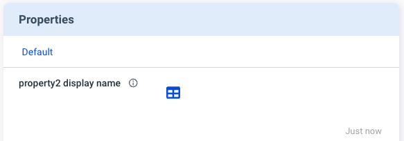

Click the table icon to view details.


### `$.params.modules[*].states[*]`

```json 
{
    "name": "...",
    "displayName": "...",
    "displayCategory": "...",
    "description": "...",
    "displayType": "...",
}
```

| Name | Type | Required | Description |
| --- | --- | --- | --- |
| `"name"` | String |  | The state name unique within the module and having a string format of no longer than 32 characters. The name must match the regular expression[^1].  |
| `"displayName"` | String |   | The field name displayed under the state. |
| `"displayCategory"` | String |   | The name of the Category tab displayed on a card. States with the same displayCategory are categorized under the same tab. |
| `"description"` | String |   | The description of the state. |
| `"displayType"` | String |  |  [`"string"`](#displaytypestring-in-states) \| [`"table"`](#displaytypetable-in-states) \| [`"link"`](#displaytypelink-in-states) |

### `$.params.modules[*].metrics[*]`

```json
{
    "name": "...",
    "displayName": "...",
    "displayCategory": "...",
    "description": "...",
    "displayUnit": "...",
    "displayType": "...",
}
```

| Name | Type | Required | Description |
| --- | --- | --- | --- |
| `"name"` | String |  | The name of the set of metrics, which is unique within the module and having a string format of no longer than 32 characters. The name must match the regular expression1.[^1].  |
| `"displayName"` | String |   |  The field name displayed under the metrics. |
| `"displayCategory"` | String |   | The name of the Category tab displayed on a card. Metrics with the same displayCategory are categorized under the same tab.|
| `"description"` | String |   | The description of the metric. |
| `"displayUnit"` | String | Depending on `"displayType"` | If the `"displayType"` is `"custom"`, the display unit should be entered. |
| `"displayType"` | String |  | [`"temperature"`](#displaytypetemperature-in-metrics) \| [`"custom"`](#displaytypecustom-in-metrics)|

### `$.params.modules[*].events[*]`

```json
{
    "name": "...",
    "displayName": "...",
    "displayCategory": "...",
    "description": "...",
}
```

| Name | Type | Required | Description |
| --- | --- | --- | --- |
| `"name"` | String |  | The event name unique within the module and having a string format of no longer than 32 characters. The name must match the regular expression[^1]. |
| `"displayName"` | String |   | The field name displayed under the event |
| `"displayCategory"` | String |   | The name of the Category tab displayed within a card. Events with the same displayCategory are categorized under the same tab. |
| `"description"` | String |   | The description of the event. |

### `$.params.modules[*].commands[*]`

```json
{
    "name": "...",
    "displayCategory": "...",
    "displayName": "...",
    "description": "...",
    "type": "...",
    "params": [
        {
            "name": "...",
            "displayName": "...",
            "description": "...",
            "displayType": "...",
            "required": true | false,
            "requiredOn": "...",
            "defaultValue": "...",
            "displayMask": "...",
            "valueEncoding": "..."
        }, ...
    ]
}
```

| Name | Type | Required | Description |
| --- | --- | --- | --- |
| `"name"` | String |  | The command name unique within the module and having a string format of no longer than 32 characters. The name must match the regular expression[^1].  |
| `"displayCategory"` | String |   | The name of the Category tab displayed on a card. Commands with the same displayCategory are categorized under the same tab. |
| `"displayName"` | String |   | The field name under the command.|
| `"description"` | String |   | The description of the command. |
| `"type"` | String |  | `"asynchronous"` |
| [`"params"`](#paramsmodulescommandsparams) | Array |   | (No need to set this item if this command has no parameters.) |

#### `$.params.modules[*].commands[*].params[*]`

| Name | Type | Required | Description |
| --- | --- | --- | --- |
| `"name"` | String |  | The command parameter name unique within the command and having a string format of no longer than 32 characters. The name must match the regular expression[^1]. |
| `"displayName"` | String |   | The field name under the command parameter. |
| `"description"` | String |   | The description of the command parameter. |
| `"displayType"` | String |  |  [`"string"`](#displaytypestring-in-commands) \| [`"text"`](#displaytypetext-in-commands) \| [`"datetime"`](#displaytypedatetime-in-commands) \| [`"switch"`](#displaytypeswitch-in-commands) \| [`"checkbox"`](#displaytypecheckbox-in-commands) \| [`"list"`](#displaytypelist-in-commands) \| [`"tos"`](#displaytypetos-in-commands)  |
| `"required"` | Bool |  | Indicates if this parameter is mandatory or not.|
| `"requiredOn"` | String |   | Indicates if this parameter is mandatory on the other parameter. |
| `"displayValues"` | String \| Array |   | Related to the `"displayType"`. |
| `"defaultValue"` | String |   | The default value of this parameter. |
| `"displayFormat"` | String | Depending on `"displayType"` | A property for the `"datetime"` displayType. Refer to the [datetime format](#displaytypedatetime-in-commands). |
| `"valueFromProperty"` | String |   | (This function is only used in special scenarios. Contact your Allxon representative for instructions.) |
| `"displayMask"` | Bool |   |  (Not implemented in the Portal yet.) |
| `"valueEncoding"` | String |   | Advance |
| `"displayOnProperty"` | String |   | (This function is only used in special scenarios. Contact your Allxon representative for instructions.)|

### `$.params.modules[*].alarms[*]`

```json
{
    "name": "...",
    "displayCategory": "...",
    "displayName": "...",
    "description": "...",
    "params": [
        {
            "name": "...",
            "displayName": "...",
            "description": "...",
            "displayType": "...",
            "required": true | false,
            "displayValues": "...",
            "defaultValue": "...",
            "displayFormat": "...",
            "valueFromProperty": "...",
            "displayMask": "...",
            "valueEncoding": "..."
        }, ...
    ]
}
```

| Name | Type | Required | Description |
| --- | --- | --- | --- |
| `"name"` | String |  |The alarm name unique within the module and having a string format of no longer than 32 characters. The name must match the regular expression[^1]. |
| `"displayCategory"` | String |   | The name of the category tab displayed on a card.Alarms with the same displayCategory are categorized under the same tab. |
| `"displayName"` | String |   | The field name displayed under the alarm. |
| `"description"` | String |   | The description of the alarm. |
| [`"params"`](#paramsmodulesalarmsparams) | Array |   | (No need to set this item if this alarm has no parameters.) |

#### `$.params.modules[*].alarms[*].params[*]`

| Name | Type | Required | Description |
| --- | --- | --- | --- |
| `"name"` | String |  | The parameter name unique within the alarm and having a string format of no longer than 32 characters. The name must match the regular expression[^1]. |
| `"displayName"` | String |   | The field name displayed under the alarm parameter.  |
| `"description"` | String |   | The description of the alarm parameter. |
| `"displayType"` | String |  | [`"string"`](#displaytypestring-in-alarms) \| [`"datetime"`](#displaytypedatetime-in-alarms) \| [`"switch"`](#displaytypeswitch-in-alarms) \| [`"checkbox"`](#displaytypecheckbox-in-alarms) \| [`"list"`](#displaytypelist-in-alarms) \| [`"temperature"`](#displaytypetemperature-in-alarms)  |
| `"required"` | Bool |  | Indicates if this parameter is mandatory or not. |
| `"displayValues"` | String |   | Related to the `"displayType"`. |
| `"defaultValue"` | String |   | The default value of this parameter. |
| `"displayFormat"` | String | Depending on `"displayType"` | A required property if the displayType is `"datetime"`. Refer to the [datetime format](#displaytypedatetime-in-alarms). |
| `"valueFromProperty"` | String |   | (This function is only used in special scenarios. Contact your Allxon representative for instructions.)|
| `"displayMask"` | Bool |   | A property for the `"string"` displayType, indicating if the string inputs are masked or not. |
| `"valueEncoding"` | String |   | (This function is only used in special scenarios. Contact your Allxon representative for instructions.)|

### `$.params.modules[*].config[*]`

```json
{
    "name": "...",
    "displayCategory": "...",
    "displayName": "...",
    "description": "...",
    "params": [
        {
            "name": "...",
            "displayName": "...",
            "description": "...",
            "displayType": "...",
            "required": true | false,
            "displayValues": "...",
            "defaultValue": "...",
            "displayFormat": "...",
            "valueFromProperty": "...",
            "displayMask": "...",
            "valueEncoding": "..."
        }, ...
    ]
}
```

| Name | Type | Required | Description |
| --- | --- | --- | --- |
| `"name"` | String |  |  The config name unique within the module and having a string format of no longer than 32 characters. The name must match the regular expression[^1].   |
| `"displayCategory"` | String |   | The name of the category tab displayed on a card. Configs with the same displayCategory are categorized under the same tab. |
| `"displayName"` | String |   | TThe field name displayed under the config.|
| `"description"` | String |   | The description of the config. |
| [`"params"`](#paramsmodulesconfigparams) | Array |   |(No need to set this item if this config has no parameters.)  |

#### `$.params.modules[*].config[*].params[*]`

| Name | Type | Required | Description |
| --- | --- | --- | --- |
| `"name"` | String |  |  The command parameter name unique within the config and having a string format of no longer than 32 characters. The name must match the regular expression[^1]. |
| `"displayName"` | String |   | The field name under the config parameter. |
| `"description"` | String |   | The description of the config parameter. |
| `"displayType"` | String |  | [`"string"`](#displaytypestring-in-configs) \| [`"datetime"`](#displaytypedatetime-in-configs) \| [`"switch"`](#displaytypeswitch-in-configs) \| [`"checkbox"`](#displaytypecheckbox-in-configs) \| [`"list"`](#displaytypelist-in-configs) \| [`"temperature"`](#displaytypetemperature-in-configs) |
| `"required"` | Bool |  | Indicates if this parameter is mandatory or not. |
| `"displayValues"` | String |   | Related to the `"displayType"` |
| `"defaultValue"` | String |   | Default value of this parameter. |
| `"displayFormat"` | String | Depending on `"displayType"` | A property for the `"datetime"` displayType. Refer to the [datetime format](#displaytypedatetime-in-configs). |
| `"valueFromProperty"` | String |   | (This function is only used in special scenarios. Contact your Allxon representative for instructions.) |
| `"displayMask"` | Bool |   | A property for the `"string"` displayType, indicating if the string inputs are masked or not. |
| `"valueEncoding"` | String |   | (This function is only used in special scenarios. Contact your Allxon representative for instructions.) |

## `"v2/notifyPluginCommand"`

Direction: Agent → Plugin

```json
{
    "jsonrpc": "2.0",
    "method": "v2/notifyPluginCommand",
    "params": {
        "serialNumber": "...",
        "appGUID": "...",
        "epoch": "...",
        "commandId": "...",
        "commandSource": "...",
        "moduleName": "...",
        "commands": [ ... ]
    }
}
```

#### `$.params`

| Name | Type | Required | Description |
| --- | --- | --- | --- |
| `"serialNumber"` | String |   | (This function is only used in special scenarios. Contact your Allxon representative for instructions.) The serial number of the device behind a gateway, only required when sending commands to devices behind a gateway.  |
| `"appGUID"` | String |  | The GUID of the plugin. |
| `"epoch"` | String |  | The current Epoch Time in seconds. |
| `"commandId"` | String |  | The assistId in MQTT message. |
| `"commandSource"` | String |  | `"remote"` |
| `"moduleName"` | String |  | The name of the module. The name must match the regular expression[^1].  |
| [`"commands"`](#paramscommands) | Array |  | A set of modules. |

#### `$.params.commands[*]`

| Name | Type | Required | Description |
| --- | --- | --- | --- |
| `"name"` | String |  | The name of the command. The name must match the regular expression[^1]. |
| [`"params"`](#paramscommandsparams) | Array |   | A set of name and value pairs for the command. |

#### `$.params.commands[*].params[*]`

| Name | Type | Required | Description |
| --- | --- | --- | --- |
| `"name"` | String |  | The name of the parameter. The name must match the regular expression[^1]. |
| `"value"` | Object \| String |  | The type of `"value"` depends on the `"displayType"` in the command parameter part of `"v2/notifyPluginUpdate"`. [More details...](#paramsmodulescommandsparams). |

#### `"displayType":"string"` in `"commands"`
Based on the `"displayType":"string"` defined in `"v2/notifyPluginUpdate"`, the **Commands** card displays a text box for the user to enter a string parameter.


See the JSON example below:

```json title="v2/notifyPluginUpdate.json"
{
    ...
    "commands": [ 
        {
            "name": "command1",
            "params": [
                {
                    "name": "stringParam",
                    "displayType": "string",                
                    "required": false,
                    ...
                }
            ],
            ...
        }
    ],
}
```
With this setting, the user can enter a string parameter, such as "foo" in the example below, and execute the command.
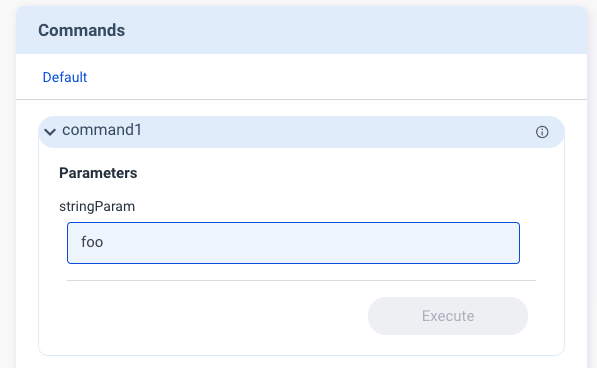

Then `"v2/notifyPluginCommand"` is sent out, carrying the command of `"value": "foo"`.

```json title="v2/notifyPluginCommand.json"
{
    ...
    "commands": [
        {
            "name": "command1",
            "params": [
               {
                  "name": "stringParam",
                  "value": "foo"
               }
            ]
        }
    ]
}
```

#### `"displayType":"datetime"` in `"commands"`

If `"v2/notifyPluginUpdate"` has `"displayType":"datetime"`, you must define `"displayFormat"` by using one of the following formats:

- `"YYYY-MM-DD"`
- `"HH:MM"`
- `"YYYY-MM-DD HH:MM"`

Then the **Commands** card on the Portal displays a corresponding field. Here is an example showing the field with `"displayFormat"` being `"HH:MM"`


See the JSON example below:


```json title="v2/notifyPluginUpdate.json"
{
    ...
    "commands": [ 
        {
            "name": "command1",
            "params": [
                {
                    "name": "dateParam",
                    "displayType": "datetime",                
                    "required": false,
                    "displayFormat": "HH:MM",
                    ...
                }
            ],
            ...
        }
    ],
}
```


When the user selects a time, for example “12:00”, and executes the command, `"v2/notifyPluginCommand"` is sent out. The value in the command follows the format of `"displayFormat": "HH:MM"`


See the JSON example below:

```json title="v2/notifyPluginCommand.json"
{
    ...
    "commands": [
        {
            "name": "command1",
            "params": [
               {
                  "name": "dateParam",
                  "value": "12:00"
               }
            ]
        }
    ]
}
```

#### `"displayType":"text"` in `"commands"`

If you set `"displayType"` to `"text"` in `"v2/notifyPluginUpdate"`, the `"value"` in the command can contain multiple lines of parameters. The **Commands** card on the Portal displays a text parameter field. 

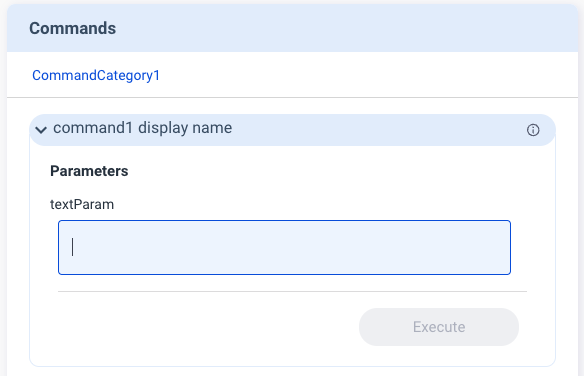

See the JSON example below:

```json title="v2/notifyPluginUpdate.json"
{
    ...
    "commands": [ 
        {
            "name": "command1",
            "params": [
                {
                    "name": "textParam",
                    "displayType": "text",                
                    "required": false,
                    ...
                }
            ],
            ...
        }
    ],
}
```

Here is an example of how this works:

The user enters “hello world” in two lines and executes the command. 


This sends out `"v2/notifyPluginCommand"` with `"value":"hello\nworld"`.

```json title="v2/notifyPluginCommand.json"
{
    ...
    "commands": [
        {
            "name": "command1",
            "params": [
               {
                  "name": "dateParam",
                  "value": "hello\nworld"
               }
            ]
        }
    ]
}
```

#### `"displayType":"switch"` in `"commands"`

The **switch** function is used to switch between two parameters. The **Commands** card displays a toggle button for the user to make the change, as shown below.


If you set `"displayType"` to `"switch"` in `"v2/notifyPluginUpdate"`, you must define `"displayValues"` as a size 2 Array, with index 0 representing false and index 1 representing true.

```json title="v2/notifyPluginUpdate.json"
{
    ...
    "commands": [ 
        {
            "name": "command1",
            "params": [
                {
                    "name": "switchParam",
                    "displayType": "switch",                
                    "displayValues": [
                        "offValue",
                        "onValue"
                    ],
                    "defaultValue": "offValue",
                    "required": false,
                    ...
                }
            ],
            ...
        }
    ],
}
```

After the user executes the command, `"v2/notifyPluginCommand"` is sent out. The value in the command follows the `"displayValues"` defined in `"v2/notifyPluginUpdate"`. 


```json title="v2/notifyPluginCommand.json"
{
    ...
    "commands": [
        {
            "name": "command1",
            "params": [
               {
                  "name": "switchParam",
                  "value": "offValue"
               }
            ]
        }
    ]
}
```

#### `"displayType":"checkbox"` in `"commands"`

The **Commands** card displays a checkbox for the user to enable or disable this parameter.

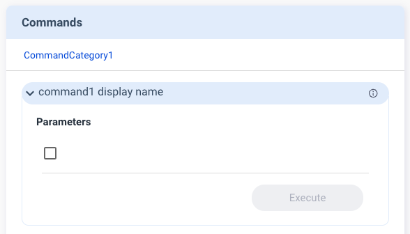

If you set `"displayType"` to `"checkbox"` in `"v2/notifyPluginUpdate"`, you must define `"displayValues"` as a size 2 Array, with index 0 representing false and index 1 representing true.

```json title="v2/notifyPluginUpdate.json"
{
    ...
    "commands": [ 
        {
            "name": "command1",
            "params": [
                {
                    "name": "checkboxParam",
                    "displayType": "checkbox",                
                    "displayValues": [
                        "offValue",
                        "onValue"
                    ],
                    "defaultValue": "offValue",
                    "required": false,
                    ...
                }
            ],
            ...
        }
    ],
}
```

After the user executes the command, `"v2/notifyPluginCommand"` is sent out. The value in the command follows the `"displayValue"` defined in `"v2/notifyPluginUpdate"`.

```json title="v2/notifyPluginCommand.json"
{
    ...
    "commands": [
        {
            "name": "command1",
            "params": [
               {
                  "name": "checkboxParam",
                  "value": "offValue"
               }
            ]
        }
    ]
}
```

#### `"displayType":"list"` in `"commands"`

The **list** function enables the user to select a parameter from a dropdown menu.

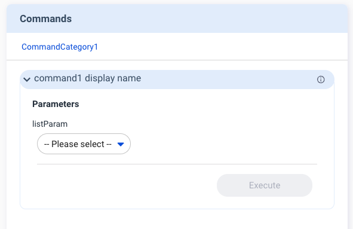


If you set `"displayType"` to `"list"` in `"v2/notifyPluginUpdate"`, you must define `"displayValues"` as the `"Array"` type.

See the JSON example below.

```json title="v2/notifyPluginUpdate.json"
{
    ...
    "commands": [ 
        {
            "name": "command1",
            "params": [
                {
                    "name": "listParam",
                    "displayType": "list",
                    "displayValues": [
                        "list1",
                        "list2"
                    ],
                    "required": false
                    ...
                }
            ],
            ...
        }
    ],
}
```
After the user executes the command, `"v2/notifyPluginCommand"` is sent out. The value in the command follows the `"displayValues"` defined in `"v2/notifyPluginUpdate"`. 


See the JSON example below.

```json title="v2/notifyPluginCommand.json"
{
    ...
    "commands": [
        {
            "name": "command1",
            "params": [
               {
                  "name": "listParam",
                  "value": "list1"
               }
            ]
        }
    ]
}
```

#### `"displayType":"tos"` in `"commands"`

"tos" stands for **Terms of Service**. Use this `"displayType"` if a command requires the user to agree to the Terms of Service before command execution. With this setting, the user agreement is mandatory on the Portal before the user can click the **Execute** button.


If you set `"displayType"` to `"tos"` in `"v2/notifyPluginUpdate"`, you must define `"displayName"` and description. Put your Terms of Service link in description.

See the JSON example below.

```json title="v2/notifyPluginUpdate.json"
{
    ...
    "commands": [ 
        {
            "name": "command1",
            "params": [
                {
                    "name": "tosParam",
                    "displayType": "tos",
                    "displayName": "Terms of Service",
                    "description": "https://policies.google.com/terms?hl=en-US",
                    "required": true
                    ...
                }
            ],
            ...
        }
    ],
}
```
After the user executes the command, `"v2/notifyPluginCommand"` is sent out, carrying `"value": false`.

```json title="v2/notifyPluginCommand.json"
{
    ...
    "commands": [
        {
            "name": "command1",
            "params": [
               {
                  "name": "tosParam",
                  "value": false
               }
            ]
        }
    ]
}
```

:::caution
The type of `"value"` is Bool.
:::

## `"v2/notifyPluginCommandAck"`

Direction: Plugin → Agent

```json
{
    "jsonrpc": "2.0",
    "method": "v2/notifyPluginCommandAck",
    "params": {
        "serialNumber": "...",
        "appGUID": "...",
        "epoch": "...",
        "commandId": "...",
        "commandSource": "...",
        "moduleName": "...",
        "commandState": "...",
        "commandAcks": [
            {
                "name": "...",
                "result": { ... }
            }, ...
        ],
        "states": [
            {
                "name": "...",
                "value": "..."
            }, ...
        ]
    }
}
```

#### `$.params`

| Name | Type | Required | Description |
| --- | --- | --- | --- |
| `"serialNumber"` | String |   | ( This function is only used in special scenarios. Contact your Allxon representative for instructions.) The serial number of the device behind a gateway, only required when you send commands to devices behind a gateway. |
| `"appGUID"` | String |  | The GUID of the plugin. |
| `"epoch"` | String |  | The current Epoch Time in seconds. |
| `"commandId"` | String |  | The same commandId retrieved from `"v2/notifyPluginCommand"`. |
| `"commandSource"` | String |  | The same commandSource retrieved from `"v2/notifyPluginCommand"`. |
| `"moduleName"` | String |  | The same moduleName retrieved from `"v2/notifyPluginCommand"`. The name must match the regular expression[^1]. |
| `"commandState"` | String |  | `"ACCEPTED"`: Plugin reports that a request for command execution is received.<br/>`"REJECTED"`: Plugin reports that the request for command execution is rejected.<br/>`"ACKED"`: Plugin reports that the command execution is completed.<br/>`"ERRORED"`: Plugin reports that the command execution failed. |
| [`"commandAcks"`](#paramscommandacks) | Array |  |  |
| [`"states"`](#paramsstates) | Array |  | The States that you want to update right after executing a command. |

#### `$.params.commandAcks[*]`

| Name | Type | Required | Description |
| --- | --- | --- | --- |
| `"name"` | String |  | The same command name retrieved from `"v2/notifyPluginCommand"`. |
| `"result"` | Object |   | The result of the command, defined by plugin. |

#### `$.params.states[*]`

| Name | Type | Required | Description |
| --- | --- | --- | --- |
| `"name"` | String |  | The same command name retrieved from `"v2/notifyPluginCommand"`. |
| `"value"` | Object \| Array \| String |  | The type of `"value"` depends on the `"displayType"` in state part of `"v2/notifyPluginUpdate"`. [More details...](#state-value-corresponding-to-displaytype-in-v2notifypluginupdate). |
| `"time"` | String |  | The Epoch Time in seconds of the state. |

## `"v2/notifyPluginState"`

Direction: Plugin → Agent

```json
{
    "jsonrpc": "2.0",
    "method": "v2/notifyPluginState",
    "params": {
        "appGUID": "...",
        "moduleName": "...",
        "epoch": "...",
        "states": [
            {
                "name": "...",
                "value": "..."
            }, ...
        ]
    }
}
```

#### `$.params`

| Name | Type | Required | Description |
| --- | --- | --- | --- |
| `"appGUID"` | String |  | The GUID of the plugin. |
| `"moduleName"` | String |  | The name of the module. The name must match the regular expression[^1] |
| `"epoch"` | String |  | The current Epoch Time in seconds. |
| [`"states"`](#paramsstates-1) | Array |  | A set of states. |

#### `$.params.states[*]`

| Name | Type | Required | Description |
| --- | --- | --- | --- |
| `"name"` | String |  | The name of the state. |
| `"value"` | Object \| Array \| String |  | The type of `"value"` depends on the `"displayType"` in state part of `"v2/notifyPluginUpdate"`. [More details...](#displaytypestring-in-states) |
| `"time"` | String |  | The current Epoch Time in seconds of the state. |


#### `"displayType":"string"` in `"states"`

If `"v2/notifyPluginUpdate"` uses `"displayType": "string"`, the state value is displayed in the string format.


```json title="v2/notifyPluginUpdate.json" 
{
    ...
    "states": [ 
        {
            "name": "stringState",
            "displayType": "string",
            ...
        },
        ...
    ]
}
```

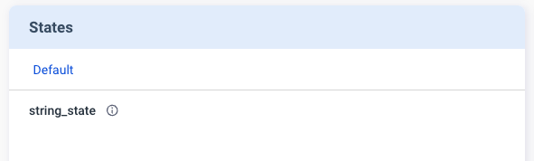

Accordingly, when `"v2/notifyPluginState"` is sent to update the state value, The type of `"value"` must be String.


Example:

```json title="v2/notifyPluginState.json" 
{
    "jsonrpc": "2.0",
    "method": "v2/notifyPluginState",
    "params": {
        "states": [ 
            {
                "name": "stringState",
                "value": "my state string"
            },
            ...
        ]
    }
}
```
Then the **States** card is updated, as shown below.


#### `"displayType":"link"` in `"states"`

If `"v2/notifyPluginUpdate"` uses `"displayType": "link"`, the state value is a URL that leads to an external resource.

Example:
```json title="v2/notifyPluginUpdate.json" 
{
    ...
    "states": [ 
        {
            "name": "linkState",
            "displayType": "link",
            ...
        },
        ...
    ]
}
```

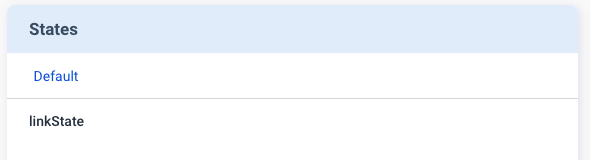

Accordingly, when `"v2/notifyPluginState"` is sent to update the state value, the type of `"value"` must be Object and follows the format below.

| Name | Type | Required | Description |
| --- | --- | --- | --- |
| `url` | String |  | A link to an external resource. |
| `alias` | String |  | An alias name for this URL.|

See the JSON example below:

```json title="v2/notifyPluginState.json" 
{
    "jsonrpc": "2.0",
    "method": "v2/notifyPluginState",
    "params": {
        ...
        "states": [ 
            {
                "name": "linkState",
                "value": {
                    "url": "https://www.google.com",
                    "alias": "Google Site"
                }
            },
            ...
        ]
    }
}
```

Then the **States** card is updated, as shown below.


#### `"displayType":"table"` in `"states"`

If `"v2/notifyPluginUpdate"` uses `"displayType": "table"`, the state value is displayed in a table.

Example:

```json title="v2/notifyPluginUpdate.json" 
{
    ...
    "states": [ 
        {
            "name": "tableState",
            "displayType": "table",
            ...
        },
        ...
    ]
}
```

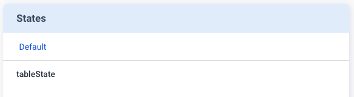

When `"v2/notifyPluginState"` is sent to update the state value, the type of `"value"` must be Array. 

See the JSON example below:


```json title="v2/notifyPluginState.json" 
{
    "jsonrpc": "2.0",
    "method": "v2/notifyPluginState",
    "params": {
        ...
        "states": [ 
            {
                "name": "tableState",
                "value": [
                    {
                        "header1": "row1 column1",
                        "header2": "row1 column2"
                    },
                    {
                        "header1": "row2 column2",
                        "header2": "row2 column2"
                    }
                ]
            }
        ]
    }
}
```

Then, the **States** card displays a table icon.

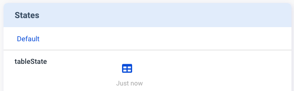

Just click the table icon to bring up a window to show the details.


## `"v2/notifyPluginMetric"`

Direction: Plugin → Agent

```json
{
    "jsonrpc": "2.0",
    "method": "v2/notifyPluginMetric",
    "params": {
        "appGUID": "...",
        "moduleName": "...",
        "epoch": "...",
        "metrics": [
            {
                "name": "...",
                "value": "..."
            }, ...
        ]
    }
}
```

#### `$.params`

| Name | Type | Required | Description |
| --- | --- | --- | --- |
| `"appGUID"` | String |  | The GUID of the plugin. |
| `"moduleName"` | String |  | The name of the module, The name must match the regular expression[^1]. |
| `"epoch"` | String |  | The current Epoch Time in seconds. |
| [`"metrics"`](#paramsmetrics) | Array |  | A set of metrics. |

#### `$.params.metrics[*]`

| Name | Type | Required | Description |
| --- | --- | --- | --- |
| `"name"` | String |  | The name of the metric. |
| `"value"` | String |  | The type of `"value"` depends on the `"displayType"` in metric part of `"v2/notifyPluginUpdate"`. The number of value supports up to fifteen digits and two decimal places. Refer to [Details](#displaytypetemperature-in-metrics).|
| `"time"` | String |  | The Epoch Time in seconds of the metrics. |

#### `"displayType":"temperature"` in `"metrics"`

If the `"displayType"` is set to `"temperature"`, the Portal displays a toggle button for switching between <sup>o</sup>F/<sup>o</sup>C (Fahrenheit/ Celsius).

Example:

```json title="v2/notifyPluginUpdate.json" 
{
    ...
    "metrics": [ 
        {
            "name": "temperatureMetric",
            "displayType": "temperature",
            ...
        },
        ...
    ]
}
```

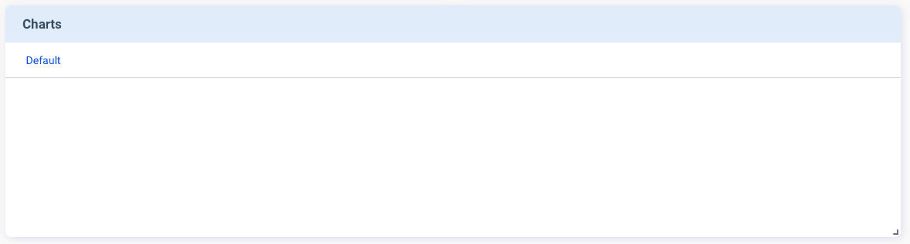

When `"v2/notifyPluginMetrics"` is sent to update the metric value, the `"value"` SHOULD be reported in unit of **Kelvin**.

```json title="v2/notifyPluginMetric.json" 
{
    "jsonrpc": "2.0",
    "method": "v2/notifyPluginMetric",
    "params": {
        ...
        "metrics": [ 
            {
                "name": "temperatureMetric",
                "value": "298"
            },
            ...
        ]
    }
}
```
The Portal converts the metric unit from **Kelvin** to **Fahrenheit** and **Celsius**.


#### `"displayType":"custom"` in `"metrics"`

If `"displayType"` is set to `"custom"`, you must define `"displayUnit"` as the unit of the metrics.

See the JSON example below:

```json title="v2/notifyPluginUpdate.json" 
{
    ...
    "metrics": [ 
        {
            "name": "customMetric",
            "displayType": "custom",
            "displayUnit": "degree",
            ...
        },
        ...
    ]
}
```


Use `"v2/notifyPluginMetrics"` to update the metric value. 
See the JSON example below:

```json title="v2/notifyPluginMetric.json" 
{
    "jsonrpc": "2.0",
    "method": "v2/notifyPluginMetric",
    "params": {
        ...
        "metrics": [ 
            {
                "name": "customMetric",
                "value": "30"
            },
            ...
        ]
    }
}
```
The **Charts** card is updated accordingly, as shown below.


## `"v2/notifyPluginEvent"`

Direction: Plugin → Agent

```json
{
    "jsonrpc": "2.0",
    "method": "v2/notifyPluginEvent",
    "params": {
        "appGUID": "...",
        "moduleName": "...",
        "epoch": "...",
        "events": [
            {
                "name": "...",
                "value": "..."
            }, ...
        ]
    }
}
```

#### `$.params`

| Name | Type | Required | Description |
| --- | --- | --- | --- |
| `"appGUID"` | String |  | The GUID of the plugin. |
| `"moduleName"` | String |  | The name of the module. The name must match the regular expression[^1] |
| `"epoch"` | String |  | The current Epoch Time in seconds. |
| [`"events"`](#paramsevents) | Array |  | A set of events |

#### `$.params.events[*]`

| Name | Type | Required | Description |
| --- | --- | --- | --- |
| `"name"` | String |  | The name of the event. |
| `"value"` |  String |  | The value of the event. |
| `"time"` | String |  | The Epoch Time in seconds of the event. |

## `"v2/notifyPluginConfigUpdate"`

Direction: Agent → Plugin

```json
{
    "jsonrpc": "2.0",
    "method": "v2/notifyPluginConfigUpdate",
    "params": {
        "appGUID": "...",
        "epoch": "...",
        "version": "...",
        "modules": [
            {
                "moduleName": "...",
                "epoch": "...",
                "configs": [
                    {
                        "name": "...",
                        "params": [
                            {
                                "name": "...",
                                "value": "..."
                            },
                            ...
                        ]
                    },
                    ...
                ]
            }
        ]
    }
}
```

#### `$.params`

| Name | Type | Required | Description |
| --- | --- | --- | --- |
| `"appGUID"` | String |  | The GUID of the plugin. |
| `"epoch"` | String |  | The current Epoch Time in seconds. |
| `"version"` | String |  | The version of the plugin config. |
| [`"modules"`](#paramsmodules-1) | Array |  | A set of modules. |

#### `$.params.modules[*]`

| Name | Type | Required | Description |
| --- | --- | --- | --- |
| `"moduleName"` | String |  | The name of the module. The name must match the regular expression[^1]. |
| `"epoch"` | String |  | The Epoch time in seconds when an update is made. Plugin should update the module’s config based on the latest Epoch time. |
| [`"configs"`](#paramsmodulesconfigs) | Array |  | A set of configs. |

#### `$.params.modules[*].configs[*]`

| Name | Type | Required | Description |
| --- | --- | --- | --- |
| `"name"` | String |  | The name of the config. The name must match the regular expression[^1]. |
| [`"params"`](#paramsmodulesconfigsparams) | Array |  |A set of name and value pairs for the configs. The maximum total size of the configs is up to 1024 bytes. |

#### `$.params.modules[*].configs[*].params[*]`

| Name | Type | Required | Description |
| --- | --- | --- | --- |
| `"name"` | String |  | The name of the parameter. The name must match the regular expression[^1]. |
| `"value"` | String |  | The type of `"value"` depends on the `"displayType"` in configs part of `"v2/notifyPluginUpdate"`. [More details](#displaytypestring-in-configs). |

#### `"displayType":"string"` in `"configs"`

Based on `"displayType": "string"` defined in `"v2/notifyPluginUpdate"`, the **Configs** card displays a text box for the user to enter a string parameter.


See the JSON example below:

```json title="v2/notifyPluginUpdate.json"
{
    ...
    "configs": [ 
        {
            "name": "config1",
            "params": [
                {
                    "name": "stringParam",
                    "displayType": "string",                
                    "required": false,
                    ...
                },
                ...
            ],
            ...
        }
    ],
}
```

The user can enter a string parameter, such as “foo” in the example below, and update the parameter on the **Configs** card.


Then `"v2/notifyPluginConfigUpdate"` is sent out, carrying the config of `"value": "foo"`.

```json title="v2/notifyPluginConfigUpdate.json"
{
    "jsonrpc": "2.0",
    "method": "v2/notifyPluginConfigUpdate",
    ...
        ...
            ...
                "configs": [
                    {
                        "name": "config1",
                        "params": [
                            {
                                "name": "stringParam",
                                "value": "foo"
                            }
                            ...
                        ]
                        ...
                    }
                    ...
                ]
}

```


#### `"displayType":"datetime"` in `"configs"`

If `"v2/notifyPluginUpdate"` uses `"displayType": "datetime"`, you must define `"displayFormat"` using one of the following formats:

- `"YYYY-MM-DD"`
- `"HH:MM"`
- `"YYYY-MM-DD HH:MM"`

See the JSON example below.

```json title="v2/notifyPluginUpdate.json"
{
    ...
    "configs": [ 
        {
            "name": "config1",
            "params": [
                {
                    "name": "datetimeParam",
                    "displayType": "datetime",                
                    "displayFormat": "HH:MM",
                    "required": false,
                    ...
                },
                ...
            ],
            ...
        }
    ],
}
```


When the user selects a time, for example "06:00” and executes the command, `"v2/notifyPluginConfigUpdate"` is sent out. The `"value"` in the update follows the format of `"displayFormat": "HH:MM"`.

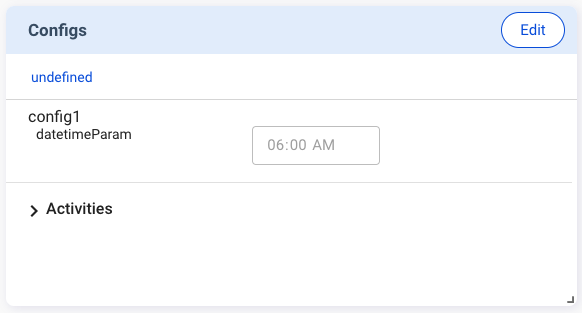

See the JSON example below:

```json title="v2/notifyPluginConfigUpdate.json"
{
    "jsonrpc": "2.0",
    "method": "v2/notifyPluginConfigUpdate",
    ...
        ...
            ...
                "configs": [
                    {
                        "name": "config1",
                        "params": [
                            {
                                "name": "datetimeParam",
                                "value": "06:00"
                            }
                            ...
                        ]
                        ...
                    }
                    ...
                ]
}
```

#### `"displayType":"switch"` in `"configs"`

The **switch** function is used to switch between two parameters. The **Configs** card displays a toggle switch for the user to make the change, as shown below.


See the JSON example as below.

```json title="v2/notifyPluginUpdate.json"
{
    ...
    "configs": [ 
        {
            "name": "config1",
            "params": [
                {
                    "name": "switchParam",
                    "displayType": "switch",                
                    "displayValues": [
                        "offValue",
                        "onValue"
                    ],
                    "defaultValue": "offValue",
                    "required": false,
                    ...
                }
            ],
            ...
        }
    ],
}
```
After the user updates the config, `"v2/notifyPluginConfigUpdate"` is sent out. The value in the command follows the `"displayValues"` defined in `"v2/notifyPluginUpdate"`.


```json title="v2/notifyPluginConfigUpdate.json"
{
    "jsonrpc": "2.0",
    "method": "v2/notifyPluginConfigUpdate",
    ...
        ...
            ...
                "configs": [
                    {
                        "name": "config1",
                        "params": [
                            {
                                "name": "switchParam",
                                "value": "offValue"
                            }
                            ...
                        ]
                        ...
                    }
                    ...
                ]
}
```

#### `"displayType":"checkbox"` in `"configs"`

The **Configs** card displays a checkbox for the user to enable or disable the parameter.


If you set `"displayType"` to `"checkbox"` in `"v2/notifyPluginUpdate"`, you must define `"displayValues"` as a size 2 Array, with index 0 representing false, index 1 representing true.

```json title="v2/notifyPluginUpdate.json"
{
    ...
    "configs": [ 
        {
            "name": "config1",
            "params": [
                {
                    "name": "checkboxParam",
                    "displayType": "checkbox",                
                    "displayValues": [
                        "offValue",
                        "onValue"
                    ],
                    "defaultValue": "offValue",
                    "required": false,
                    ...
                }
            ],
            ...
        }
    ],
}
```

After the user updates the config, `"v2/notifyPluginConfigUpdate"` is sent out. The value in the update follows the `"displayValues"` defined in `"v2/notifyPluginUpdate"`. 


```json title="v2/notifyPluginConfigUpdate.json"
{
    "jsonrpc": "2.0",
    "method": "v2/notifyPluginConfigUpdate",
    ...
        ...
            ...
                "configs": [
                    {
                        "name": "config1",
                        "params": [
                            {
                                "name": "checkboxParam",
                                "value": "offValue"
                            }
                            ...
                        ]
                        ...
                    }
                    ...
                ]
}
```

#### `"displayType":"list"` in `"configs"`

The **list** function enables the user to select a parameter from a dropdown menu.

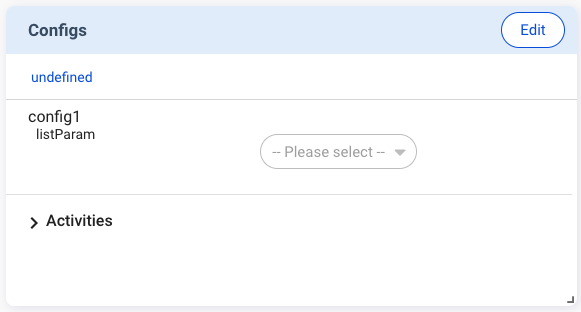

If you set `"displayType"` to `"list"` in `"v2/notifyPluginUpdate"` , you must define `"displayValues"` as the Array type.

See the JSON example below:

```json title="v2/notifyPluginUpdate.json"
{
    ...
    "configs": [ 
        {
            "name": "config1",
            "params": [
                {
                    "name": "listParam",
                    "displayType": "list",                
                    "displayValues": [
                        "list1",
                        "list2"
                    ],
                    "defaultValue": "list1",
                    "required": false,
                    ...
                }
            ],
            ...
        }
    ],
}
```

After the user updates the config, `"v2/notifyPluginConfigUpdate"` is sent out. The value in the update follows the `"displayValues"` defined in `"v2/notifyPluginUpdate"`. 

See the JSON example below:

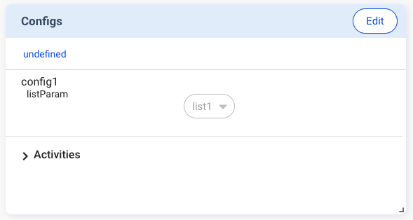

```json title="v2/notifyPluginConfigUpdate.json"
{
    "jsonrpc": "2.0",
    "method": "v2/notifyPluginConfigUpdate",
    ...
        ...
            ...
                "configs": [
                    {
                        "name": "config1",
                        "params": [
                            {
                                "name": "listParam",
                                "value": "list1"
                            }
                            ...
                        ]
                        ...
                    }
                    ...
                ]
}
```

#### `"displayType":"temperature"` in `"configs"`

If you set `"displayType"` to `"temperature"`, the user can enter temperature parameters in Fahrenheit or Celsius.


See the JSON example below:

```json title="v2/notifyPluginUpdate.json"
{
    ...
    "configs": [ 
        {
            "name": "config1",
            "params": [
                {
                    "name": "temperatureParam",
                    "displayType": "temperature",                
                    "required": false,
                    ...
                }
            ],
            ...
        }
    ],
}
```

Please note that while the user uses the Fahrenheit or Celsius scale on the Portal, the temperature scale sent to the plugin needs to be **Kelvin**.

Example:

The user enters “28 <sup>o</sup>C” on the **Configs** card. However, `v2/notifyPluginConfigUpdate.json` shows `"value":"301.15"`.


```json title="v2/notifyPluginConfigUpdate.json"
{
    "jsonrpc": "2.0",
    "method": "v2/notifyPluginConfigUpdate",
    ...
        ...
            ...
                "configs": [
                    {
                        "name": "config1",
                        "params": [
                            {
                                "name": "temperatureParam",
                                "value": "301.15"
                            }
                            ...
                        ]
                        ...
                    }
                    ...
                ]
}
```

## `"v2/notifyPluginAlarmUpdate"`

Direction: Agent → Plugin

```json
{
    "jsonrpc": "2.0",
    "method": "v2/notifyPluginAlarmUpdate",
    "params": {
        "appGUID": "...",
        "epoch": "...",
        "version": "...",
        "modules": [
            {
                "moduleName": "...",
                "epoch": "...",
                "alarms": [
                    {
                        "name": "...",
                        "enabled": true,
                        "params": [
                            {
                                "name": "...",
                                "value": "..."
                            },
                            ...
                        ]
                    },
                    ...
                ]
            }
        ]
    }
}
```

#### `$.params`

| Name | Type | Required | Description |
| --- | --- | --- | --- |
| `"appGUID"` | String |  | The GUID of the plugin. |
| `"epoch"` | String |  | The current Epoch Time in seconds. |
| `"version"` | String |  | The version of the plugin alarm. |
| [`"modules"`](#paramsmodules-2) | Array |  | A set of modules. |

#### `$.params.modules[*]`

| Name | Type | Required | Description |
| --- | --- | --- | --- |
| `"moduleName"` | String |  | The name of the module. The name must match the regular expression[^1]. |
| `"epoch"` | String |  | The Epoch time in seconds when an update is made. Plugin should update the module’s alarms based on the latest Epoch time. |
| [`"alarms"`](#paramsmodulesalarms-1) | Array |  | A set of alarms. |

#### `$.params.modules[*].alarms[*]`

| Name | Type | Required | Description |
| --- | --- | --- | --- |
| `"name"` | String |  | The name of the alarm. The name must match the regular expression[^1]. |
| `"enabled"` | Bool |  | Alarm is enabled. |
| [`"params"`](#paramsmodulesalarmsparams-1) | Array |  | A set of name and value pairs for the alarm. The maximum total size of the alarm is up to 1024 bytes |

#### `$.params.modules[*].alarms[*].params[*]`

| Name | Type | Required | Description |
| --- | --- | --- | --- |
| `"name"` | String |  | The name of the parameter. The name must match the regular expression[^1]. |
| `"value"` | String |  | The type of `"value"` depends on the `"displayType"` in alarm part of `"v2/notifyPluginUpdate"`. [More details](#displaytypestring-in-alarms). |

#### `"displayType":"string"` in `"alarms"`

Based on `"displayType": "string"` defined in `"v2/notifyPluginUpdate"`, the **Alert Settings** card displays a text box for the user to enter a string parameter.


See the JSON example below:

```json title="v2/notifyPluginUpdate.json"
{
    ...
    "alarms": [ 
        {
            "name": "alarm1",
            "params": [
                {
                    "name": "stringParam",
                    "displayType": "string",                
                    "required": false,
                    ...
                },
                ...
            ],
            ...
        }
    ],
}
```

The user can enter a string parameter, such as "foo” in the example below, and update the parameter on the **Alert Settings** card.


Then `"v2/notifyPluginAlarmUpdate"` is sent out, carrying `"value": "foo"`.

```json title="v2/notifyPluginAlarmUpdate.json"
{
    "jsonrpc": "2.0",
    "method": "v2/notifyPluginAlarmUpdate",
    ...
        ...
            ...
                "alarms": [
                    {
                        "name": "alarm1",
                        "params": [
                            {
                                "name": "stringParam",
                                "value": "foo"
                            }
                            ...
                        ]
                        ...
                    }
                    ...
                ]
}

```


#### `"displayType":"datetime"` in `"alarms"`

If `"v2/notifyPluginUpdate"` uses `"displayType": "datetime"`, you must define `"displayFormat"` using one of the following formats:

- `"YYYY-MM-DD"`
- `"HH:MM"`
- `"YYYY-MM-DD HH:MM"`

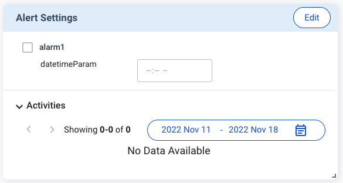

See the JSON example below:

```json title="v2/notifyPluginUpdate.json"
{
    ...
    "alarms": [ 
        {
            "name": "alarm1",
            "params": [
                {
                    "name": "datetimeParam",
                    "displayType": "datetime",                
                    "displayFormat": "HH:MM",
                    "required": false,
                    ...
                },
                ...
            ],
            ...
        }
    ],
}
```

When the user selects a time, for example "06:00”, to update the alert setting, `"v2/notifyPluginAlarmUpdate"` is sent out. The `"value"` in the update follows the format of `"displayFormat": "HH:MM"`.

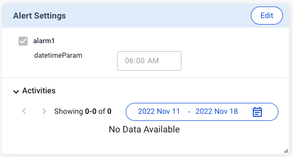

See the JSON example below:

```json title="v2/notifyPluginAlarmUpdate.json"
{
    "jsonrpc": "2.0",
    "method": "v2/notifyPluginAlarmUpdate",
    ...
        ...
            ...
                "alarms": [
                    {
                        "name": "alarm1",
                        "params": [
                            {
                                "name": "datetimeParam",
                                "value": "06:00"
                            }
                            ...
                        ]
                        ...
                    }
                    ...
                ]
}
```

#### `"displayType":"switch"` in `"alarms"`

The **switch** function is used to switch between two parameters. The **Alert Settings** card displays a toggle button for the user to make the change, as shown below.

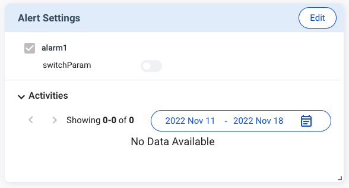

If you set `"displayType"` to `"switch"` in `"v2/notifyPluginUpdate"`, you must define `"displayValues"` as a size 2 Array, with index 0 representing false and index 1 representing true.

```json title="v2/notifyPluginUpdate.json"
{
    ...
    "alarms": [ 
        {
            "name": "alarm1",
            "params": [
                {
                    "name": "switchParam",
                    "displayType": "switch",                
                    "displayValues": [
                        "offValue",
                        "onValue"
                    ],
                    "defaultValue": "offValue",
                    "required": false,
                    ...
                }
            ],
            ...
        }
    ],
}
```

After the user updates the alert settings, `"v2/notifyPluginAlarmUpdate"` is sent out. The value in the update follows the `"displayValues"` defined in `"v2/notifyPluginUpdate"`.

```json title="v2/notifyPluginAlarmUpdate.json"
{
    "jsonrpc": "2.0",
    "method": "v2/notifyPluginAlarmUpdate",
    ...
        ...
            ...
                "alarms": [
                    {
                        "name": "alarm1",
                        "params": [
                            {
                                "name": "switchParam",
                                "value": "offValue"
                            }
                            ...
                        ]
                        ...
                    }
                    ...
                ]
}
```

#### `"displayType":"checkbox"` in `"alarms"`

The **Alert Settings** card displays a checkbox for the user to enable or disable the parameter.


If you set `"displayType"` to `"checkbox"` in `"v2/notifyPluginUpdate"`, you must define `"displayValues"` as a size 2 Array, with index 0 representing false and index 1 representing true.


```json title="v2/notifyPluginUpdate.json"
{
    ...
    "alarms": [ 
        {
            "name": "alarm1",
            "params": [
                {
                    "name": "checkboxParam",
                    "displayType": "checkbox",                
                    "displayValues": [
                        "offValue",
                        "onValue"
                    ],
                    "defaultValue": "offValue",
                    "required": false,
                    ...
                }
            ],
            ...
        }
    ],
}
```

After the user updates the alert settings, `"v2/notifyPluginAlarmUpdate"` is sent out. The value in the update follows the `"displayValues"` defined in `"v2/notifyPluginUpdate"`    

```json title="v2/notifyPluginAlarmUpdate.json"
{
    "jsonrpc": "2.0",
    "method": "v2/notifyPluginAlarmUpdate",
    ...
        ...
            ...
                "alarms": [
                    {
                        "name": "alarm1",
                        "params": [
                            {
                                "name": "checkboxParam",
                                "value": "offValue"
                            }
                            ...
                        ]
                        ...
                    }
                    ...
                ]
}
```

#### `"displayType":"list"` in `"alarms"`

The **list** function enables the user to select a parameter from a dropdown menu on the **Alert Settings** card.

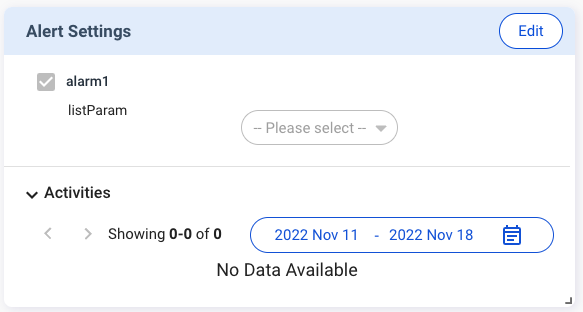

If you set `"displayType"` to `"list"` in `"v2/notifyPluginUpdate"`, you must define `"displayValues"` as the Array type.

See the JSON example below:

```json title="v2/notifyPluginUpdate.json"
{
    ...
    "alarms": [ 
        {
            "name": "alarm1",
            "params": [
                {
                    "name": "listParam",
                    "displayType": "list",                
                    "displayValues": [
                        "list1",
                        "list2"
                    ],
                    "defaultValue": "list1",
                    "required": false,
                    ...
                }
            ],
            ...
        }
    ],
}
```
After the user updates the alert settings, `"v2/notifyPluginAlarmUpdate"` is sent out. The value in the update follows the `"displayValues"` defined in `"v2/notifyPluginUpdate"`.


See the JSON example below: 

```json title="v2/notifyPluginAlarmUpdate.json"
{
    "jsonrpc": "2.0",
    "method": "v2/notifyPluginAlarmUpdate",
    ...
        ...
            ...
                "alarms": [
                    {
                        "name": "alarm1",
                        "params": [
                            {
                                "name": "listParam",
                                "value": "list1"
                            }
                            ...
                        ]
                        ...
                    }
                    ...
                ]
}
```

#### `"displayType":"temperature"` in `"alarms"`

If you set `"displayType"` to `"temperature"`, the user can enter temperature parameters in Fahrenheit or Celsius.


See the JSON example below:

```json title="v2/notifyPluginUpdate.json"
{
    ...
    "alarms": [ 
        {
            "name": "alarm1",
            "params": [
                {
                    "name": "temperatureParam",
                    "displayType": "temperature",                
                    "required": false,
                    ...
                }
            ],
            ...
        }
    ],
}
```

Please note that while the user uses the Fahrenheit or Celsius scale on the Portal, the temperature scale sent to the plugin needs to be **Kelvin**.

Example:

The user enters 28<sup>o</sup>C on the **Alert Settings** card. However, `v2/notifyPluginAlarmUpdate.json` shows `"value":"301.15"`.


```json title="v2/notifyPluginAlarmUpdate.json"
{
    "jsonrpc": "2.0",
    "method": "v2/notifyPluginAlarmUpdate",
    ...
        ...
            ...
                "alarms": [
                    {
                        "name": "alarm1",
                        "params": [
                            {
                                "name": "temperatureParam",
                                "value": "301.15"
                            }
                            ...
                        ]
                        ...
                    }
                    ...
                ]
}
```


## `"v2/notifyPluginAlert"`

Direction: Plugin → Agent

```json
{
    "jsonrpc": "2.0",
    "method": "v2/notifyPluginAlert",
    "params": {
        "appGUID": "...",
        "moduleName": "...",
        "epoch": "...",
        "alarms": [
            {
                "name": "...",
                "action": "...",
                "time": "...",
                "message": "..."
            }, ...
        ]
    }
}
```

#### `$.params`

| Name | Type | Required | Description |
| --- | --- | --- | --- |
| `"appGUID"` | String |  | The GUID of the plugin. |
| `"moduleName"` | String |  | The name of the module. The name must match the regular expression[^1]. |
| `"epoch"` | String |  | The current Epoch Time in seconds. |
| [`"alarms"`](#paramsalarms) | Array |  | A set of alarms. |

#### `$.params.alarms[*]`

| Name | Type | Required | Description |
| --- | --- | --- | --- |
| `"name"` | String |  | The name of the alarm. The name must match the regular expression[^1]. |
| `"action"` | String |  | `"trigger"`: When the alarm has been triggered.<br/> `"resolve"`: When the alarm has been resolved. |
| `"time"` | String |  | The Epoch Time in seconds of the action. |
| `"message"` | String |  | The content to be sent through available alert channels, e.g. email. |

## API Error Codes

#### `$.error`
| Name | Type | Required | Description |
| --- | --- | --- | --- |
| `"code"` | String |  | A [number](#error-codes) that indicates the type of an occurred error. |
| `"message"` | String |  | A String that provides a short description of the error. |

Example:

```json
{
    "jsonrpc": "2.0",
    "error": {
        "code": "-326000",
        "message": "The JSON sent is not a valid Request object."
    },
    "id": null
}
```

#### Error Codes
| Code | Status | Message |
| --- | --- | --- |
| `-320000` | `Device offline` | If agent cannot send the request to MQTT, return device offline. |
| `-326000` | `Invalid Request (sign error or time error)` | The JSON sent is not a valid Request object. |
| `-327000` | `Parse error` | Invalid JSON was received by the server.<br/>An error occurred on the server while parsing the JSON text. |

[^1]: regular expression: `^[a-zA-Z][a-zA-Z0-9_-]*$`.

[^2]: regular expression: `^[0-9]+[.][0-9]+[.][0-9]+$`. 

<!-- Advance part -->
<!-- ### `"displayOn"`
:::caution
Not recommand to use. Hard to maintain when using group level operation.
:::
This function used by `displayOnProperty` of command. command only display when command's `displayOnProperty` value match current property name and value. Example:

```json
{
    "jsonrpc": "2.0",
    "method": "v2/notifyPluginUpdate",
    "params": {
        ...
        "modules": [
            {
                ...
                "properties": [ 
                    {
                        "name": "property_1",
                        "displayType": "displayOn",
                        "value": "mode1"
                    }
                 ],
                "commands": [ 
                    {
                        ...
                        "name": "command_1",
                        "displayOnProperty": {
                            "property_1": [
                                "mode1"
                            ]
                        }
                    }
                ]
            }
        ]
    }
}
```

### `"valueFromProperty"`
:::caution
Not recommand to use. Hard to maintain when using group level operation.
:::

Provide dynamic data that a parameter of a command needs. It supports `"switch"`, `"checkbox"` and `"list"` displayTypes of command parameter. 

```json
{
    "jsonrpc": "2.0",
    "method": "v2/notifyPluginUpdate",
    "params": {
        ...
        "modules": [
            {
                "moduleName": "previewModuleName",
                "properties": [
                    {
                        "name": "camera-list",
                        "displayType": "valueFromProperty",
                        "value": {
                            "displayValues": [
                                "camera-1",
                                "camera-2"
                            ],
                            "defaultValue": "camera-1"
                        }
                    }
                ],
                "commands": [
                    {
                        "name": "login-camera",
                        "type": "asynchronous",
                        "displayName": "Login Camera",
                        "params": [
                            {
                                "name": "camera-list-param",
                                "displayName": "Choose Camera",
                                "description": "Choose a camera to login",
                                "displayType": "list",
                                "required": "true",
                                "displayValues": [],
                                "defaultValue": "",
                                "valueFromProperty": "camera-list"
                            }
                        ]
                    }
                ]
            }
        ]
    }
}
```

<details>
  <summary>Example</summary>

```json
{
    "jsonrpc": "2.0",
    "method": "v2/notifyPluginUpdate",
    "params": {}
}
```

</details>
 -->
