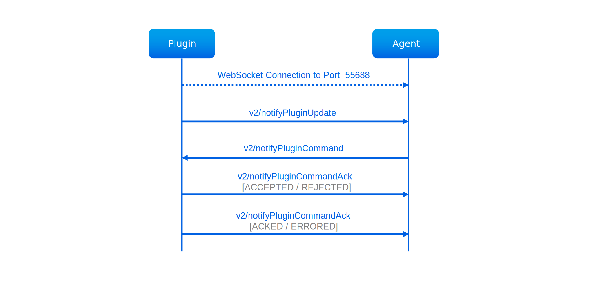
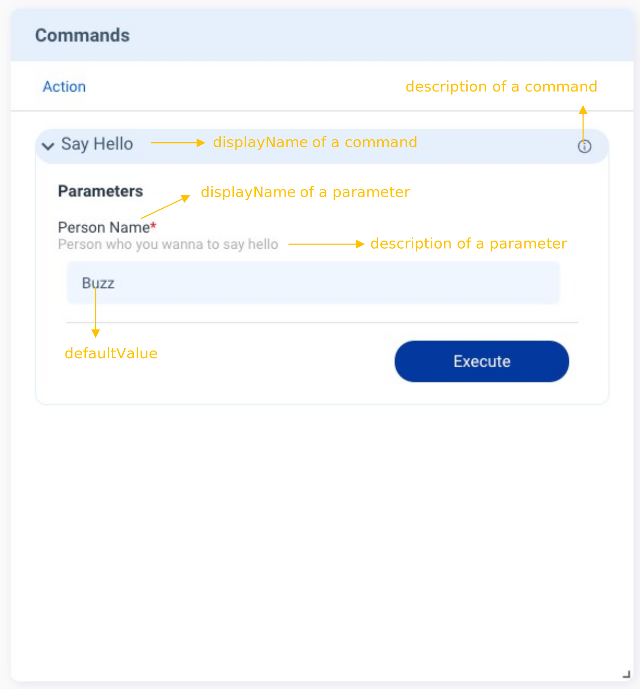

The **Commands** feature allows developers to define the commands supported by the plugin. The **Commands** card provides a custom GUI to send commands through Allxon Portal. You need to send `v2/notifyPluginUpdate` to initialize the card. When you execute commands from Allxon Portal, the plugin receives `v2/notifyPluginCommand`, sends `v2/notifyPluginCommandAck` back to confirm receipt, and finally sends `v2/notifyPluginCommandAck` again to bring the execution result back to Allxon Portal.

## Tutorials

### Implement the Command Card

Here is a example of using the **Commands** card:

```json {17-35} 
{
    "jsonrpc": "2.0",
    "method": "v2/notifyPluginUpdate",
    "params": {
        "sdk": "${OCTO_SDK_VERSION}",
        "appGUID": "${PLUGIN_APP_GUID}",
        "appName": "${PLUGIN_NAME}",
        "epoch": "",
        "displayName": "plugIN Hello",
        "type": "ib",
        "version": "${PLUGIN_VERSION}",
        "modules": [
            {
                "moduleName": "${PLUGIN_NAME}",
                "displayName": "plugIN Hello",
                "properties": [],
                "commands": [
                    {
                        "name": "say_hello",
                        "type": "asynchronous",
                        "displayCategory": "Action",
                        "displayName": "Say Hello",
                        "description": "Say hello to a person",
                        "params": [
                            {
                                "name": "person",
                                "displayName": "Person Name",
                                "description": "Person who you wanna to say hello",
                                "displayType": "string",
                                "required": true,
                                "defaultValue": "Buzz"
                            }
                        ]
                    }
                ]
            }
        ]
    }
}
```


Fill in the parameter and click the Execute button. Then the command is brought to the plugin via `v2/notifyPluginCommand`:


```json {3}
{
    "jsonrpc": "2.0",
    "method": "v2/notifyPluginCommand?authorization=$argon2id$v=19$m=64,t=16,p=8$YnFaWiIoX1ckSmE9Tkp5YQ$XLS6riVCcBj/EUr5lYnJ8Q",
    "params": {
        "appGUID": "a8e873a1-e5df-43a2-928a-745ff9c94dfb",
        "moduleName": "plugin-hello",
        "commandSource": "remote",
        "commands": [
            {
                "name": "say_hello",
                "params": [
                    {
                        "name": "person",
                        "value": "Buzz"
                    }
                ]
            }
        ],
        "commandId": "d0a0af987c17da435b2bc44dfbee8ffe90104f4f",
        "epoch": "1664185099"
    }
}
```

:::note
You might be curious about the text following the “*?*” mark in the highlighted line. Such text is used for safety verification. When you call `JsonValidator::Verify()`, Allxon Octo SDK verifies whether this JSON is safe through the text.
:::

Once the plugin receives `v2/notifyPluginCommand`, it sends back `v2/notifyPluginCommandAck` with `"commandState": "ACCEPTED"` to Allxon Portal to confirm receipt.

:::info
The plugin responds with `"commandState": "ACCEPTED"` or `"commandState": "REJECTED"` to inform the Portal whether the plugin accepts this command or not.
:::

```json {10}
{
    "jsonrpc": "2.0",
    "method": "v2/notifyPluginCommandAck",
    "params": {
        "appGUID": "a8e873a1-e5df-43a2-928a-745ff9c94dfb",
        "epoch": "1664250407",
        "commandId": "c96a50867715c200fbea63b5898945512afd9409",
        "commandSource": "remote",
        "moduleName": "plugin-hello",
        "commandState": "ACCEPTED",
        "commandAcks": [
            {
                "name": "say_hello",
                "result": {
                    "response": "Hello Buzz"
                }
            }
        ]
    }
}
```

After completing your command task, send back to Allxon Portal v`v2/notifyPluginCommandAck` with `"commandState": "ACKED"`, which contains the execution result.

```json {10}
{
    "jsonrpc": "2.0",
    "method": "v2/notifyPluginCommandAck",
    "params": {
        "appGUID": "a8e873a1-e5df-43a2-928a-745ff9c94dfb",
        "epoch": "1664250407",
        "commandId": "c96a50867715c200fbea63b5898945512afd9409",
        "commandSource": "remote",
        "moduleName": "plugin-hello",
        "commandState": "ACKED",
        "commandAcks": [
            {
                "name": "say_hello",
                "result": {
                    "response": "Hello Buzz"
                }
            }
        ]
    }
}
```

:::info
The plugin responds with `"commandState": "ACKED"` or `"commandState": "ERRORED"`to inform the Portal of the execution result.
:::

:::caution
When the Portal sends out `v2/notifyPluginCommand`, a commandId is included. The plugin needs to read and include the commandId when sending back the `v2/notifyPluginCommandAck`.
:::

If all goes well, the **Command Response Details** dialog is displayed on Allxon Portal, as shown below:


:::note
Allxon Portal has a command execution timeout of one minute. If the plugin executes the command for more than a minute, the Portal shows a timeout message.
:::


### Update States After a Command

Sometimes executing a command will alter the value of states. To provide users with more immediate feedback, you can use `v2/notifyPluginCommandAck` along with updated state values to promptly refresh the Portal.

Here is a code example of `v2/notifyPluginCommandAck.json`. After executing a command, the **States** card will refresh instantly to reflect the updated values.

```json title="v2/notifyPluginCommandAck.json with States" {19-24}
{
    "jsonrpc": "2.0",
    "method": "v2/notifyPluginCommandAck",
    "params": {
        "appGUID": "a8e873a1-e5df-43a2-928a-745ff9c94dfb",
        "epoch": "1664250407",
        "commandId": "c96a50867715c200fbea63b5898945512afd9409",
        "commandSource": "remote",
        "moduleName": "plugin-hello",
        "commandState": "ACKED",
        "commandAcks": [
            {
                "name": "say_hello",
                "result": {
                    "response": "Hello Buzz"
                }
            }
        ],
        "states": [
            {
                "name": "greet_message",
                "value": "Hello Buzz"
            }
        ]
    }
}
```


## Display Type
The card supports several parameter input types (i.e. displayType): [string](#string), [text](#text), [datetime](#datetime), [switch](#switch), [checkbox](#checkbox), [list](#list), and [ToS](#tos). For how to set up these input types, see the following sections.

### String
The following example shows the code in `v2/notifyPluginUpdate.json` for displaying a text box for parameter input. 

```json title="v2/notifyPluginUpdate.json"
{
    ...
    "commands": [ 
        {
            "name": "command1",
            "params": [
                {
                    "name": "stringParam",
                    "displayType": "string",                
                    "required": false,
                    ...
                }
            ],
            ...
        }
    ],
}
```
The **Commands** card displays as follows:


When a command is executed, `"v2/notifyPluginCommand"` carries a `"name"` and a `"value"` from the input parameter.

```json title="v2/notifyPluginCommand.json"
{
    ...
    "commands": [
        {
            "name": "command1",
            "params": [
               {
                  "name": "stringParam",
                  "value": "foo"
               }
            ]
        }
    ]
}
```
### Text
The following example shows the code in `v2/notifyPluginUpdate.json` for displaying a multiline text box for parameter input. 
```json title="v2/notifyPluginUpdate.json"
{
    ...
    "commands": [ 
        {
            "name": "command1",
            "params": [
                {
                    "name": "textParam",
                    "displayType": "text",                
                    "required": false,
                    ...
                }
            ],
            ...
        }
    ],
}
```
The **Commands** card displays as follows:


When a command is executed, `"v2/notifyPluginCommand"` carries a `"name"` and a `"value"` from the input parameter.

```json title="v2/notifyPluginCommand.json"
{
    ...
    "commands": [
        {
            "name": "command1",
            "params": [
               {
                  "name": "dateParam",
                  "value": "hello\nworld"
               }
            ]
        }
    ]
}
```


### Datetime
The following example shows the code in `v2/notifyPluginUpdate.json` for displaying a date/time picker for parameter input. You must define `"displayFormat"` by using one of the following formats:

* `"YYYY-MM-DD"`
* `"HH:MM"` 
* `"YYYY-MM-DD HH:MM"`

```json title="v2/notifyPluginUpdate.json"
{
    ...
    "commands": [ 
        {
            "name": "command1",
            "params": [
                {
                    "name": "dateParam",
                    "displayType": "datetime",                
                    "required": false,
                    "displayFormat": "HH:MM",
                    ...
                }
            ],
            ...
        }
    ],
}
```

The **Commands** card displays as follows:


When a command is executed, `v2/notifyPluginCommand` carries a `"name"` and a `"value"` that follows the `"displayFormat"` defined in the `v2/notifyPluginUpdate`.

```json title="v2/notifyPluginCommand.json"
{
    ...
    "commands": [
        {
            "name": "command1",
            "params": [
               {
                  "name": "dateParam",
                  "value": "12:00"
               }
            ]
        }
    ]
}
```
:::info
The time parameter to be sent is not a timestamp and does not contain any time zone information. The plugin executes the command of datetime parameter according to the device's time zone.
:::


### Switch
The following example shows the code in `v2/notifyPluginUpdate.json` for displaying a switch toggle for parameter input. The switch toggle is used to switch between two parameters. You must define `"displayValues"` as a size 2 Array, with index 0 representing false and index 1 representing true. 

```json title="v2/notifyPluginUpdate.json"
{
    ...
    "commands": [ 
        {
            "name": "command1",
            "params": [
                {
                    "name": "switchParam",
                    "displayType": "switch",                
                    "displayValues": [
                        "offValue",
                        "onValue"
                    ],
                    "defaultValue": "offValue",
                    "required": false,
                    ...
                }
            ],
            ...
        }
    ],
}
```
The **Commands** card displays as follows:


When a command is executed, `v2/notifyPluginCommand` carries a `"name"` and a `"value"` that follows the `"displayValues"` defined in `v2/notifyPluginUpdate`.

 ```json title="v2/notifyPluginCommand.json"
{
    ...
    "commands": [
        {
            "name": "command1",
            "params": [
               {
                  "name": "switchParam",
                  "value": "offValue"
               }
            ]
        }
    ]
}
```

### Checkbox
The following example shows the code in `v2/notifyPluginUpdate.json` for displaying a checkbox for parameter input. The checkbox is used to enable or disable the parameter. You must define `"displayValues"` as a size 2 Array, with index 0 representing false and index 1 representing true. 

```json title="v2/notifyPluginUpdate.json"
{
    ...
    "commands": [ 
        {
            "name": "command1",
            "params": [
                {
                    "name": "checkboxParam",
                    "displayType": "checkbox",                
                    "displayValues": [
                        "offValue",
                        "onValue"
                    ],
                    "defaultValue": "offValue",
                    "required": false,
                    ...
                }
            ],
            ...
        }
    ],
}
```

The Commands card displays as follows:


When a command is executed, `v2/notifyPluginCommand` carries a `"name"` and a `"value"` that follows the `"displayValues"` defined in `v2/notifyPluginUpdate`.
 
 ```json title="v2/notifyPluginCommand.json"
{
    ...
    "commands": [
        {
            "name": "command1",
            "params": [
               {
                  "name": "checkboxParam",
                  "value": "offValue"
               }
            ]
        }
    ]
}
```
### List
The following example shows the code in `v2/notifyPluginUpdate.json` for displaying a dropdown list for parameter selection. You must define `"displayValues"` as the **Array** type.

```json title="v2/notifyPluginUpdate.json"
{
    ...
    "commands": [ 
        {
            "name": "command1",
            "params": [
                {
                    "name": "listParam",
                    "displayType": "list",
                    "displayValues": [
                        "list1",
                        "list2"
                    ],
                    "required": false
                    ...
                }
            ],
            ...
        }
    ],
}
```
The **Commands** card displays as follows:


When a command is executed, `"v2/notifyPluginCommand"` carries a `"name"` and a `"value"` that follows the `"displayValues"` defined in `v2/notifyPluginUpdate`.

```json title="v2/notifyPluginCommand.json"
{
    ...
    "commands": [
        {
            "name": "command1",
            "params": [
               {
                  "name": "listParam",
                  "value": "list1"
               }
            ]
        }
    ]
}
```

### ToS
ToS stands for **Terms of Service**. The following example shows the code in `v2/notifyPluginUpdate.json` for displaying a mandatory parameter that requires users to agree with the ToS to proceed with command execution. You must define `"displayName"` as **alias** and `"description"` as the **URL** of the ToS.

```json title="v2/notifyPluginUpdate.json"
{
    ...
    "commands": [ 
        {
            "name": "command1",
            "params": [
                {
                    "name": "tosParam",
                    "displayType": "tos",
                    "displayName": "Terms of Service",
                    "description": "https://policies.google.com/terms?hl=en-US",
                    "required": true
                    ...
                }
            ],
            ...
        }
    ],
}
```

The **Commands** card displays as follows:


When a command is executed, `v2/notifyPluginCommand` carries a `"name"` and a `"value": false`.
```json title="v2/notifyPluginCommand.json"
{
    ...
    "commands": [
        {
            "name": "command1",
            "params": [
               {
                  "name": "tosParam",
                  "value": false
               }
            ]
        }
    ]
}
```
:::caution
The data type of `"value"` is **Bool**.
:::


