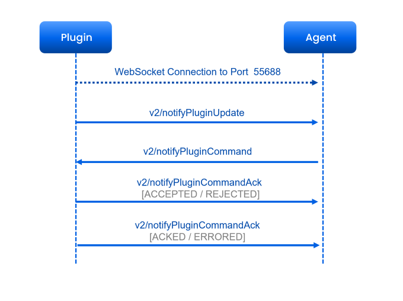
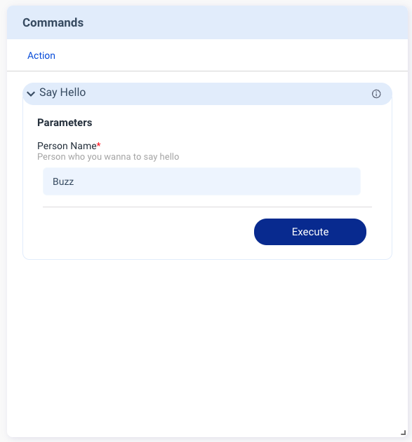
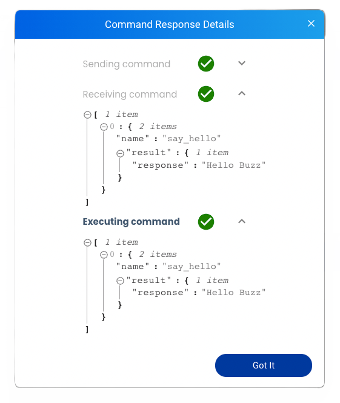

The **Commands** feature allows developers to define the commands supported by the plugin. The **Commands** card provides a custom GUI to send commands through Allxon Portal. You need to send `v2/notifyPluginUpdate` to initialize the card. When you execute commands from Allxon Portal, the plugin receives `v2/notifyPluginCommand`, sends `v2/notifyPluginCommandAck` back to confirm receipt, and finally sends `v2/notifyPluginCommandAck` again to bring the execution result back to Allxon Portal.


Here is a example of using the **Commands** card:

```json {17-35} 
{
    "jsonrpc": "2.0",
    "method": "v2/notifyPluginUpdate",
    "params": {
        "sdk": "${OCTO_SDK_VERSION}",
        "appGUID": "${PLUGIN_APP_GUID}",
        "appName": "${PLUGIN_NAME}",
        "epoch": "",
        "displayName": "plugIN Hello",
        "type": "ib",
        "version": "${PLUGIN_VERSION}",
        "modules": [
            {
                "moduleName": "${PLUGIN_NAME}",
                "displayName": "plugIN Hello",
                "properties": [],
                "commands": [
                    {
                        "name": "say_hello",
                        "type": "asynchronous",
                        "displayCategory": "Action",
                        "displayName": "Say Hello",
                        "description": "Say hello to a person",
                        "params": [
                            {
                                "name": "person",
                                "displayName": "Person Name",
                                "description": "Person who you wanna to say hello",
                                "displayType": "string",
                                "required": true,
                                "defaultValue": "Buzz"
                            }
                        ]
                    }
                ]
            }
        ]
    }
}
```



Fill in the parameter and click the Execute button. Then the command is brought to the plugin via `v2/notifyPluginCommand`:


```json {3}
{
    "jsonrpc": "2.0",
    "method": "v2/notifyPluginCommand?authorization=$argon2id$v=19$m=64,t=16,p=8$YnFaWiIoX1ckSmE9Tkp5YQ$XLS6riVCcBj/EUr5lYnJ8Q",
    "params": {
        "appGUID": "a8e873a1-e5df-43a2-928a-745ff9c94dfb",
        "moduleName": "plugin-hello",
        "commandSource": "remote",
        "commands": [
            {
                "name": "say_hello",
                "params": [
                    {
                        "name": "person",
                        "value": "Buzz"
                    }
                ]
            }
        ],
        "commandId": "d0a0af987c17da435b2bc44dfbee8ffe90104f4f",
        "epoch": "1664185099"
    }
}
```

:::note
You might be curious about the text following the “*?*” mark in the highlighted line. Such text is used for safety verification. When you call `JsonValidator::Verify()`, Allxon Octo SDK verifies whether this JSON is safe through the text.
:::

Once the plugin receives `v2/notifyPluginCommand`, it sends back `v2/notifyPluginCommandAck` with `"commandState": "ACCEPTED"` to Allxon Portal to confirm receipt.

:::info
The plugin responds with `"commandState": "ACCEPTED"` or `"commandState": "REJECTED"` to inform the Portal whether the plugin accepts this command or not.
:::

```json {10}
{
    "jsonrpc": "2.0",
    "method": "v2/notifyPluginCommandAck",
    "params": {
        "appGUID": "a8e873a1-e5df-43a2-928a-745ff9c94dfb",
        "epoch": "1664250407",
        "commandId": "c96a50867715c200fbea63b5898945512afd9409",
        "commandSource": "remote",
        "moduleName": "plugin-hello",
        "commandState": "ACCEPTED",
        "commandAcks": [
            {
                "name": "say_hello",
                "result": {
                    "response": "Hello Buzz"
                }
            }
        ]
    }
}
```

After completing your command task, send back to Allxon Portal v`v2/notifyPluginCommandAck` with `"commandState": "ACKED"`, which contains the execution result.

```json {10}
{
    "jsonrpc": "2.0",
    "method": "v2/notifyPluginCommandAck",
    "params": {
        "appGUID": "a8e873a1-e5df-43a2-928a-745ff9c94dfb",
        "epoch": "1664250407",
        "commandId": "c96a50867715c200fbea63b5898945512afd9409",
        "commandSource": "remote",
        "moduleName": "plugin-hello",
        "commandState": "ACKED",
        "commandAcks": [
            {
                "name": "say_hello",
                "result": {
                    "response": "Hello Buzz"
                }
            }
        ]
    }
}
```

:::info
The plugin responds with `"commandState": "ACKED"` or `"commandState": "ERRORED"`to inform the Portal of the execution result.
:::

:::caution
When the Portal sends out `v2/notifyPluginCommand`, a commandId is included. The plugin needs to read and include the commandId when sending back the `v2/notifyPluginCommandAck`.
:::

If all goes well, the **Command Response Details** dialog is displayed on Allxon Portal, as shown below:



:::note
Allxon Portal has a command execution timeout of one minute. If the plugin executes the command for more than a minute, the Portal shows a timeout message.
:::
