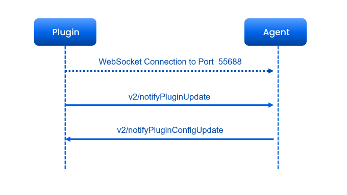
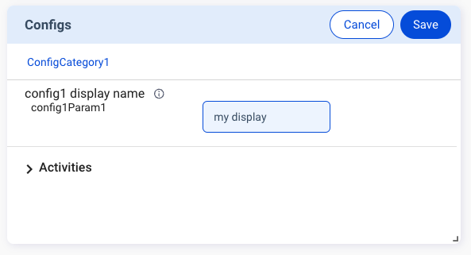

The **Configs** feature sequence flow is similar to that of the **Alerts** feature. You need to send `v2/notifyPluginUpdate` to initialize the **Configs** card on Allxon Portal. Then you can proceed to complete the settings. Once done, the plugin receives `v2/notifyPluginConfigUpdate` for the settings.

Here is an example of creating the **Configs** card:

First, send `v2/notifyPluginUpdate`.

```json {17-31}
{
  "jsonrpc": "2.0",
  "method": "v2/notifyPluginUpdate",
  "params": {
    "sdk": "${OCTO_SDK_VERSION}",
    "appGUID": "${PLUGIN_APP_GUID}",
    "appName": "${PLUGIN_NAME}",
    "epoch": "",
    "displayName": "plugIN Hello",
    "type": "ib",
    "version": "${PLUGIN_VERSION}",
    "modules": [
      {
        "moduleName": "${PLUGIN_NAME}",
        "displayName": "plugIN Hello",
        "properties": [],
        "configs": [
          {
            "name": "config1",
            "displayName": "config1 display name",
            "description": "config1 description",
            "displayCategory": "ConfigCategory1",
            "params": [
              {
                "name": "config1Param1",
                "required": true,
                "displayType": "string"
              }
            ]
          }
        ]
      }
    ]
  }
}
```

Then you can see the **Configs** card, as shown below.


Now let’s try updating the settings of the **Configs** card. Use the following procedure to fill in the parameters. 

1. Click **Edit** on the upper right corner of the card.
2. Enter *"my display"* as the parameter and click **Save**



3. A confirmation dialog pops up. Click **Save** to confirm the change.


Once done, the plugin gets notified of the configs setting update by receiving the following new `v2/notifyPluginConfigUpdate`.

```json
{
    "jsonrpc": "2.0",
    "method": "v2/notifyPluginConfigUpdate?authorization=$argon2id$v=19$m=64,t=16,p=8$KksxWlhPbjRULHA0Yj5WYA$abdF1Vo4573+Uz5I0Xz81A",
    "params": {
        "appGUID": "a8e873a1-e5df-43a2-928a-745ff9c94dfb",
        "version": "1.0.1",
        "epoch": "1664866949",
        "modules": [
            {
                "moduleName": "plugin-hello",
                "epoch": "1664866940",
                "configs": [
                    {
                        "name": "config1",
                        "params": [
                            {
                                "name": "config1Param1",
                                "value": "my display"
                            }
                        ]
                    }
                ]
            }
        ]
    }
}
```
