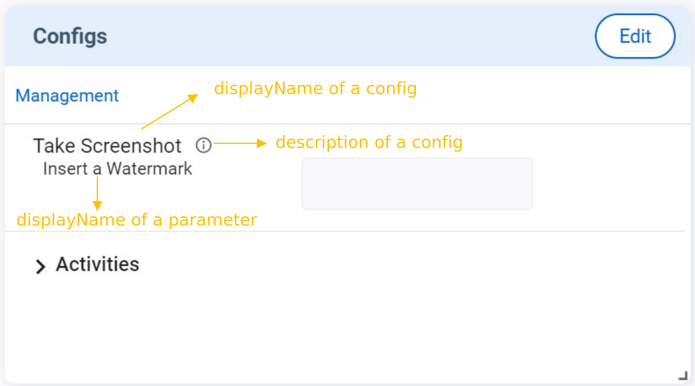
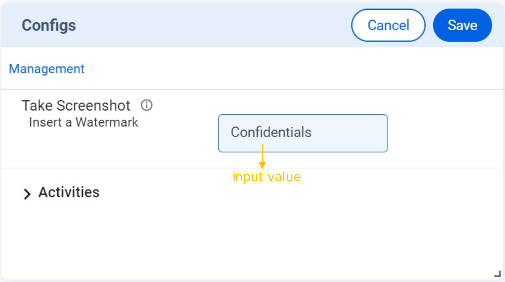

The **Configs** feature sequence flow is similar to that of the **Alerts** feature. You need to send `v2/notifyPluginUpdate` to initialize the **Configs** card on Allxon Portal. Then you can proceed to complete the settings. Once done, the plugin receives `v2/notifyPluginConfigUpdate` for the settings.

## Tutorials

Here is an example of creating the **Configs** card:

First, send `v2/notifyPluginUpdate`.

```json {17-31}
{
  "jsonrpc": "2.0",
  "method": "v2/notifyPluginUpdate",
  "params": {
    "sdk": "${OCTO_SDK_VERSION}",
    "appGUID": "${PLUGIN_APP_GUID}",
    "appName": "${PLUGIN_NAME}",
    "epoch": "",
    "displayName": "plugIN Hello",
    "type": "ib",
    "version": "${PLUGIN_VERSION}",
    "modules": [
      {
        "moduleName": "${PLUGIN_NAME}",
        "displayName": "plugIN Hello",
        "properties": [],
        "configs": [
          {
            "name": "screenshot",
            "displayName": "Take Screenshot",
            "description": "automate rule when taking screenshot",
            "displayCategory": "Management",
            "params": [
              {
                "name": "Insert a Watermark",
                "required": true,
                "displayType": "string"
              }
            ]
          }
        ]
      }
    ]
  }
}
```

Then you can see the **Configs** card, as shown below.



At this time, the Config is not yet set up. The Portal sends the following `v2/notifyPluginConfigUpdate` to the plugin for resting config configuration.

**Going to deprecated format**

```json
{
  "jsonrpc": "2.0",
  "method": "v2/notifyPluginConfigUpdate?authorization=$argon2id$v=19$m=64,t=16,p=8$KksxWlhPbjRULHA0Yj5WYA$abdF1Vo4573+Uz5I0Xz81A",
  "params": {
    "appGUID": "a8e873a1-e5df-43a2-928a-745ff9c94dfb",
    "epoch": "1664866949"
  }
}
```

**Up coming format**

```json
{
  "jsonrpc": "2.0",
  "method": "v2/notifyPluginConfigUpdate?authorization=$argon2id$v=19$m=64,t=16,p=8$KksxWlhPbjRULHA0Yj5WYA$abdF1Vo4573+Uz5I0Xz81A",
  "params": {
    "appGUID": "a8e873a1-e5df-43a2-928a-745ff9c94dfb",
    "version": "1.0.1",
    "epoch": "1664866949",
    "modules": [
      {
        "moduleName": "plugin-hello",
        "epoch": "1664866940",
        "configs": []
      }
    ]
  }
}
```

Now let’s try updating the settings of the **Configs** card. Use the following procedure to fill in the parameters.

1. Click **Edit** on the upper right corner of the card.
2. Enter _"my display"_ as the parameter and click **Save**



3. A confirmation dialog pops up. Click **Save** to confirm the change.


Once done, the plugin gets notified of the configs setting update by receiving the following new `v2/notifyPluginConfigUpdate`.

```json
{
  "jsonrpc": "2.0",
  "method": "v2/notifyPluginConfigUpdate?authorization=$argon2id$v=19$m=64,t=16,p=8$KksxWlhPbjRULHA0Yj5WYA$abdF1Vo4573+Uz5I0Xz81A",
  "params": {
    "appGUID": "a8e873a1-e5df-43a2-928a-745ff9c94dfb",
    "version": "1.0.1",
    "epoch": "1664866949",
    "modules": [
      {
        "moduleName": "plugin-hello",
        "epoch": "1664866940",
        "configs": [
          {
            "name": "screenshot",
            "params": [
              {
                "name": "Insert a watermark",
                "value": "Confidentials"
              }
            ]
          }
        ]
      }
    ]
  }
}
```

:::caution
The settings of Alerts and Configs belong to the **group-level**. When the user changes the Alerts/Configs settings on the Portal, the Portal deploys the changes to all the plugins in the same device group. Then Allxon Portal displays the **Alerts/Configs** card based on the latest plugin version in the device group and stores the latest settings.

When the plugin receives the Alerts/Configs settings, it MUST check whether the settings are supported by the current plugin version. If not supported, the plugin MUST ignore the message.
:::

## Display Type

The **Configs** card supports several parameter input types (i.e. displayType): [string](#string), [datetime](#datetime), [switch](#switch), [checkbox](#checkbox), [list](#list), and [temperature](#temperature). For how to set up these input types, see the following sections.

### String

The following example shows the code in `v2/notifyPluginUpdate.json` for displaying a text box for parameter input.

```json title="v2/notifyPluginUpdate.json"
{
   ...
   "configs": [
       {
           "name": "config1",
           "params": [
               {
                   "name": "stringParam",
                   "displayType": "string",
                   "required": false,
                   ...
               },
               ...
           ],
           ...
       }
   ],
}
```

The **Configs** card displays as follows:


When a configuration is set up, `v2/notifyPluginConfigUpdate` carries a `"name"` and a `"value"` from the parameter input.

```json title="v2/notifyPluginConfigUpdate.json"
{
    "jsonrpc": "2.0",
    "method": "v2/notifyPluginConfigUpdate",
    ...
        ...
            ...
                "configs": [
                    {
                        "name": "config1",
                        "params": [
                            {
                                "name": "stringParam",
                                "value": "foo"
                            }
                            ...
                        ]
                        ...
                    }
                    ...
                ]
}

```

### Datetime

The following example shows the code in `v2/notifyPluginUpdate.json` for displaying a date/time picker for parameter input. You must define `"displayFormat"` by using one of the following formats:

- `"YYYY-MM-DD"`
- `"HH:MM"`
- `"YYYY-MM-DD HH:MM"`

```json title="v2/notifyPluginUpdate.json"
{
    ...
    "configs": [
        {
            "name": "config1",
            "params": [
                {
                    "name": "datetimeParam",
                    "displayType": "datetime",
                    "displayFormat": "HH:MM",
                    "required": false,
                    ...
                },
                ...
            ],
            ...
        }
    ],
}
```

The **Configs** card displays as follows:


When a configuration is enabled, `v2/notifyPluginConfigUpdate` carries a `"name"` and a `"value"` that follows the `"displayFormat"` defined in the `v2/notifyPluginUpdate`.

```json title="v2/notifyPluginConfigUpdate.json"
{
    "jsonrpc": "2.0",
    "method": "v2/notifyPluginConfigUpdate",
    ...
        ...
            ...
                "configs": [
                    {
                        "name": "config1",
                        "params": [
                            {
                                "name": "datetimeParam",
                                "value": "06:00"
                            }
                            ...
                        ]
                        ...
                    }
                    ...
                ]
}
```

:::info
The time parameter to be sent is not a timestamp and does not contain any time zone information. The plugin executes the command of datetime parameter according to the device's time zone.
:::

### Switch

The following example shows the code in `v2/notifyPluginUpdate.json` for displaying a switch toggle for parameter input. The switch toggle is used to switch between two parameters. You must define `"displayValues"` as a size 2 Array, with index 0 representing false and index 1 representing true.

```json title="v2/notifyPluginUpdate.json"
{
    ...
    "configs": [
        {
            "name": "config1",
            "params": [
                {
                    "name": "switchParam",
                    "displayType": "switch",
                    "displayValues": [
                        "offValue",
                        "onValue"
                    ],
                    "defaultValue": "offValue",
                    "required": false,
                    ...
                }
            ],
            ...
        }
    ],
}
```

The **Configs** card displays as follows:


When a configuration is set up, `v2/notifyPluginConfigUpdate` carries a `"name"` and a `"value"` that follows the `"displayValues"` defined in the `v2/notifyPluginUpdate`.

```json title="v2/notifyPluginConfigUpdate.json"
{
    "jsonrpc": "2.0",
    "method": "v2/notifyPluginConfigUpdate",
    ...
        ...
            ...
                "configs": [
                    {
                        "name": "config1",
                        "params": [
                            {
                                "name": "switchParam",
                                "value": "offValue"
                            }
                            ...
                        ]
                        ...
                    }
                    ...
                ]
}
```

### Checkbox

The following example shows the code in `v2/notifyPluginUpdate.json` for displaying a checkbox for parameter input. The checkbox is used to enable or disable the parameter. You must define `"displayValues"` as a size 2 Array, with index 0 representing false and index 1 representing true.

```json title="v2/notifyPluginUpdate.json"
{
    ...
    "configs": [
        {
            "name": "config1",
            "params": [
                {
                    "name": "checkboxParam",
                    "displayType": "checkbox",
                    "displayValues": [
                        "offValue",
                        "onValue"
                    ],
                    "defaultValue": "offValue",
                    "required": false,
                    ...
                }
            ],
            ...
        }
    ],
}
```

The **Configs** card displays as follows:


When a configuration is set up, `v2/notifyPluginConfigUpdate` carries a `"name"` and a `"value"` that follows the `"displayValues"` defined in `v2/notifyPluginUpdate`.

```json title="v2/notifyPluginConfigUpdate.json"
{
    "jsonrpc": "2.0",
    "method": "v2/notifyPluginConfigUpdate",
    ...
        ...
            ...
                "configs": [
                    {
                        "name": "config1",
                        "params": [
                            {
                                "name": "checkboxParam",
                                "value": "offValue"
                            }
                            ...
                        ]
                        ...
                    }
                    ...
                ]
}
```

### List

The following example shows the code in `v2/notifyPluginUpdate.json` for displaying a dropdown list for parameter input. You must define `"displayValues"` as the **Array** type.

```json title="v2/notifyPluginUpdate.json"
{
    ...
    "configs": [
        {
            "name": "config1",
            "params": [
                {
                    "name": "listParam",
                    "displayType": "list",
                    "displayValues": [
                        "list1",
                        "list2"
                    ],
                    "defaultValue": "list1",
                    "required": false,
                    ...
                }
            ],
            ...
        }
    ],
}
```

The **Configs** card displays as follows:


When a configuration is set up, `v2/notifyPluginConfigUpdate` carries a `"name"` and a `"value"` that follows the `"displayValues"` defined in `v2/notifyPluginUpdate`.

```json title="v2/notifyPluginConfigUpdate.json"
{
   "jsonrpc": "2.0",
   "method": "v2/notifyPluginConfigUpdate",
   ...
       ...
           ...
               "configs": [
                   {
                       "name": "config1",
                       "params": [
                           {
                               "name": "listParam",
                               "value": "list1"
                           }
                           ...
                       ]
                       ...
                   }
                   ...
               ]
}
```

### Temperature

The following example shows the code in `v2/notifyPluginUpdate.json` for displaying a predefined temperature scale for parameter input. Users can enter temperature parameters in Fahrenheit or Celsius.

```json title="v2/notifyPluginUpdate.json"
{
    ...
    "configs": [
        {
            "name": "config1",
            "params": [
                {
                    "name": "temperatureParam",
                    "displayType": "temperature",
                    "required": false,
                    ...
                }
            ],
            ...
        }
    ],
}
```

The **Configs** card displays as follows:


When a configuration is set up, `"v2/notifyPluginConfigUpdate"` carries a `"name"` and a `"value"` from the temperature parameter input.

```json title="v2/notifyPluginConfigUpdate.json"
{
    "jsonrpc": "2.0",
    "method": "v2/notifyPluginConfigUpdate",
    ...
        ...
            ...
                "configs": [
                    {
                        "name": "config1",
                        "params": [
                            {
                                "name": "temperatureParam",
                                "value": "301.15"
                            }
                            ...
                        ]
                        ...
                    }
                    ...
                ]
}
```

:::note
While the Fahrenheit and Celsius scales are used on the Portal, the temperature data sent to the plugin needs to be in **Kelvin**.
:::
