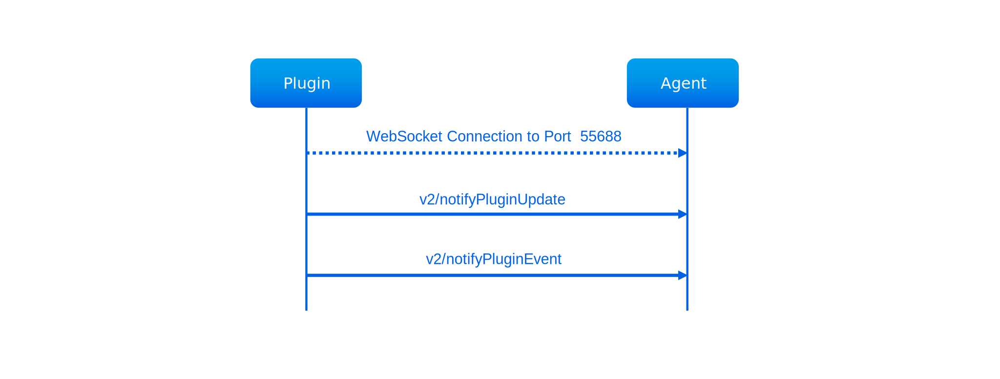
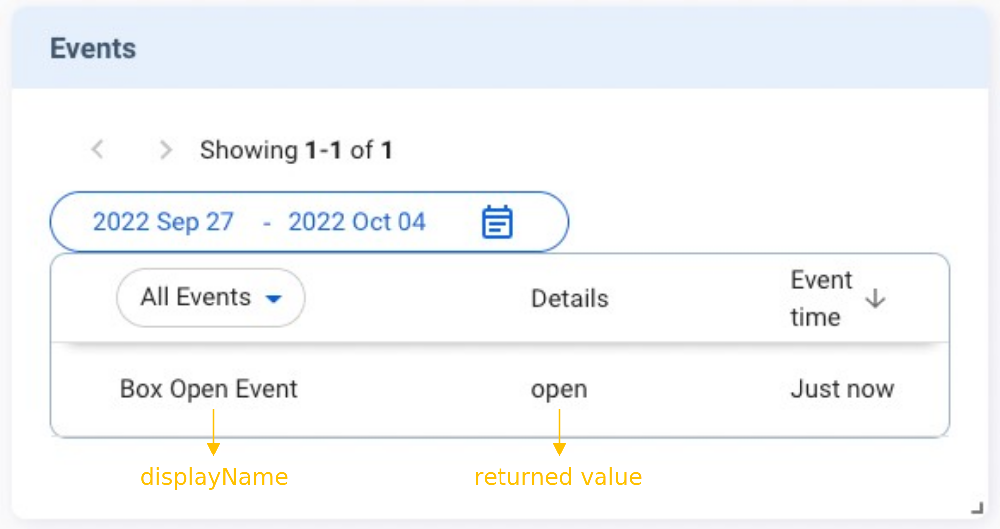

The **Events** card displays the history of activities and events defined by the plugin. Its card sequence flow is the same as that of the **States** card. After initializing the card with `v2/notifyPluginUpdate`, you can send `v2/notifyPluginEvent` to upload events.

## Tutorials
Here is an example of creating the **Events** card:

First, send the following `v2/notifyPluginUpdate` JSON. You need to define `"name"` and `"displayName"` for a plugin-supported event.


```json {17-24}
{
  "jsonrpc": "2.0",
  "method": "v2/notifyPluginUpdate",
  "params": {
    "sdk": "${OCTO_SDK_VERSION}",
    "appGUID": "${PLUGIN_APP_GUID}",
    "appName": "${PLUGIN_NAME}",
    "epoch": "",
    "displayName": "plugIN Hello",
    "type": "ib",
    "version": "${PLUGIN_VERSION}",
    "modules": [
      {
        "moduleName": "${PLUGIN_NAME}",
        "displayName": "plugIN Hello",
        "properties": [],
        "events": [
          {
            "description": "Event trigger when box opened",
            "displayCategory": "category1",
            "displayName": "Box Open Event",
            "name": "box-open-event"
          }
        ]
      }
    ]
  }
}
```
Once done, Allxon Portal shows the **Events** card below.


Now you can send `v2/notifyPluginEvent` to upload an event record.
The `"name"` must be identical to that in `"v2/notifyPluginUpdate.json"`, and the data type of `"value"` must be **String**. 

```json
{
   "jsonrpc": "2.0",
   "method": "v2/notifyPluginEvent",
   "params": {
      "appGUID": "${PLUGIN_APP_GUID}",
      "moduleName": "${PLUGIN_NAME}",
      "epoch": "",
      "events": [
         {
            "name": "box-open-event",
            "value": "open"
         }
      ]
   }
}
```

The `"value"` is shown in the **Detail** column. The **Events** card then displays like this:

