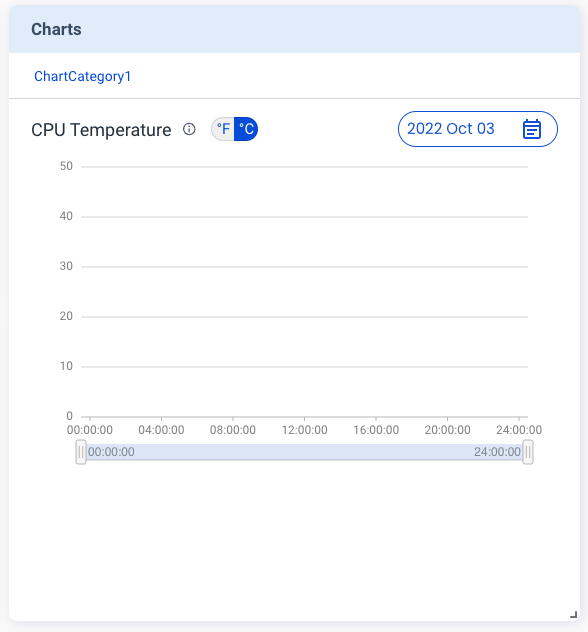

The **Metrics** feature helps you to present information in a **Charts** card on the Portal, such as device temperature. The sequence flow is just the same as that of the **States** card.

Here is an example of creating the **Charts** card:

First, send the following `v2/notifyPluginUpdate` JSON.

```json {17-26}
{
  "jsonrpc": "2.0",
  "method": "v2/notifyPluginUpdate",
  "params": {
    "sdk": "${OCTO_SDK_VERSION}",
    "appGUID": "${PLUGIN_APP_GUID}",
    "appName": "${PLUGIN_NAME}",
    "epoch": "",
    "displayName": "plugIN Hello",
    "type": "ib",
    "version": "${PLUGIN_VERSION}",
    "modules": [
      {
        "moduleName": "${PLUGIN_NAME}",
        "displayName": "plugIN Hello",
        "properties": [],
        "metrics": [
          {
            "name": "cpu_temperature",
            "displayName": "CPU Temperature",
            "description": "Present CPU Temprature in chart.",
            "displayCategory": "ChartCategory1",
            "displayType": "temperature",
            "displayUnit": "",
            "value": ""
          }
        ]
      }
    ]
  }
}
```

Once done, Allxon Portal shows the **Charts** card below. The diagram is empty because it's still in the initialization state.




Now you can send `v2/notifyPluginMetric` to upload data:


```json
{
   "jsonrpc": "2.0",
   "method": "v2/notifyPluginMetric",
   "params": {
      "appGUID": "${PLUGIN_APP_GUID}",
      "moduleName": "${PLUGIN_NAME}",
      "epoch": "",
      "metrics": [
         {
            "name": "cpu_temperature",
            "value": "298.15"
         }
      ]
   }
}
```
While the `"value"` is `“298.15"` in the code line above, why does the Charts card show 25<sup>o</sup>C ? This is because Allxon Portal uses **Kelvin** as the unit of temperature if you select `"temperature"` as the `"displayType"`.
 
You may curious why `"value"` is `"298.5"`, because if your `"displayType"` is set to `"temperature"`, Allxon Portal would assume your `"value"` unit is Kelvin.

:::tip
Use this [unit converter](https://www.unitconverters.net/) to make sure you convert correctly between *Fahrenheit*, *Celsius* and *Kelvin*.

:::

Below is an example of the **Charts** card::


You can continue to send the `v2/notifyPluginMetric`. The chart is updated accordingly.


