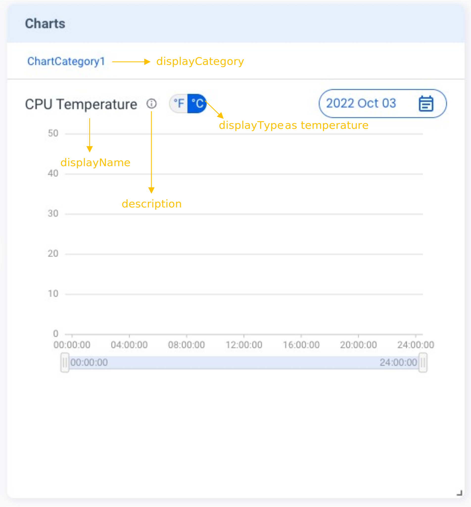
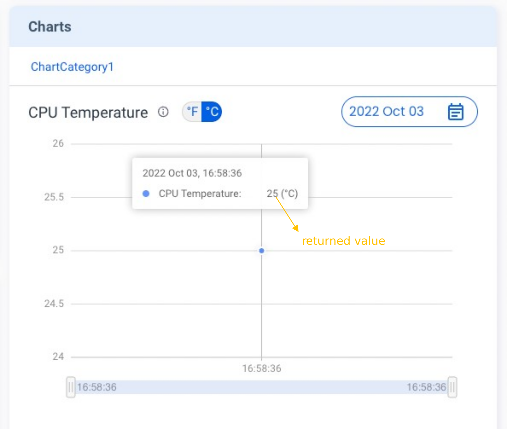

The **Metrics** feature helps you to present information in a **Charts** card on the Portal, such as device temperature. The sequence flow is just the same as that of the **States** card.

## Tutorials

Here is an example of creating the **Charts** card:

First, send the following `v2/notifyPluginUpdate` JSON.

```json {17-26}
{
  "jsonrpc": "2.0",
  "method": "v2/notifyPluginUpdate",
  "params": {
    "sdk": "${OCTO_SDK_VERSION}",
    "appGUID": "${PLUGIN_APP_GUID}",
    "appName": "${PLUGIN_NAME}",
    "epoch": "",
    "displayName": "plugIN Hello",
    "type": "ib",
    "version": "${PLUGIN_VERSION}",
    "modules": [
      {
        "moduleName": "${PLUGIN_NAME}",
        "displayName": "plugIN Hello",
        "properties": [],
        "metrics": [
          {
            "name": "cpu_temperature",
            "displayName": "CPU Temperature",
            "description": "Present CPU Temprature in chart.",
            "displayCategory": "ChartCategory1",
            "displayType": "temperature",
            "displayUnit": "",
            "value": ""
          }
        ]
      }
    ]
  }
}
```

Once done, Allxon Portal shows the **Charts** card below. The diagram is empty because it's still in the initialization state.



Now you can send `v2/notifyPluginMetric` to upload data:

```json
{
  "jsonrpc": "2.0",
  "method": "v2/notifyPluginMetric",
  "params": {
    "appGUID": "${PLUGIN_APP_GUID}",
    "moduleName": "${PLUGIN_NAME}",
    "epoch": "",
    "metrics": [
      {
        "name": "cpu_temperature",
        "value": "298.15"
      }
    ]
  }
}
```

While the `"value"` is `“298.15"` in the code line above, why does the Charts card show 25<sup>o</sup>C ? This is because Allxon Portal uses **Kelvin** as the unit of temperature if you select `"temperature"` as the `"displayType"`.

You may curious why `"value"` is `"298.5"`, because if your `"displayType"` is set to `"temperature"`, Allxon Portal would assume your `"value"` unit is Kelvin.

:::tip
Use this [unit converter](https://www.unitconverters.net/) to make sure you convert correctly between _Fahrenheit_, _Celsius_ and _Kelvin_.

:::

Below is an example of the **Charts** card::


You can continue to send the `v2/notifyPluginMetric`. The chart is updated accordingly.


## Display Type

You can define the unit of the chart or use a predefined temperature scale. For how to set up the unit of a chart, see the following sections.

### Temperature

The following example shows the code in `v2/notifyPluginUpdate.json` for displaying a temperature line graph with a predefined toggle button. The toggle button is used for switching between <sup>o</sup>F/<sup>o</sup>C (Fahrenheit/ Celsius).

```json title="v2/notifyPluginUpdate.json"
{
    ...
    "metrics": [
        {
            "name": "temperatureMetric",
            "displayType": "temperature",
            ...
        },
        ...
    ]
}
```

When `v2/notifyPluginMetrics.json` is used to update the temperature metric, the `"name"` must be identical to that in `v2/notifyPluginUpdate.json`, and the `"value"` SHOULD be reported in **Kelvin**.

```json title="v2/notifyPluginMetric.json"
{
    "jsonrpc": "2.0",
    "method": "v2/notifyPluginMetric",
    "params": {
        ...
        "metrics": [
            {
                "name": "temperatureMetric",
                "value": "298"
            },
            ...
        ]
    }
}
```

The Portal converts the metric unit from **Kelvin** to **Fahrenheit** and **Celsius**.


### Custom

The following example shows the code in `v2/notifyPluginUpdate.json` for displaying a line graph with a custom unit. You must define `"displayUnit"` as the unit of the metrics.

```json title="v2/notifyPluginUpdate.json"
{
    ...
    "metrics": [
        {
            "name": "customMetric",
            "displayType": "custom",
            "displayUnit": "degree",
            ...
        },
        ...
    ]
}
```

When `"v2/notifyPluginMetrics.json"` is used to update the metric, the `"name"` must be identical to that in `"v2/notifyPluginUpdate.json"`, and the data type of `"value"` must be **String**.

```json title="v2/notifyPluginMetric.json"
{
    "jsonrpc": "2.0",
    "method": "v2/notifyPluginMetric",
    "params": {
        ...
        "metrics": [
            {
                "name": "customMetric",
                "value": "30"
            },
            ...
        ]
    }
}
```

Then the **Charts** card is updated, as shown below.


