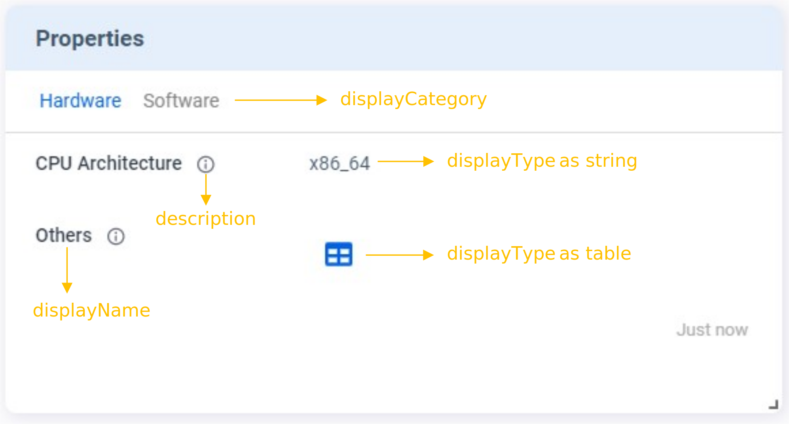
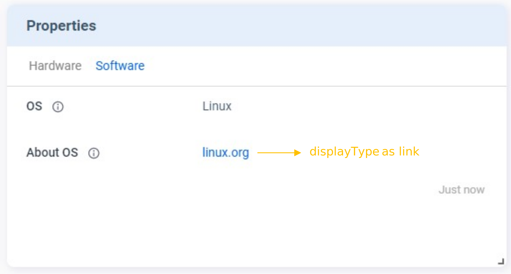

The **Properties** card is designed for showing static information, such as firmware version, hardware configuration, etc. 

## Tutorials
Here is an example of `v2/notifyPluginUpdate` JSON. Let’s focus on the highlighted section to learn how to create your **Properties** card.


```json {16-61} 
{
    "jsonrpc": "2.0",
    "method": "v2/notifyPluginUpdate",
    "params": {
        "sdk": "${OCTO_SDK_VERSION}",
        "appGUID": "${PLUGIN_APP_GUID}",
        "appName": "${PLUGIN_NAME}",
        "epoch": "",
        "displayName": "Device Info",
        "type": "ib",
        "version": "${PLUGIN_VERSION}",
        "modules": [
            {
                "moduleName": "${PLUGIN_NAME}",
                "displayName": "Device Info",
                "properties": [
                    {
                        "name": "cpu-arch",
                        "displayName": "CPU Architecture",
                        "displayCategory": "Hardware",
                        "description": "Print the current CPU Architecture",
                        "displayType": "string",
                        "value": "x86_64"
                    },
                    {
                        "name": "other",
                        "displayName": "Others",
                        "displayCategory": "Hardware",
                        "description": "Print the others hardware infomation",
                        "displayType": "table",
                        "value": [
                            {
                                "Component": "Memory",
                                "Capability": "8GB"
                            },
                            {
                                "Component": "Storage",
                                "Capability": "256GB"
                            }
                        ]
                    },
                    {
                        "name": "os",
                        "displayName": "OS",
                        "displayCategory": "Software",
                        "description": "Print the OS Name",
                        "displayType": "string",
                        "value": "Linux"
                    },
                    {
                        "name": "os-detail",
                        "displayName": "About OS",
                        "displayCategory": "Software",
                        "description": "More detail about OS",
                        "displayType": "link",
                        "value": {
                            "url": "https://www.linux.org/",
                            "alias": "linux.org"
                        } 
                    }
                ]
            }
        ]
    }
}
```

Here is how it looks like on Allxon Portal:


The **plugIN** card displays the basic information about this plugin.

<!--  -->


There are two tabs under the **Properties** card: **Hardware** and **Software**.  
Since both _CPU Architecture_ and _Others_ have `"displayCategory"` set to `"Hardware"`, you can view them under the **Hardware** tab. 




There are different kinds of `"displayType"`. In this example, the `"displayType"` is `"table"` and a table icon  is displayed. If you click on the icon, a window pops up for you to view more details, as shown below.


You can also click on **Software** tab to switch to the *Software* category. Under this category, all properties that have `"displayCategory"` set to `"Software"` are displayed. See below screenshot:



The *linux.org* is a clickable external link since the `"displayType"` of *About OS* is set to `"link"`.

:::caution
The `"value"` format depends on the `"displayType"`. Make sure you have a correct `"value"` format. 
:::

## Display Type
The card supports three display types: [string](#string), [link](#link), and [table](#table). For how to set up these display types, see the following sections.

### String
The following example shows the code in `v2/notifyPluginUpdate.json` for displaying a property in string format. The data type of `"value"` must be **String**.

```json title="v2/notifyPluginUpdate.json"
{
    ...
    "properties": [ 
        {
            "name": "property1",
            "displayType": "string",
            "value": "my string",
            ...
        },
        ...
    ]
}
```

The **Properties** card displays as follows:


### Link
The following example shows the code in `v2/notifyPluginUpdate.json` for displaying a property as a hyperlink. The data type of `"value"` must be **Object** along with `"url"` and `"alias"`.

```json title="v2/notifyPluginUpdate.json"
{
    ...
    "properties": [ 
        {
            "name": "property1",
            "displayType": "link",
            "value": {
                "url": "https://www.google.com",
                "alias": "Google Site"
            },
            ...
        },
        ...
    ]
}
```

The **Properties** card displays as follows:


### Table
The following example shows the code in `v2/notifyPluginUpdate.json` for displaying a property in a table. To define the content of the table, the data type of `"value"` must be Array and follow the format shown in this example.

```json title="v2/notifyPluginUpdate.json" 
{
    ...
    "properties": [ 
        {
            "name": "property1",
            "displayType": "table",
            "value": [
                {
                    "header1": "row1 column1",
                    "header2": "row1 column2"
                },
                {
                    "header1": "row2 column2",
                    "header2": "row2 column2"
                },
                ...
            ],
            ...
        },
        ...
    ]
}
```

The **Properties** card displays as follows:

 

Clicking the table icon brings up the details.

