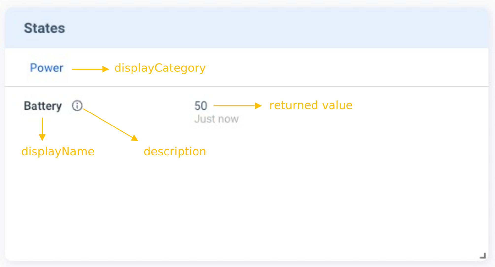

The **States** card is designed for providing current device states. Such data is not reserved on Allxon Cloud; only the latest data is shown on the Portal. You need to send `v2/notifyPluginState` to initialize the **States** card, and then continually send `v2/notifyPluginState` to update the information on the **States** card.

## Tutorials

Here is an example of creating the **States** card:

First, send the following `v2/notifyPluginState` JSON.

```json {17-25}
{
  "jsonrpc": "2.0",
  "method": "v2/notifyPluginUpdate",
  "params": {
    "sdk": "${OCTO_SDK_VERSION}",
    "appGUID": "${PLUGIN_APP_GUID}",
    "appName": "${PLUGIN_NAME}",
    "epoch": "",
    "displayName": "Device Info",
    "type": "ib",
    "version": "${PLUGIN_VERSION}",
    "modules": [
      {
        "moduleName": "device-info-plugin",
        "displayName": "Device Info",
        "properties": [],
        "states": [
          {
            "name": "battery-percent",
            "displayCategory": "Power",
            "displayName": "Battery",
            "description": "remaining battery percentage",
            "displayType": "string"
          }
        ]
      }
    ]
  }
}
```

Once done, Allxon Portal shows the **States** card below. There is no value for _Battery_ because it's still in the initialization state.


Next, send `v2/notifyPluginState` to assign and update the _Battery_ value:

```json {11}
{
  "jsonrpc": "2.0",
  "method": "v2/notifyPluginState",
  "params": {
    "appGUID": "${PLUGIN_APP_GUID}",
    "moduleName": "${PLUGIN_NAME}",
    "epoch": "",
    "states": [
      {
        "name": "battery-percent",
        "value": "50"
      }
    ]
  }
}
```

Then you can see the _Battery_ value has been updated, and the time of update is displayed below the value.



:::note Limitation
The update frequency of the **States** value is about once a minute.
:::

## Display Type

The card supports three display types: [string](#string), [link](#link), and [table](#table). For how to set up these display types, see the following sections.

### String

The following example shows the code in `v2/notifyPluginUpdate.json` for displaying a state in string format.

```json title="v2/notifyPluginUpdate.json"
{
    ...
    "states": [
        {
            "name": "stringState",
            "displayType": "string",
            ...
        },
        ...
    ]
}
```

When `v2/notifyPluginState.json` is used to update the state, the `"name"` must be identical to that in `v2/notifyPluginUpdate.json`, and the data type of `"value"` must be **String**.

```json title="v2/notifyPluginState.json"
{
    "jsonrpc": "2.0",
    "method": "v2/notifyPluginState",
    "params": {
        "states": [
            {
                "name": "stringState",
                "value": "my state string"
            },
            ...
        ]
    }
}
```

Then the **States** card is updated, as shown below.


### Link

The following example shows the code in `v2/notifyPluginUpdate.json` for displaying a state as a hyperlink.

```json title="v2/notifyPluginUpdate.json"
{
    ...
    "states": [
        {
            "name": "linkState",
            "displayType": "link",
            ...
        },
        ...
    ]
}
```

When `v2/notifyPluginState.json` is used to update the state, the `"name"` must be identical to that in `"v2/notifyPluginUpdate.json"`, and the data type of `"value"` must be **Object** along with `"url"` and `"alias"`.

```json title="v2/notifyPluginState.json"
{
    "jsonrpc": "2.0",
    "method": "v2/notifyPluginState",
    "params": {
        ...
        "states": [
            {
                "name": "linkState",
                "value": {
                    "url": "https://www.google.com",
                    "alias": "Google Site"
                }
            },
            ...
        ]
    }
}
```

Then the **States** card is updated, as shown below.


### Table

The following example shows the code in `v2/notifyPluginUpdate.json` for displaying a state in a table.

```json title="v2/notifyPluginUpdate.json"
{
    ...
    "states": [
        {
            "name": "tableState",
            "displayType": "table",
            ...
        },
        ...
    ]
}
```

When `"v2/notifyPluginState.json"` is used to update the state, the `"name"` must be identical to that in `"v2/notifyPluginUpdate.json"`. To define the content of the table, the data type of `"value"` must be Array and follow the format in the example below.

```json title="v2/notifyPluginState.json"
{
    "jsonrpc": "2.0",
    "method": "v2/notifyPluginState",
    "params": {
        ...
        "states": [
            {
                "name": "tableState",
                "value": [
                    {
                        "header1": "row1 column1",
                        "header2": "row1 column2"
                    },
                    {
                        "header1": "row2 column2",
                        "header2": "row2 column2"
                    }
                ]
            }
        ]
    }
}
```

Then the **States** card displays a table icon.


Clicking the table icon brings up the details.


