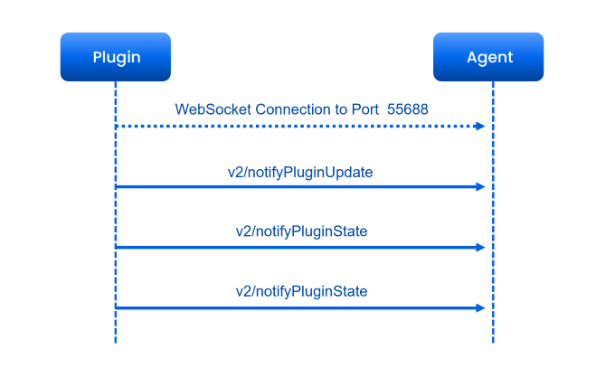
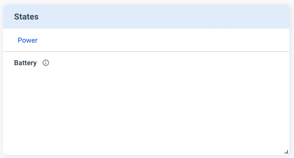

The **States** card is designed for providing current device states. Such data is not reserved on Allxon Cloud; only the latest data is shown on the Portal. You need to send `v2/notifyPluginState` to initialize the **States** card, and then continually send `v2/notifyPluginState` to update the information on the **States** card. 
 
Here is an example of creating the **States** card:

First, send the following `v2/notifyPluginState` JSON.

```json {17-25} 
{
    "jsonrpc": "2.0",
    "method": "v2/notifyPluginUpdate",
    "params": {
        "sdk": "${OCTO_SDK_VERSION}",
        "appGUID": "${PLUGIN_APP_GUID}",
        "appName": "${PLUGIN_NAME}",
        "epoch": "",
        "displayName": "Device Info",
        "type": "ib",
        "version": "${PLUGIN_VERSION}",
        "modules": [
            {
                "moduleName": "device-info-plugin",
                "displayName": "Device Info",
                "properties": [],
                "states": [
                    {
                        "name": "battery-percent",
                        "displayCategory": "Power",
                        "displayName": "Battery",
                        "description": "remaining battery percentage",
                        "displayType": "string"
                    }
                ]
            }
        ]
    }
}
```

Once done, Allxon Portal shows the **States** card below. There is no value for *Battery* because it's still in the initialization state.



Next, send `v2/notifyPluginState` to assign and update the *Battery* value:


```json {11}
{
    "jsonrpc": "2.0",
    "method": "v2/notifyPluginState",
    "params": {
        "appGUID": "${PLUGIN_APP_GUID}",
        "moduleName": "${PLUGIN_NAME}",
        "epoch": "",
        "states": [
            {
                "name": "battery-percent",
                "value": "50"
            }
        ]
    }
}
```

Then you can see the *Battery* value has been updated, and the time of update is displayed below the value.


:::note Limitation
The update frequency of the **States** value is about once a minute.
:::
