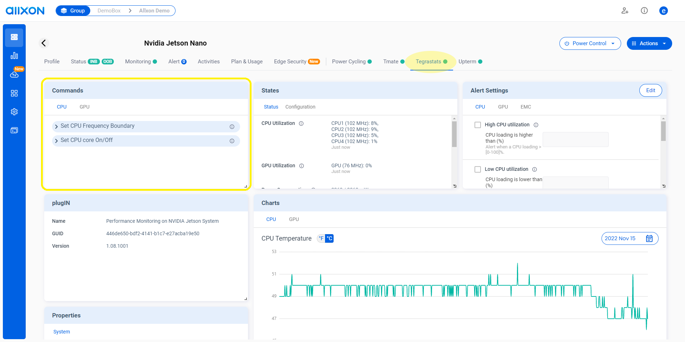
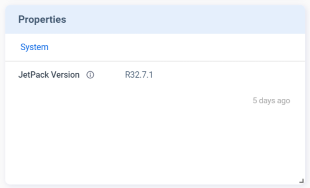
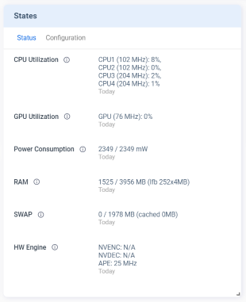
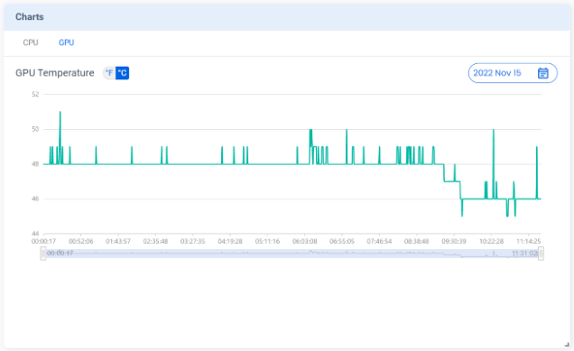
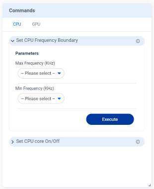
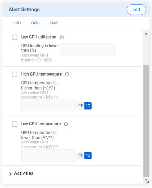
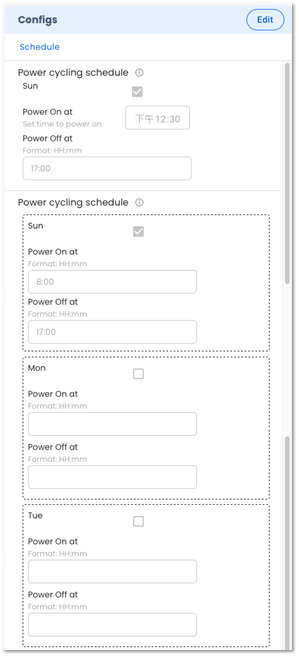

# Features

There are seven types of features available in Allxon Octo SDK — **Properties**, **States**, **Metrics**, **Events**, **Commands**, **Alerts** and **Configs**. Once a plugin is registered with the Agent, a new tab appears on the Portal. As shown in the screenshot below, each applicable feature has a corresponding “card” to display details.

## Properties

The **Properties** card displays the device information that is not frequently changed. By default, the information on this card is only updated when a plugin is registered for the first time.

:::tip Example device information:

- Hardware model name
- Firmware version
- Serial number
- Customer support contact

:::

:::info Supported display types:

- String
- Hyperlink
- Table (a pop-up window)

:::

## States

The **States** card displays the device information that is frequently updated. Only the latest state is displayed and kept on the server.

:::tip Example device information:

- CPU/ GPU/ RAM utilization
- System temperature
- Power consumption

:::

:::info Supported display types:

- String
- Hyperlink
- Table (a pop-up window)
  :::

## Events

The **Events** card displays the history of activities and events defined by the plugin. It allows users to view records over the last 90 days.

:::tip Example activities/events:

- Device health status
- Cyber threat activity
- Intrusion detection record

:::

## Metrics

The **Metrics** feature brings time-series data to the **Charts** card on the Portal. The Charts card displays time-series data in a trend. It allows users to drag the scrollbar to zoom in or zoom out on a time interval and view data over the last 90 days.

:::tip Example data types:

- System temperature
- Humidity
- Voltage

:::

## Commands

The **Commands** feature allows users to send commands supported by the device plugin. Users can also set parameters for the commands on the Portal.

:::tip Example commands:

- Power Switch/On/Off
- Set CPU/GPU Frequency Boundary

:::

:::info Supported parameter input types:

- String ​
- Multi-line text
- Date/ time picker​
- Switch toggle​
- Checkbox​
- Dropdown list
- ToS (Terms of Service) requiring ticking

:::

## Alerts

The **Alerts** feature allows users to set thresholds for plugin-predefined alerts and then apply the settings to edge devices. If the threshold on an edge device is reached, the device plugin triggers alerts to Allxon Cloud to send notifications to the users.

:::tip Example alerts:

- CPU/GPU loading is higher than 95 %
- Battery level is lower than 10%

:::

:::info Supported parameter input types:

- String ​
- Date/ time picker​
- Switch toggle​
- Checkbox​
- Dropdown list
- Predefined temperature scale
  :::

## Configs

The **Configs** feature allows users to configure device settings and set rules to automate operations.

:::tip Example configuration:

- Scheduling power on at 9 am and power off at 6 pm
- Adjust GPU frequency to 16,000,000 Hz when the temperature reaches 96OC

:::

:::info Supported parameter input types:

- String ​
- Date/ time picker​
- Switch toggle​
- Checkbox​
- Dropdown list
- Predefined temperature scale
  :::

:::note

1. Allxon Agent reports back the data of **States**, **Events**, **Metrics**, and **Alerts** once per minute. Accordingly, the data displayed on the Allxon Portal is updated once per minute.

2. The settings of **Alerts** and **Configs** belong to the group-level. When the user changes the Alerts/Configs settings on the Portal, the Portal deploys the changes to all the plugins in the same device group. Then Allxon Portal displays the **Alerts/Configs** card based on the _latest plugin version_ in the device group and stores the _latest settings_.

3. The **Commands** can be executed by a single device as well as by multiple devices in group. When a command is being executed, the Portal checks the plugin version installed on the device. Only the devices with the same plugin version can be selected for group command execution.
   :::
