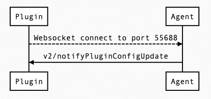
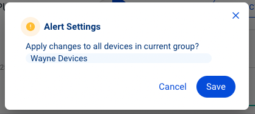

Configs Card sequence flow similar with Alert Card. Send `v2/notifyPluginUpdate` to initialize Alert Card, if you have Config setting on Allxon Portal, you will get `v2/notifyPluginConfigUpdate` after sending `v2/notifPluginUpdate`.

Let's take a look at the example:

```json {17-31}
{
  "jsonrpc": "2.0",
  "method": "v2/notifyPluginUpdate",
  "params": {
    "sdk": "${OCTO_SDK_VERSION}",
    "appGUID": "${PLUGIN_APP_GUID}",
    "appName": "${PLUGIN_NAME}",
    "epoch": "",
    "displayName": "plugIN Hello",
    "type": "ib",
    "version": "${PLUGIN_VERSION}",
    "modules": [
      {
        "moduleName": "${PLUGIN_NAME}",
        "displayName": "plugIN Hello",
        "properties": [],
        "configs": [
          {
            "name": "config1",
            "displayName": "config1 display name",
            "description": "config1 description",
            "displayCategory": "ConfigCategory1",
            "params": [
              {
                "name": "config1Param1",
                "required": true,
                "displayType": "string"
              }
            ]
          }
        ]
      }
    ]
  }
}
```

After sending `v2/notifyPluginUpdate`, Configs Card will look like the image below.


Let's setting Config Card on Allxon Portal to fill parameters. Click "Edit" -> Type "my display" in config1-> "Save".




After setting, Plugin should received new `v2/notifyPluginConfigUpdate` below to notify Plugin that config setting updated. 

```json
{
    "jsonrpc": "2.0",
    "method": "v2/notifyPluginConfigUpdate?authorization=$argon2id$v=19$m=64,t=16,p=8$KksxWlhPbjRULHA0Yj5WYA$abdF1Vo4573+Uz5I0Xz81A",
    "params": {
        "appGUID": "a8e873a1-e5df-43a2-928a-745ff9c94dfb",
        "version": "1.0.1",
        "epoch": "1664866949",
        "modules": [
            {
                "moduleName": "plugin-hello",
                "epoch": "1664866940",
                "configs": [
                    {
                        "name": "config1",
                        "params": [
                            {
                                "name": "config1Param1",
                                "value": "my display"
                            }
                        ]
                    }
                ]
            }
        ]
    }
}
```