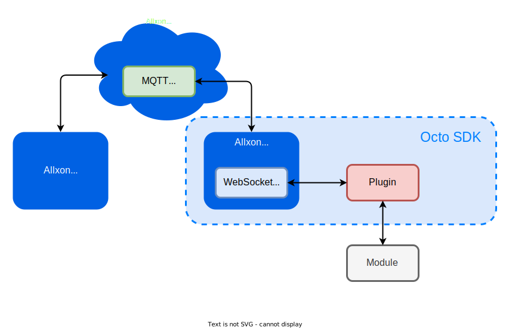
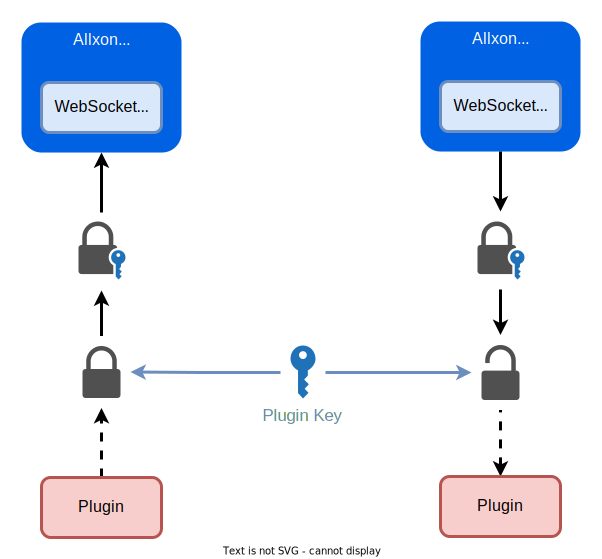

# Introduction



This picture show the Allxon infrastructure a overview. Each Plugin communicate with Allxon Agent through [JSON-RPC](https://www.jsonrpc.org/specification) Websocket, and Allxon Agent like a bridge to bring JSON between Allxon cloud and Plugin.

## Secure Data

Octo SDK use Plugin Credential help you to verify JSON from Allxon Agent, and help you to sign JSON to Allxon Agent. 



```cpp
#include <string>
#include "json_validator.h"

int main(int argc, char **argv)
{
    // notifyPluginUpdate json template
    std::string json_content = "{\"jsonrpc\": \"2.0\", \"method\": \"v2/notifyPluginUpdate\"...}"; 
    std::string PLUGIN_NAME = "my_plugin_name";
    std::string PLUGIN_APP_GUID = "my_plugin_app_guid";
    std::string PLUGIN_ACCESS_KEY = "my_plugin_access_key";
    std::string PLUGIN_VERSION = "my_plugin_version";
    
    auto json_validator = JsonValidator(PLUGIN_NAME, PLUGIN_APP_GUID,
                                        PLUGIN_ACCESS_KEY, PLUGIN_VERSION,
                                        json_content); 
    
    std::string other_plugin_api_json_content;
    if (json_validator.Sign(other_plugin_api_json_content))
    {
        // if sign success, you can send it through websocket
        // e.g. 
        // enpoint.send(other_plugin_api_json_content);
    }

    if (json_validator.Verify(other_plugin_api_json_content))
    {
        // if verify success, means json content is safe, you can read it
    }
    return 0;
}
```

## Octo JSON RPC API

Let's briefly introduce every API functionality to power your device on. 

### `v2/notifyPluginUpdate`

| Direction | Description |
| --- | --- |
| Plugin → Allxon Agent | Plugin initialize every Card on Allxon Portal, must call `v2/notifyPluginUpdate` API after the WebSocket connection is established. |

### `v2/notifyPluginCommand`

| Direction | Description |
| --- | --- |
| Allxon Agent → Plugin | Plugin will be notified once user trigger Command Card on Allxon Portal. |

### `v2/notifyPluginCommandAck`

| Direction | Description |
| --- | --- |
| Plugin → Allxon Agent | After receive `v2/notifyPluginCommand`, Plugin acknowledge the Command back to Allxon portal. | 
	
### `v2/notifyPluginState`

| Direction | Description |
| --- | --- |
| Plugin → Allxon Agent | Plugin updates data to the Allxon Portal State Card. Tyically is designed for realtime data and repesent current device states information, these data won't be reserve on Allxon Portal, only keeps latest data. Ex: network condition, power status.. | 
	
### `v2/notifyPluginEvent`

| Direction | Description |
| --- | --- |
| Plugin → Allxon Agent | Plugin updates data to the Allxon Portal Event Card. Tyically is designed for non realtime data and repesent device events information, would be reserve on Allxon Portal. Ex: IO trigger event, user login event.. | 
	
### `v2/notifyPluginMetric`

| Direction | Description |
| --- | --- |
| Plugin → Allxon Agent | Plugin updates data to the Allxon Portal Metric Card. Tyically is designed for non realtime data and prefered repesent to chart style, would be reserve on Allxon Portal. Ex: device temperature.. | 
	
### `v2/notifyPluginAlert`

| Direction | Description |
| --- | --- |
| Plugin → Allxon Agent | Plugin trigger Alert to the Allxon Portal. Typically is designed for emergency data ,Allxon Portal will notify user through email, webhook... depend on your setting on Allxon Portal. | 

### `v2/notifyPluginAlarmUpdate`

| Direction | Description |
| --- | --- |
| Allxon Agent → Plugin | Plugin will be notified once the Plugin is online if there are alert settings on Allxon Portal. When you setup your alert setting on Allxon Portal, Plugin will get `v2/notifyPluginAlarmUpdate` to synchronize alert related setting. | 

### `v2/notifyPluginConfigUpdate`

| Direction | Description |
| --- | --- |
| Allxon Agent → Plugin | Plugin will be notified once the Plugin is online if there are config settings on Allxon Portal. Typically is designed for configuring your device from Allxon Portal. |

:::tip
For more details [API documentation](https://wayneliu0512.github.io/octo-developer-zone_docusaurus/API%20Reference)
:::


## Typical API Sequence Flow

The image below shows what typical API sequence flow. 
1. Connect to Allxon Agent by Websocket.
2. Send `v2/notifyPluginUpdate` to initialize Allxon Portal Cards.
3. You probably will get `v2/notifyPluginAlarmUpdate` if you've Alert setting on Allxon Portal.
4. Just like previous step, You probably will get `v2/notifyPluginConfigUpdate` if you've Config setting on Allxon Portal.

