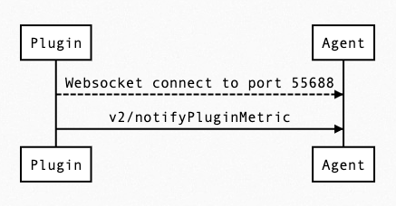
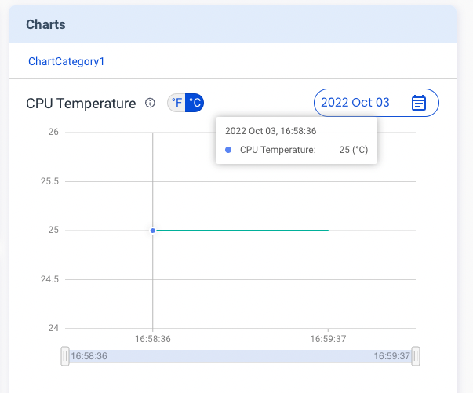

Metrics Card help you to present chart style information, Ex: device temperature. Sequence flow just same with State Card.

Take a look at the example:

```json {17-26}
{
  "jsonrpc": "2.0",
  "method": "v2/notifyPluginUpdate",
  "params": {
    "sdk": "${OCTO_SDK_VERSION}",
    "appGUID": "${PLUGIN_APP_GUID}",
    "appName": "${PLUGIN_NAME}",
    "epoch": "",
    "displayName": "plugIN Hello",
    "type": "ib",
    "version": "${PLUGIN_VERSION}",
    "modules": [
      {
        "moduleName": "${PLUGIN_NAME}",
        "displayName": "plugIN Hello",
        "properties": [],
        "metrics": [
          {
            "name": "cpu_temperature",
            "displayName": "CPU Temperature",
            "description": "Present CPU Temprature in chart.",
            "displayCategory": "ChartCategory1",
            "displayType": "temperature",
            "displayUnit": "",
            "value": ""
          }
        ]
      }
    ]
  }
}
```

After Sending `v2/notifyPluginUpdate` JSON above, Allxon Portal will show Metrics Card below. Diagram is empty, because it's still in initialize state.


Let's try send `v2/notifyPluginMetric` to upload data:

```json
{
   "jsonrpc": "2.0",
   "method": "v2/notifyPluginMetric",
   "params": {
      "appGUID": "${PLUGIN_APP_GUID}",
      "moduleName": "${PLUGIN_NAME}",
      "epoch": "",
      "metrics": [
         {
            "name": "cpu_temperature",
            "value": "298.15"
         }
      ]
   }
}
```
 
You may curious why `"value"` is `"298.5"`, because if your `"displayType"` is set to `"temperature"`, Allxon Portal would assume your `"value"` unit is Kelvin.

:::tip
This [link](https://www.unitconverters.net/) help you to convert between Celcius and Kelvin.
:::

Metric Card will display like this:


Keep sending second shot of `v2/notifyPluginMetric`:


