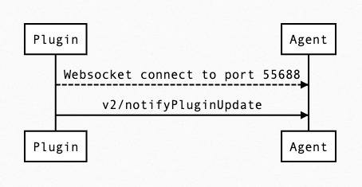
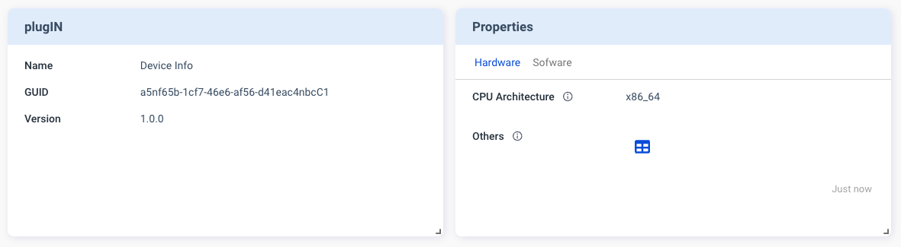

Properties Card is Designed for showing static related information, such as firmware version, hardware configuration, ..., etc. Here is a `v2/notifyPluginUpdate` example JSON, we can focus on highlight part to learn how to setup your Properties Card.

```json {16-61} 
{
    "jsonrpc": "2.0",
    "method": "v2/notifyPluginUpdate",
    "params": {
        "sdk": "${OCTO_SDK_VERSION}",
        "appGUID": "${PLUGIN_APP_GUID}",
        "appName": "${PLUGIN_NAME}",
        "epoch": "",
        "displayName": "Device Info",
        "type": "ib",
        "version": "${PLUGIN_VERSION}",
        "modules": [
            {
                "moduleName": "${PLUGIN_NAME}",
                "displayName": "Device Info",
                "properties": [
                    {
                        "name": "cpu-arch",
                        "displayName": "CPU Architecture",
                        "displayCategory": "Hardware",
                        "description": "Print the current CPU Architecture",
                        "displayType": "string",
                        "value": "x86_64"
                    },
                    {
                        "name": "other",
                        "displayName": "Others",
                        "displayCategory": "Hardware",
                        "description": "Print the others hardware infomation",
                        "displayType": "table",
                        "value": [
                            {
                                "Component": "Memory",
                                "Capability": "8GB"
                            },
                            {
                                "Component": "Storage",
                                "Capability": "256GB"
                            }
                        ]
                    },
                    {
                        "name": "os",
                        "displayName": "OS",
                        "displayCategory": "Sofware",
                        "description": "Print the OS Name",
                        "displayType": "string",
                        "value": "Linux"
                    },
                    {
                        "name": "os-detail",
                        "displayName": "About OS",
                        "displayCategory": "Sofware",
                        "description": "More detail about OS",
                        "displayType": "link",
                        "value": {
                            "url": "https://www.linux.org/",
                            "alias": "linux.org"
                        } 
                    }
                ]
            }
        ]
    }
}
```

Here is how it looks like on Allxon Portal:



When you click on "Others" table icon , table dialog will popup. This is what it like when you set `"displayType"` to `"table"`.


When you click on "Software", will jump into "Software" Category. It will content properties that set `"displayCategory"` to `"Software"`.


"linux.org" is a clickable external link, because `"displayType"` is `"link"`.

:::caution
`"value"` format is depend on which `"displayType"`, make sure you have a correct `"value"` format. 
:::