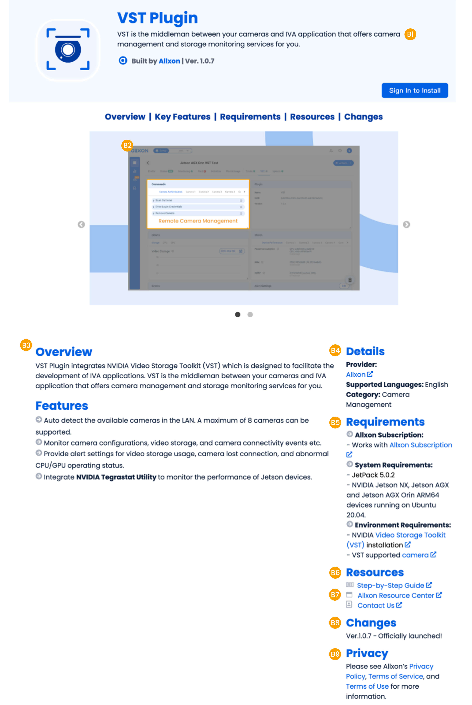

# Plugin Station Listing Guideline

You’ve finished building your plugin, tested it, and implemented user feedback, which means your plugin is ready to be reviewed by the Allxon team, hurrah! 

In the next section, we’ll walk you through when and how to submit your plugin to Allxon Plugin Station. Be sure to read this carefully, as it contains information that will lead to a successful review.

## Monthly listing timeline

We will open the opportunity to list new plugins on Plugin Station *once a month*. Please get in touch with your Allxon contact window for upcoming listing dates. To ensure the quality and safety of our Plugin Station, developers must submit the necessary information at least **three weeks** before the listing date.   

There are two things that we will do when we receive  your plugin submission. 

- [Plugin Review](#submit-your-plugin): To ensure that the submitted plugins comply with our policies and guidelines, and meet legal requirements and user experience standards, we will review each plugin, which usually takes *5-10 working days*. If any issues are found during the reviewing process, developers must address them immediately and resubmit the plugin for review. 
  
  

- [Listing Content Curation](_img/Listing_Content_A.svg): Once your plugin has been successfully reviewed, we will prepare the plugin’s product page based on your submitting content, which usually takes *3-5 working days*.  

:::info 

Developers should reserve sufficient time for the plugin review process, as there may be back-and-forth communication that could potentially cause delays. 

::: 

## Submit Your Plugin

Once your plugin is ready to release, fill out the [**Plugin Review Submission Form**](https://share.hsforms.com/1qQowbU1iSy-R7-LBUykGFg4e307) and submit all the requested information to help us review. Let's browse through the guidelines and see what you will need to prepare beforehand. 

- **Build your plugin package**

  Make sure you follow the [instructions](../docs/Build%20a%20Plugin%20Package.md) to build your plugin package.  In the last section, you can find the plugin online installer that is the script for how Allxon Plugin Station installs a plugin.  Make sure to test it before submitting your plugin package. 

- **Set up a demo device on Allxon Portal**

  Provide the URL of a demo device on Allxon Portal. We will quickly browse through and review the functions you claimed. 

- **Set a demo video of the plugin**

  Provide the URL of the video clip to demonstrate the user scenario and show us how the plugin works. 

- **Provide a demo account**

  Provide full access to your plugin. If your plugin includes account-based features, provide either an active demo account or any other resources that might be needed to review your plugin. 

## Submit Listing Content

Once your plugin passes review, it’s ready to be published onto Allxon Plugin Station. Use this [**Listing Content Template**](https://www.allxon.com/hubfs/Plugin%20Listing/Plugin%20Station%20Listing%20Content%20Template_v202305.xlsx) to submit all the required assets to your Allxon contact—app name, description, images, videos, helpful links, and more. Every element of the plugin landing page has the power to drive downloads of your plugin. 

**Section A: Plugin Card on Plugin Station**

- **A1: Plugin name** (maximum 30 characters) 

  Make sure your plugin name is unique and clear to what your plugin does.  

- **A2: Plugin icon** 

  Create a plugin icon that clearly represents your brand and stands out among the rest. This is the simplest way to ensure that your plugin grabs users’ attention and your app listing gets a ton of traffic. Your icon must follow the requirement below. 
  
  - Dimensions: 500*500px 
  
  - Rounded Corner: 140*140px 
  
  - Type: svg
  
  - Size: <10KB 

- **A3: Plugin provider**

- **A4: Plugin version** 

- **A5: Promotional text** (maximum 170 characters)

  Provide an engaging description that highlights the features and functionality of your plugin. Let potential users know what makes your plugin unique and why they’ll love it. The promotional text is the most important — this is what users can read without having to tap to learn more. 
  
  

**Section B: Plugin Landing Page**

- **B1: Tagline** 

  Highlight features or typical uses of your plugin that resonate with your audience. A tagline can be up to 90 characters long and appears below your plugin’s name. 

- **B2: Plugin preview**

  A plugin preview is the best way to tell the story about your plugin. Create visuals that are descriptive and clear, so users can easily understand what your plugin does and how it can make their day-to-day operation easier. 
  Provide at least one screenshot.  Supported file types and requirements: 
  
  - Type: png, jpg, svg or gif under 8MB 
  - Image size: 1440 * 900 px maximum 
  - Gray mask size and color: 1440 * 900 px #666666 opacity: 70%  
  - Font size and color: Poppins Regular 28pt #F99F00 5pt 
  - File naming convention: Name files with alt text in the order that you’d like them to appear on the plugin listing. For example, "1-alt text.png", "2-alt text.png", "3-alt text.png". 

- **B3: Description** 

  Clearly explain how your plugin can help users carry out their goals. And highlight your plugin's key features and context in bullet points for how it works.  

- **B4: Detail**
  
  - Provider name 
  - Provider website 
  - Language available of the plugin 
  - Plugin category 

- **B5: Requirements** 
  
  - Pricing plan: Link to your software’s pricing plan; enter the URL where users can find more information on your pricing plans. 
  - System requirements: List down the requirements to make sure your plugin runs well, e.g., OS, SW dependency. 
  - Environment Requirements: List down specific environment requirements with the URL. 

- **B6: Resources**

  Provide resources for user onboarding and trouble shooting, e.g., user guide, tutorials etc.

- **B7: Supports**

  Provide at least one support contact method for users who have questions while using your plugin. e.g. support email, forum, community etc. 

- **B8: Changes**

  Provide release notes to communicate changes to users. 

- **B9: Legal Stuff** 

  Provide links of legal documentation, e.g. Privacy Policy, Terms of Service, Terms of Use. 

## Maintain Your Published Plugin

Allxon Plugin Station helps users find high-quality, dependable plugins to aid in optimizing their device operations with Allxon. This means that it is not just about the initial plugin submission and review. 

### Resubmit your plugin

Plugins can change, and that's a good thing. You must resubmit your app for review when you make substantial changes or updates to the features, purpose or functionality of your plugin. 

### Remove your plugin from Allxon Plugin Station

If you're no longer actively maintaining or developing your app, it's essential to ensure a proper discontinuation process by contacting the Allxon Team Make sure to include the following information: 

- The expected date of removal from Allxon Plugin Station. 
- The end of support date for current users, ideally 3-6 months before. 

We will inform current users with an end-of-life notification through the Allxon backend system. 

## Possible Enforcement Actions

In order to  provide everyone with the best possible experience from Allxon Plugin Station, there are circumstances in which we will contact you and possibly delist or take further action on your plugin. 

We may contact you for response when: 

1. Your plugin appears to be unmaintained or abandoned 
2. Our expectations for published plugin are not being met 
3. We see increased instances of your plugin being uninstalled 
4. We see large numbers of errors for your plugin 
5. The support or privacy policy page links for the plugin are broken 

If we do not hear back from you after reaching out to you for any reason, we will reach out again while simultaneously delisting your plugin to protect users. If we hear back from you, and confirm that the issues are resolved and no longer affect the optimization of Allxon Plugin Station, we will be able to re-list your plugin again.
