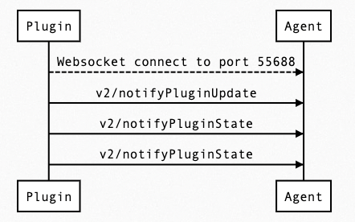

States Card is designed for realtime data and repesent current device states information, these data won't be reserve on Allxon Portal, only keeps latest data. Send `v2/notifyPluginUpdate` to initialize States Card, After that, Keep sending `v2/notifyPluginState` to continue update States Card information. Take a look at the example:

```json {17-25} 
{
    "jsonrpc": "2.0",
    "method": "v2/notifyPluginUpdate",
    "params": {
        "sdk": "${OCTO_SDK_VERSION}",
        "appGUID": "${PLUGIN_APP_GUID}",
        "appName": "${PLUGIN_NAME}",
        "epoch": "",
        "displayName": "Device Info",
        "type": "ib",
        "version": "${PLUGIN_VERSION}",
        "modules": [
            {
                "moduleName": "device-info-plugin",
                "displayName": "Device Info",
                "properties": [],
                "states": [
                    {
                        "name": "battery-percent",
                        "displayCategory": "Power",
                        "displayName": "Battery",
                        "description": "remaining battery percentage",
                        "displayType": "string"
                    }
                ]
            }
        ]
    }
}
```

After Sending `v2/notifyPluginUpdate` JSON above, Allxon Portal will show States Card below. Value behind Battery is empty, because it's still in initialize state. 


Next, we try to send `v2/notifyPluginState` to assign and update Battery value:

```json {11}
{
    "jsonrpc": "2.0",
    "method": "v2/notifyPluginState",
    "params": {
        "appGUID": "${PLUGIN_APP_GUID}",
        "moduleName": "${PLUGIN_NAME}",
        "epoch": "",
        "states": [
            {
                "name": "battery-percent",
                "value": "50"
            }
        ]
    }
}
```

Then you can see Battery's value already update, and update time will show below the value.


:::note Limitation
The update frequency of the States value is at least once a minute.
:::

