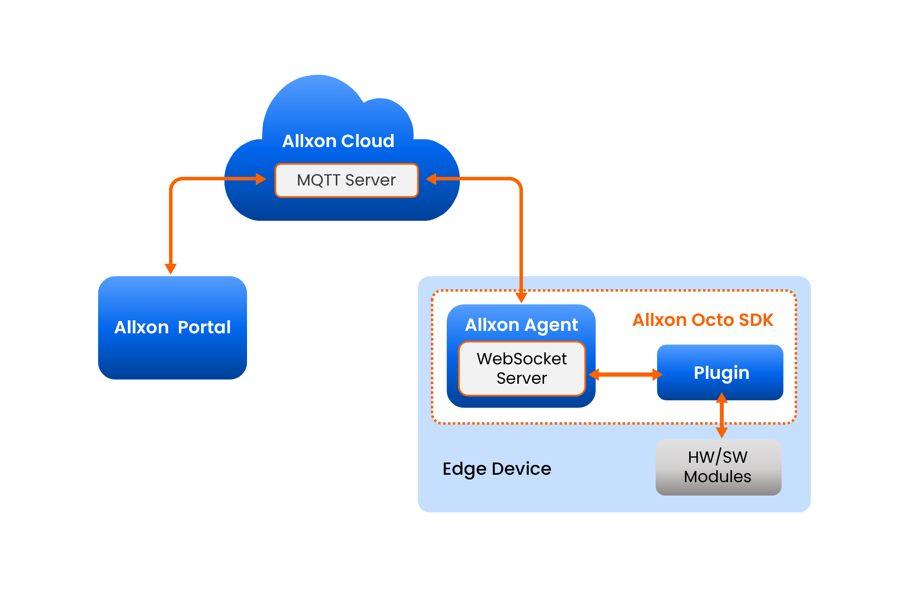

# Architecture 

**Allxon Octo SDK** establishes an extensible architecture on edge devices with Allxon Agent and device plugins. The SDK includes a set of unified and integrated interfaces, which accelerates plugin development, enhances security, and facilitates and simplifies the communication between device applications and the cloud.

This picture below is an overview of the Allxon Octo architecture. The plugin communicates with Allxon Agent through JSON-RPC Websocket, and the Allxon Agent connects to MQTT server hosted by Allxon Cloud. With such a design, Allxon Octo API seamlessly transmits JSON between the cloud and the plugin.




Not quite clear? Refer to the descriptions below to learn more about each element.

**Allxon Cloud**: The backend server(s) of Allxon service; both Allxon Portal and Allxon Agent are connected to Allxon Cloud.
**Allxon Portal**: The frontend server(s) of Allxon service.
**Allxon Agent**: An agent application that communicates between edge devices and Allxon Cloud.
**Plugin**: A software application that extends the functionalities of Allxon service. A plugin sends collected data from modules to Allxon Cloud via the Allxon Agent. It also sends commands from Allxon Portal to modules via the Allxon Agent.
**Module**: A hardware component (e.g. GPU, SSD, fan) or a software application (e.g. remote console utilities). A plugin collects data from a module or sends commands to a module.
**MQTT Broker**: Allxon Agent connects to a MQTT broker hosted by Allxon Cloud. All the data exchange between Allxon Agents and Allxon Cloud go through this channel.
**WebSocket Server**: A plugin connects to a WebSocket server hosted within an Allxon Agent. The plugin sends and receives data to/from Allxon Cloud with Allxon Octo APIs through this channel.
**Allxon Octo API**: The Application Programming Interface used to communicate between Allxon Agent and plugins.
**Allxon Octo SDK**: The Software Development Kit provided by Allxon, which helps developers to build plugins and verify Allxon Octo APIs.

## Securing Your Data​

Allxon Octo SDK uses *Plugin Credential* to verify the JSON sent from Allxon Agent and to sign the JSON to be sent to Allxon Agent.


```cpp
#include <string>
#include "json_validator.h"

int main(int argc, char **argv)
{
    // notifyPluginUpdate json template
    std::string json_content = "{\"jsonrpc\": \"2.0\", \"method\": \"v2/notifyPluginUpdate\"...}"; 
    std::string PLUGIN_NAME = "my_plugin_name";
    std::string PLUGIN_APP_GUID = "my_plugin_app_guid";
    std::string PLUGIN_ACCESS_KEY = "my_plugin_access_key";
    std::string PLUGIN_VERSION = "my_plugin_version";
    
    auto json_validator = JsonValidator(PLUGIN_NAME, PLUGIN_APP_GUID,
                                        PLUGIN_ACCESS_KEY, PLUGIN_VERSION,
                                        json_content); 
    
    std::string other_plugin_api_json_content;
    if (json_validator.Sign(other_plugin_api_json_content))
    {
        // if sign-in is successful, you can send it through websocket
        // e.g. 
        // enpoint.send(other_plugin_api_json_content);
    }

    if (json_validator.Verify(other_plugin_api_json_content))
    {
        // if verification is successful, it means json content is safe, you can read it
    }
    return 0;
}
```
