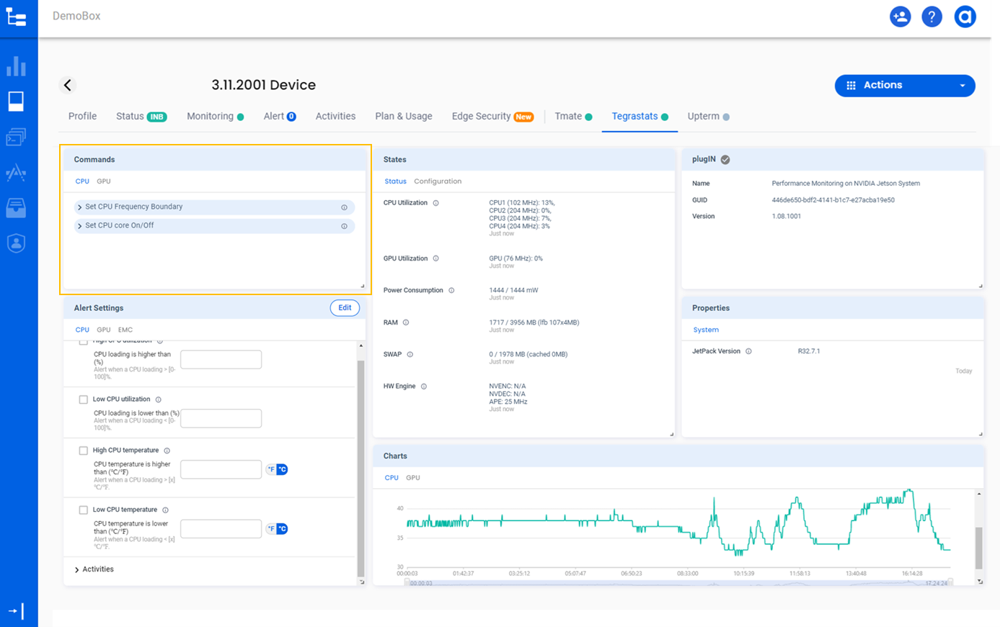
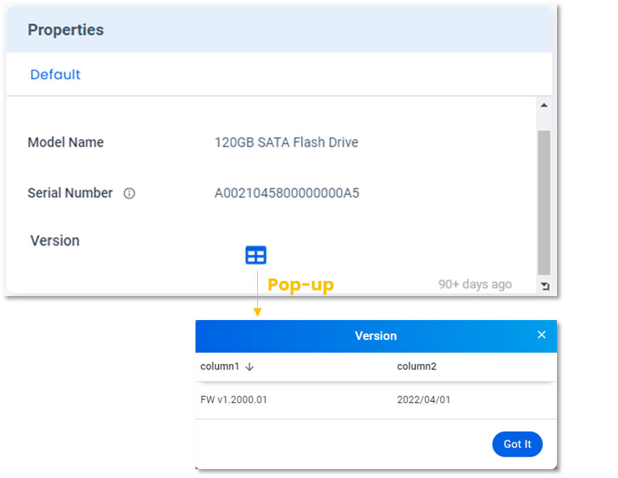
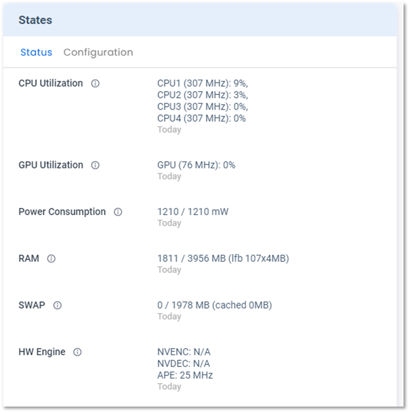
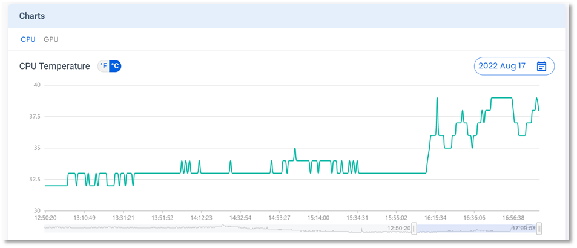
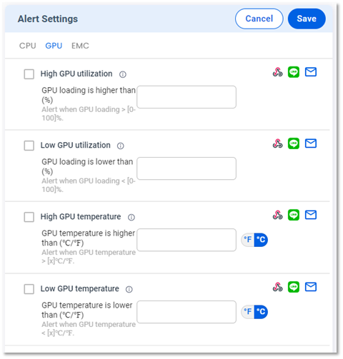
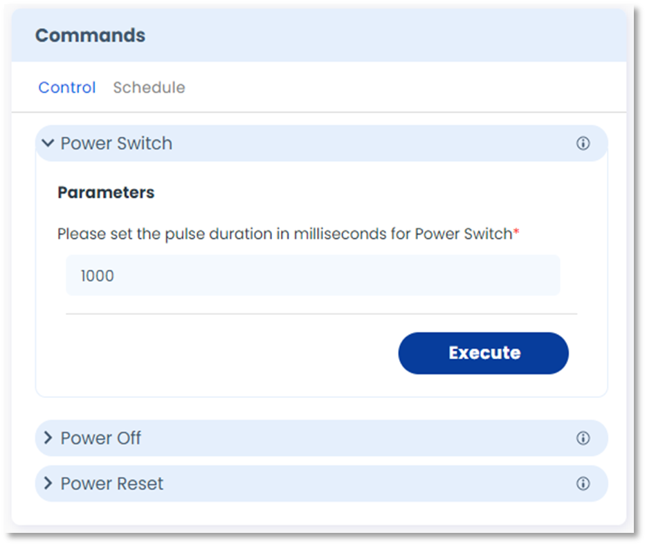

# Features

There are seven types of features available in Allxon Octo SDK — **Properties**, **States**, **Metrics**, **Events**,** Commands**, **Alerts** and **Configs**. Once a plugin is registered with the Agent, a new tab appears on the Portal. As shown in the screen example below, each applicable feature has a corresponding “card” to display details.

## Properties
The **Properties **card displays the device information that is not frequently changed. The information on this card is typically updated when a plugin is registered for the first time.

:::tip
Example device information:
- Hardware model name
- Firmware version
- Serial number
- Customer support contact
:::

:::INFO
Supported display types:
- String
- Table (a pop-up window)
- Link (URL or IP address)
:::

## States
The **States** card displays the device information that is frequently updated. Only the latest state is displayed and kept on the server.

:::tip
Example device information:
- CPU/ GPU/ RAM utilization
- System temperature
- Power consumption
:::

:::INFO
Supported display types:
- String
- Table (a pop-up window)
- Link (URL or IP address)
:::

## Events
The **Events** card displays the history of activities and events defined by the plugin. It allows users to view records over the last 90 days.

:::Tip
Example activities/events:
- Device health status
- Cyber threat activity
- Intrusion detection record
:::

## Metrics
The **Metrics **card displays time-series data in a trend chart. It allows users to scroll the roller to zoom in or zoom out on a time interval and view data inover the last 90 days.

:::Tip
Example data types:
- System temperature
- Humidity
- Voltage
:::

## Alerts
The **Alerts** feature allows users to set alert thresholds on the Portal and then apply the settings to edge devices. If a threshold on an edge device is reached, the device plugin triggers alerts to Allxon Cloud to send notifications to the users.

:::Tip
Example alerts
- CPU/GPU loading is higher than 95 %
- Low battery level warning
:::

:::Info
Supported Parameter Types:
- String ​
- Date/ time​
- Switch ​
- Check box​
- List (dropdown)
- Temperature (^O^F / ^O^C)
:::

## Commands
The **Commands** feature allows users to send commands supported by the device plugin. Users can also set parameters for the commands on the Portal.

:::Tip
Example commands
- Power Switch/On/Off
- Set CPU/GPU Frequency Boundary
:::

:::Info
Supported Parameter Types:
- String ​
- Date/ time​
- Switch ​
- Check box​
- List (dropdown)
- ToS  (Term of Service)
:::

## Configs
The **Configs** feature allows users to configure device settings and set rules to automate operations.

:::Tip
Example configuration
- Power Cycling Schedule
- Adjust GPU frequency to 16,000,000 Hz when the temperature reaches 96 degrees
:::

:::Info
Supported Parameter Types:
- String ​
- Date/ time​
- Switch ​
- Check box​
- List (dropdown)
- Temperature (^O^F / ^O^C)
:::
