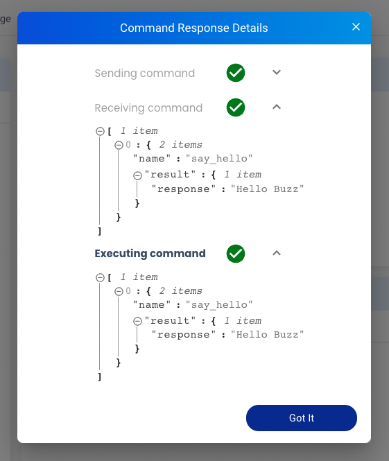

Command Cards provide a custom GUI to send command through Allxon protal. Send `v2/notifyPluginUpdate` to initialize. When you execute the Command from Allxon Portal, Plugin will receive `v2/notifyPluginCommand`, then send `v2/notifyPluginCommandAck` back to confirm the receive, finally, send  `v2/notifyPluginCommandAck` to bring execution result back to Allxon Portal.

Here is a example:

```json {17-35} 
{
    "jsonrpc": "2.0",
    "method": "v2/notifyPluginUpdate",
    "params": {
        "sdk": "${OCTO_SDK_VERSION}",
        "appGUID": "${PLUGIN_APP_GUID}",
        "appName": "${PLUGIN_NAME}",
        "epoch": "",
        "displayName": "plugIN Hello",
        "type": "ib",
        "version": "${PLUGIN_VERSION}",
        "modules": [
            {
                "moduleName": "${PLUGIN_NAME}",
                "displayName": "plugIN Hello",
                "properties": [],
                "commands": [
                    {
                        "name": "say_hello",
                        "type": "asynchronous",
                        "displayCategory": "Action",
                        "displayName": "Say Hello",
                        "description": "Say hello to a person",
                        "params": [
                            {
                                "name": "person",
                                "displayName": "Person Name",
                                "description": "Person who you wanna to say hello",
                                "displayType": "string",
                                "required": true,
                                "defaultValue": "Buzz"
                            }
                        ]
                    }
                ]
            }
        ]
    }
}
```


After click "Execute" button, Allxon Portal will send `v2/notifyPluginCommand` to Plugin:

```json {3}
{
    "jsonrpc": "2.0",
    "method": "v2/notifyPluginCommand?authorization=$argon2id$v=19$m=64,t=16,p=8$YnFaWiIoX1ckSmE9Tkp5YQ$XLS6riVCcBj/EUr5lYnJ8Q",
    "params": {
        "appGUID": "a8e873a1-e5df-43a2-928a-745ff9c94dfb",
        "moduleName": "plugin-hello",
        "commandSource": "remote",
        "commands": [
            {
                "name": "say_hello",
                "params": [
                    {
                        "name": "person",
                        "value": "Buzz"
                    }
                ]
            }
        ],
        "commandId": "d0a0af987c17da435b2bc44dfbee8ffe90104f4f",
        "epoch": "1664185099"
    }
}
```

:::note
You may curious what's texts follow `?` at highlight line. Octo SDK will verify this JSON is safe through these texts When you call Octo SDK `JsonValidator::Verify()`. 
:::

Once we received `v2/notifyPluginCommand`, send back `v2/notifyPluginCommandAck` with `"commandState": "ACCEPTED"` to comfirm received with Allxon Portal.

```json {10}
{
    "jsonrpc": "2.0",
    "method": "v2/notifyPluginCommandAck",
    "params": {
        "appGUID": "a8e873a1-e5df-43a2-928a-745ff9c94dfb",
        "epoch": "1664250407",
        "commandId": "c96a50867715c200fbea63b5898945512afd9409",
        "commandSource": "remote",
        "moduleName": "plugin-hello",
        "commandState": "ACCEPTED",
        "commandAcks": [
            {
                "name": "say_hello",
                "result": {
                    "response": "Hello Buzz"
                }
            }
        ]
    }
}
```

After finished your command task, send `v2/notifyPluginCommandAck` with `"commandState": "ACKED"` and contain execution result back to Allxon Portal.

```json {10}
{
    "jsonrpc": "2.0",
    "method": "v2/notifyPluginCommandAck",
    "params": {
        "appGUID": "a8e873a1-e5df-43a2-928a-745ff9c94dfb",
        "epoch": "1664250407",
        "commandId": "c96a50867715c200fbea63b5898945512afd9409",
        "commandSource": "remote",
        "moduleName": "plugin-hello",
        "commandState": "ACKED",
        "commandAcks": [
            {
                "name": "say_hello",
                "result": {
                    "response": "Hello Buzz"
                }
            }
        ]
    }
}
```

:::note
There're other `"commandState"` can use: `"REJECTED"`, `"ERRORED"`
:::

If everything going well, command execute dialog on Allxon Portal will show up like this:



